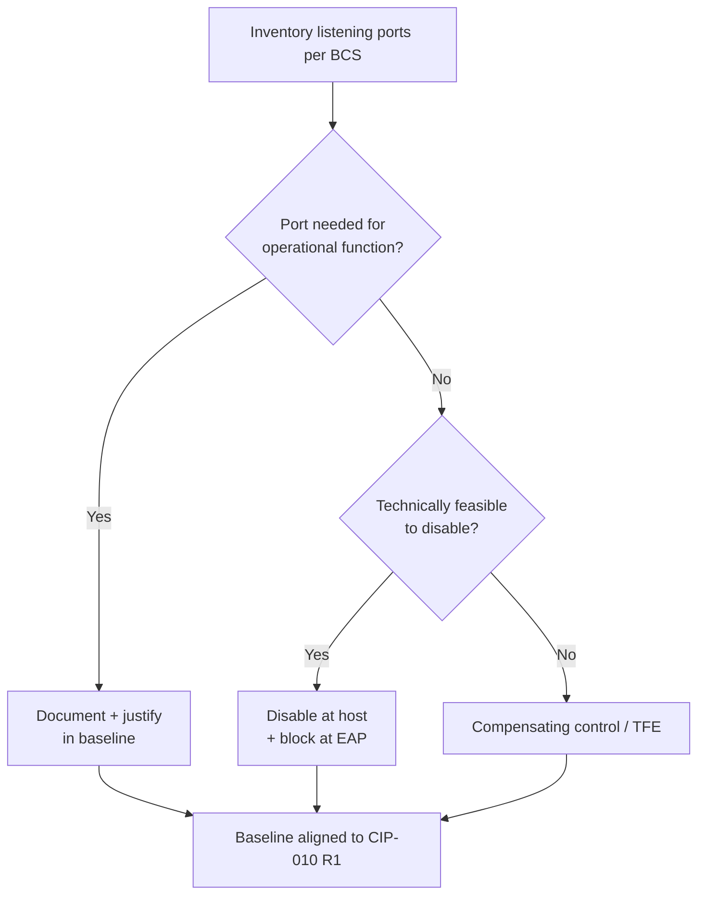

# 04.06 — Ports & Services Baseline (CIP-007-6 R1)

| Field | Value |
|---|---|
| Document ID | CIP-04.06 |
| Version | 1.0 |
| Date | 2026-03-02 |
| Classification | BES Cyber System Information (BCSI) // Illustrative Portfolio Sample |
| Owner | Marcus Bell (OT/ICS Security Lead) |
| Author | Advisory Team |
| Status | Approved |

## Purpose

This document defines and evidences GridPoint Energy's control of **logical network accessible ports** under **CIP-007-6 Requirement R1** for the **14 Medium-impact BES Cyber Systems** and their associated EACMS, PACS, and PCA. It requires that only needed ports be enabled, that each enabled port be documented and justified, and that unneeded ports be disabled or otherwise protected. Implementation **closes GAP-08** (Moderate — enabled ports not fully documented/justified per BCS).

## Applicability & Scope

CIP-007-6 R1 applies to Medium-impact BES Cyber Systems and their associated EACMS, PACS, and PCA — where technically feasible. GridPoint documents enabled logical ports for each of the 14 Medium BCS and for applicable associated systems, aligning the port inventory with the **14 configuration baselines** maintained under CIP-010 R1.

## R1 Requirement-Part Coverage

| Part | Requirement | GridPoint Implementation |
|---|---|---|
| R1.1 | Where technically feasible, enable only logical network accessible ports that have been determined to be needed, including port ranges/services where needed for a purpose; and protect against unnecessary use | Per-BCS documented port list; default-deny at EAPs; unneeded ports disabled at the host and blocked at the EAP |
| R1.2 | Protect against the use of unnecessary physical input/output ports used for network connectivity, command line, or removable media | Disable/blank unused physical ports; port-block/lock controls; alignment with TCA/Removable Media controls (CIP-010 R4) |

## Enabled-Port Documentation Model

Each Medium BCS has a documented, justified list of enabled logical ports tied to its operational function. Representative (illustrative) entries:

| BCS group | Port/Service | Protocol | Justification | Disposition |
|---|---|---|---|---|
| Control-Center EMS/SCADA (ESP-1/2) | 102/TCP | ICCP/TASE.2 | Inter-control-center telemetry (Millbrook↔Easton) | Enabled — needed |
| Control-Center EMS/SCADA | 20000/TCP | DNP3 (routable) | SCADA polling of field devices | Enabled — needed |
| Substation BCS (ESP-3) | 502/TCP | Modbus/TCP | Device communications where used | Enabled — needed |
| All Medium BCS | 123/UDP | NTP | Time synchronization for event correlation | Enabled — needed |
| All Medium BCS | 514/TCP-UDP | Syslog | Log forwarding to SIEM (CIP-007 R4) | Enabled — needed |
| Intermediate System | 22/443 TCP | SSH/TLS | Brokered IRA sessions (CIP-005 R2) | Enabled — needed |
| All Medium BCS | 23/TCP | Telnet | Legacy management | Disabled — replaced by encrypted management |
| All Medium BCS | 69/UDP | TFTP | Not required | Disabled |

Where a port cannot be technically disabled, a **compensating control** and/or **Technical Feasibility Exception (TFE)** is documented per the CMEP framework.

## Governance & Change Control

The enabled-port lists are part of each BCS configuration baseline. Any change to enabled ports flows through **CIP-010 R1 configuration change management** with authorization and logging, and is re-verified against the baseline under **CIP-010 R2** monitoring. Port inventories are validated during the 15-month paper vulnerability assessment (CIP-010 R3).

## Physical Port Protection (R1.2)

Beyond logical ports, R1.2 requires protection against unnecessary use of physical input/output ports (network jacks, console/serial ports, and removable-media ports). GridPoint applies:

| Physical port type | Control | Notes |
|---|---|---|
| Unused network jacks | Disabled at switch / blanked | Prevents unauthorized network connection |
| Console / serial ports | Physically secured within PSP; access-controlled | Console access tied to CIP-004 authorization |
| USB / removable-media ports | Disabled or restricted; blocked where feasible | Coordinated with CIP-010 R4 TCA/Removable Media controls |

Physical ports that must remain available for legitimate operations are protected by their location inside a monitored PSP (CIP-006) and by logical restrictions on their use.

## Per-BCS Coverage Summary

| BCS group | Count | Enabled-port list documented | Unneeded ports disabled |
|---|---|---|---|
| Control-Center BCS (ESP-1/2) | 4 | Yes | Yes |
| Medium substation BCS (ESP-3) | 10 | Yes | Yes |
| Associated EACMS (incl. EAPs) | 26 | Yes | Yes |
| PACS | 18 | Yes | Yes |
| Associated PCA | 60 | Yes | Yes |

Coverage is reconciled against the BCA inventory so that every applicable Cyber Asset has a documented, justified enabled-port list, which is the condition that closed GAP-08.

## Evidence (RSAW-ready)

- Per-BCS enabled-port listings with justification (14 BCS + applicable EACMS/PACS/PCA).
- Host configuration exports / port-scan reconciliations demonstrating only needed ports enabled.
- Physical port control evidence (blanked/locked ports).
- Any TFEs or compensating-control documentation for ports that cannot be disabled.

## Determining "Needed" Ports

A port is retained as *needed* only when it maps to a documented operational function of the Cyber Asset — real-time telemetry exchange, device polling, time synchronization, log forwarding, or authenticated management. Ports that cannot be tied to such a function are candidates for disablement. The determination is made by the asset owner in conjunction with the OT/ICS Security Lead and recorded in the baseline, giving auditors a clear justification trail for every listening service.

| Decision input | Source |
|---|---|
| Operational function mapping | Asset owner / Elena Ruiz (substations) |
| Security review | Marcus Bell (OT/ICS Security Lead) |
| Baseline record | CIP-010 R1 configuration baseline |
| Drift detection | CIP-010 R2 configuration monitoring |

## Gap Closure

| Gap | Description | Status |
|---|---|---|
| GAP-08 (Moderate) | Enabled logical ports not fully documented/justified per BCS | **Closed** — enabled ports documented and justified for all 14 Medium BCS; unneeded ports disabled and blocked at EAPs |

## Cross-References

- `04.02-electronic-security-perimeter-cip-005-r1.md` — EAP default-deny reinforcing port control.
- `04.11-configuration-baselines-cip-010-r1.md` — 14 baselines containing port inventories.
- `04.12-configuration-monitoring-cip-010-r2.md` — detection of baseline/port drift.
- `04.14-transient-cyber-assets-cip-010-r4.md` — removable media / physical port protection.
- `../02-bes-cyber-system-categorization/02.12-gap-register-and-risk-ranking.md` — GAP-08.

---

[⬅ Previous](04.05-physical-access-monitoring-cip-006-r2.md) · [🏠 Phase README](04.00-README.md) · [Next ➡](04.07-patch-management-cip-007-r2.md)
