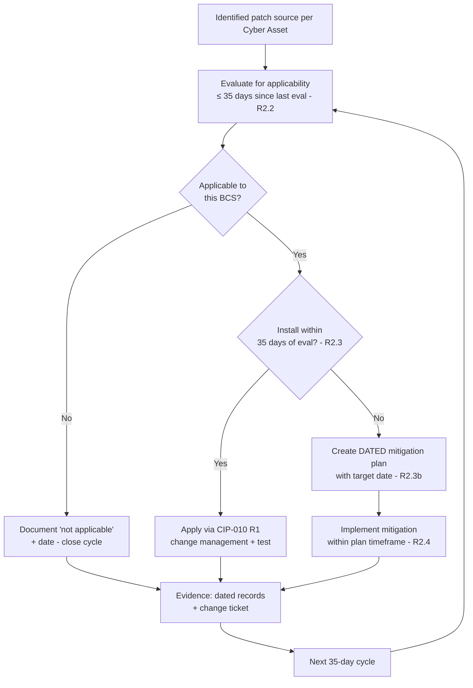

# 04.07 — Patch Management (CIP-007-6 R2)

| Field | Value |
|---|---|
| Document ID | CIP-04.07 |
| Version | 1.0 |
| Date | 2026-03-02 |
| Classification | BES Cyber System Information (BCSI) // Illustrative Portfolio Sample |
| Owner | Priya Nair (IT Security Manager) |
| Author | Advisory Team |
| Status | Approved |

## Purpose

This is a **keystone control document**. It defines and evidences GridPoint Energy's **security patch management** program under **CIP-007-6 Requirement R2** for the **14 Medium-impact BES Cyber Systems** and their associated EACMS, PACS, and PCA. It establishes identified **patch sources** for every applicable Cyber Asset, a **35-day evaluation cycle**, an installation-or-mitigation decision within 35 days of evaluation, and **dated mitigation plans** for patches not applied in time. This control directly remediates the driver that prompted the program — a prior self-logged lapse of the patch-evaluation cycle — and **closes GAP-02 (High)** and **GAP-23 (Low)**.

## Why This Control Matters

GridPoint self-logged a prior instance in which the patch-evaluation cycle exceeded 35 days on control-center BCS (a Phase-02 High-risk finding, GAP-02). A missed evaluation cycle is a common source of CIP-007 R2 violations and can carry significant CMEP penalties. This program installs a disciplined, evidence-generating cadence so that every applicable Cyber Asset has a tracked patch source and every 35-day window is demonstrably met.

## Applicability & Scope

CIP-007-6 R2 applies to Medium-impact BES Cyber Systems and their associated EACMS, PACS, and PCA. Scope includes the 4 Control-Center BCS, the 10 substation BCS, the Intermediate System, ESP firewalls/EAPs (EACMS), the PACS, and applicable PCA. Assets with no released patch source are documented as such.

## R2 Requirement-Part Coverage

| Part | Requirement | GridPoint Implementation |
|---|---|---|
| R2.1 | A **patch management process** for tracking, evaluating, and installing cyber security patches; the process must include the identification of a **source or sources** monitored for release of applicable patches | Documented process; a named patch source is identified for each applicable Cyber Asset (OS, application, firmware, security tooling) |
| R2.2 | At least once **every 35 calendar days**, evaluate security patches for applicability that have been released since the last evaluation from the identified source(s) | Scheduled 35-day evaluation cycle per source; evaluation results recorded and dated |
| R2.3 | Within **35 calendar days** of the evaluation completion, take one of: (a) apply the applicable patches; (b) create a dated **mitigation plan**; or (c) revise an existing mitigation plan | Applicable patches installed via change management, or a dated mitigation plan created within 35 days |
| R2.4 | For each mitigation plan, **implement** the plan within the timeframe specified, or revise it | Mitigation plans have owners and target dates; execution tracked to completion, with authorized revisions where needed |

## 35-Day Patch Cycle

## Patch-Source Identification (R2.1)

Each applicable Cyber Asset has a documented source that GridPoint monitors for patch releases. Representative mapping:

| Asset class | Example patch source | Evaluation owner |
|---|---|---|
| EMS/SCADA application (Control Centers) | Vendor security advisory portal / release notes | Marcus Bell |
| BCS operating systems | OS vendor security update feed | Priya Nair |
| Substation BCS firmware | Device manufacturer firmware advisories | Elena Ruiz |
| ESP firewalls / EAPs (EACMS) | Firewall vendor advisories | Marcus Bell |
| Intermediate System / jump host | OS + remote-access software advisories | Priya Nair |
| PACS components | PACS vendor advisories | Frank Delgado |
| Endpoint malware prevention | Security-tool vendor feed | Priya Nair |

Where a device has no vendor-provided patch source, that condition is documented; monitoring for that asset is satisfied by tracking the vendor channel for any future releases.

## Evaluation-to-Disposition Workflow

1. **Monitor** — subscribed sources reviewed continuously; formal evaluation performed at least every 35 days.
2. **Evaluate applicability (R2.2)** — each released patch assessed against the asset baseline; result (applicable / not applicable) recorded with the evaluation date.
3. **Disposition within 35 days (R2.3)** — apply the patch (via CIP-010 R1 change management with test-before-deploy where feasible), or create a dated mitigation plan.
4. **Mitigation execution (R2.4)** — mitigation plans carry an owner and target date; progress is tracked to closure; revisions are authorized and dated.
5. **Evidence** — every step is dated and filed for RSAW sampling.

## Mitigation Plans for Un-Applied Patches

When an applicable patch cannot be installed within 35 days (e.g., operational window, vendor validation, availability risk to real-time operations), GridPoint documents a **dated mitigation plan** specifying the compensating measures (e.g., EAP rule tightening, enhanced monitoring, IRA restriction) and a remediation target date. Mitigation plans are reviewed until the patch is installed or the risk is otherwise resolved. This preserves reliability while maintaining CIP-007 R2 compliance.

## Interfaces with Other Controls

| Interface | Purpose |
|---|---|
| CIP-010 R1 (baselines) | Patch installation is an authorized configuration change; baselines updated post-install |
| CIP-010 R3 (paper VA) | Patch posture reviewed during 15-month vulnerability assessment |
| CIP-007 R4 (event monitoring) | Failed/successful patch events and mitigation-relevant events logged to SIEM |
| CIP-008 (incident response) | Actively-exploited unpatched vulnerabilities can trigger IR |

## Roles & Responsibilities

| Role | Person | Responsibility |
|---|---|---|
| IT Security Manager | Priya Nair | Owns the patch management process; OS/tooling evaluations |
| OT/ICS Security Lead | Marcus Bell | EMS/SCADA and EACMS patch evaluations |
| Substation & Field Engineering Lead | Elena Ruiz | Substation firmware evaluations |
| Physical Security Manager | Frank Delgado | PACS patch evaluations |
| NERC Compliance Manager | Karen Whitfield | Cycle discipline, evidence, RSAW readiness |
| CIP Senior Manager | Daniel Reyes | Approves mitigation plans and overall posture |

## Cadence Controls to Prevent Recurrence

To ensure the 35-day window is never missed again, GridPoint layers procedural and detective controls:

| Control | Purpose |
|---|---|
| Calendarized evaluation tasks per source | Forces evaluation before day 35 |
| Automated reminders / ticketing | Escalates approaching-due evaluations |
| Monthly internal review of cycle status | Detects any slippage early |
| Evidence completeness check | Confirms each cycle produced a dated record |
| Management reporting to CIP Senior Manager | Accountability and visibility |

These controls form the internal-controls layer that the program was chartered to mature after the prior self-log.

## Worked Example — Mitigation Path

An EMS/SCADA vendor releases a security patch. GridPoint evaluates applicability within 35 days and confirms it applies. Because installation requires a maintenance window that falls outside the 35-day disposition window, GridPoint creates a **dated mitigation plan** on day 20: tighten the relevant EAP rule, increase SIEM monitoring on the affected hosts, and target installation at the next authorized outage. The plan is implemented within its stated timeframe (R2.4); once the patch is installed via CIP-010 R1 change management, the baseline is updated and the mitigation plan is closed with evidence.

## Evidence (RSAW-ready)

- Patch management process document with source list per Cyber Asset.
- 35-day evaluation records (dated) demonstrating no gap between cycles.
- Installation change tickets and post-install baseline updates.
- Dated mitigation plans with owners, target dates, and closure evidence.
- Reconciliation showing every applicable Cyber Asset covered.

## Gap Closure

| Gap | Description | Status |
|---|---|---|
| GAP-02 (High) | Patch-evaluation cycle exceeded 35 days (prior self-log) on control-center BCS | **Closed** — 35-day cycle instituted with identified sources, dated evaluations, and mitigation-plan discipline across all applicable assets |
| GAP-23 (Low) | Patch-source documentation incomplete for some devices | **Closed** — patch source identified and documented for every applicable Cyber Asset |

## Cross-References

- `04.06-ports-and-services-baseline-cip-007-r1.md` — baseline context for patch changes.
- `04.08-malicious-code-prevention-cip-007-r3.md` — malware-definition update cadence (related hardening).
- `04.11-configuration-baselines-cip-010-r1.md` — change management for patch installation.
- `04.13-vulnerability-assessments-cip-010-r3.md` — 15-month paper VA reviewing patch posture.
- `../02-bes-cyber-system-categorization/02.12-gap-register-and-risk-ranking.md` — GAP-02, GAP-23.
- `../01-program-foundation/01.05-cip-program-charter-and-objectives.md` — prior self-log driver.

---

[⬅ Previous](04.06-ports-and-services-baseline-cip-007-r1.md) · [🏠 Phase README](04.00-README.md) · [Next ➡](04.08-malicious-code-prevention-cip-007-r3.md)
