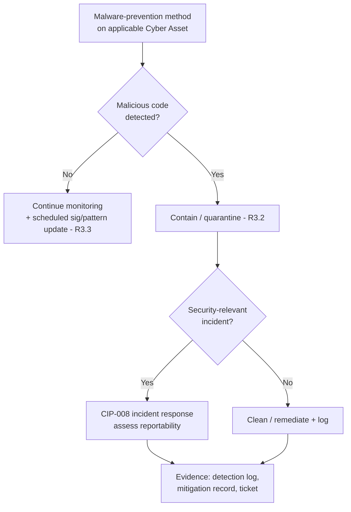

# 04.08 — Malicious Code Prevention (CIP-007-6 R3)

| Field | Value |
|---|---|
| Document ID | CIP-04.08 |
| Version | 1.0 |
| Date | 2026-03-02 |
| Classification | BES Cyber System Information (BCSI) // Illustrative Portfolio Sample |
| Owner | Priya Nair (IT Security Manager) |
| Author | Advisory Team |
| Status | Approved |

## Purpose

This document defines and evidences GridPoint Energy's **malicious code prevention** program under **CIP-007-6 Requirement R3** for the **14 Medium-impact BES Cyber Systems** and their associated EACMS, PACS, and PCA. It establishes the deployment of malware-prevention methods on applicable Cyber Assets, the process for **mitigating the threat of detected malicious code**, and the process for **updating malware signatures/patterns** (or maintaining behavior-based methods), including documented exceptions where prevention is not technically feasible.

## Applicability & Scope

CIP-007-6 R3 applies to Medium-impact BES Cyber Systems and their associated EACMS, PACS, and PCA. GridPoint deploys endpoint malware prevention on applicable BCS at the 2 Control Centers and 8 Medium substations, on the Intermediate System (jump host), and on applicable associated systems. Certain embedded/real-time devices that cannot host signature-based agents are addressed via **alternative behavior-based methods** or documented **per-device exceptions** with compensating controls.

## R3 Requirement-Part Coverage

| Part | Requirement | GridPoint Implementation |
|---|---|---|
| R3.1 | Deploy method(s) to **deter, detect, or prevent malicious code** | Endpoint anti-malware on applicable BCS; application allow-listing / behavior monitoring where signature agents are infeasible; EAP IDS/IPS as a network-layer complement |
| R3.2 | **Mitigate the threat of detected malicious code** | Documented response: isolate, clean/quarantine, and route security-relevant detections to the CIP-008 incident-response process |
| R3.3 | For methods that use signatures or patterns, have a process for the **update of signatures or patterns**, including the source and process for testing and installing | Managed update cadence from an identified source; test/staging before deployment to real-time BCS; update installation logged |

## Malware-Prevention Method by Asset Class

| Asset class | Primary method | Update / maintenance |
|---|---|---|
| Control-Center BCS (Windows-class EMS/SCADA hosts) | Signature-based anti-malware | Signatures updated on managed cadence; tested before deploy (R3.3) |
| Intermediate System (jump host) | Signature-based anti-malware + allow-listing | Same as above; high priority given remote-access exposure |
| Substation BCS (embedded/real-time) | Application allow-listing / behavior-based (where agents infeasible) | Configuration integrity monitoring; documented exception where applicable |
| ESP firewalls / EAPs (EACMS) | Network IDS/IPS malicious-comms detection | Signature updates managed with EAP tuning (see 04.03) |
| PACS components | Vendor-supported anti-malware where feasible | Vendor update channel |

## Detection-to-Mitigation Workflow

## Signature/Pattern Update Process (R3.3)

1. **Source** — malware signatures/patterns obtained from an identified security-tool vendor feed.
2. **Test** — updates staged and validated to avoid disrupting real-time OT operations before deployment to production BCS.
3. **Install** — deployment to applicable Cyber Assets on a managed cadence; installation recorded and dated.
4. **Verify** — coverage and update currency reviewed; failures alerted to the IT Security Manager.

For behavior-based methods that do not rely on signatures, R3.3 signature-update obligations are satisfied by maintaining the behavioral/allow-listing configuration and its change control instead.

## Exceptions

Where malware prevention is **not technically feasible** on a specific Cyber Asset (e.g., closed embedded controllers), GridPoint documents a per-asset exception with the rationale and compensating controls (allow-listing, EAP inspection, physical/logical isolation, enhanced monitoring), and files a **Technical Feasibility Exception (TFE)** where required under the CMEP framework.

## Deployment Coverage Summary

| Asset group | Count | Method | Signature-based? |
|---|---|---|---|
| Control-Center BCS (ESP-1/2) | 4 | Anti-malware agent | Yes |
| Medium substation BCS (ESP-3) | 10 | Allow-listing / behavior-based where agents infeasible | Mixed |
| Intermediate System (jump host) | 1 | Anti-malware + allow-listing | Yes |
| ESP firewalls / EAPs (EACMS) | 6 EAPs / 26 EACMS | Network IDS/IPS | Yes (network) |
| PACS | 18 | Vendor anti-malware where feasible | Where feasible |

Coverage is reconciled against the BCA inventory. Each applicable Cyber Asset either hosts a malware-prevention method or is covered by a documented exception with compensating controls, satisfying R3.1 across the Medium-impact footprint.

## Testing Before Deployment

Because signature/pattern updates can affect real-time OT operations, updates destined for Control-Center and substation BCS are validated in a staging environment before production installation. This test-before-deploy discipline (R3.3) protects reliability while keeping detection current, and mirrors the change-management rigor applied to patch installation under CIP-007 R2 and CIP-010 R1.

## Layered Defense Context

Malicious-code prevention is one layer of GridPoint's defense-in-depth: EAP default-deny and IDS/IPS (CIP-005), ports/services minimization (CIP-007 R1), timely patching (CIP-007 R2), security event monitoring (CIP-007 R4), and TCA/removable-media controls (CIP-010 R4) act together so that a failure of any single layer does not expose the Medium BCS.

## Evidence (RSAW-ready)

- Deployment inventory showing malware-prevention method per applicable Cyber Asset.
- Signature/pattern update logs with source, test, and install dates.
- Detection and mitigation records (samples) linked to CIP-008 where applicable.
- Documented exceptions / TFEs with compensating controls for infeasible assets.

## Roles & Responsibilities

| Role | Person | Responsibility |
|---|---|---|
| IT Security Manager | Priya Nair | Owns malware-prevention deployment, updates, and exceptions |
| OT/ICS Security Lead | Marcus Bell | EAP IDS/IPS tuning; substation behavior-based methods |
| Substation & Field Engineering Lead | Elena Ruiz | Embedded-device allow-listing / exception documentation |
| NERC Compliance Manager | Karen Whitfield | Evidence and RSAW readiness |

## Continuous Improvement

Malware-prevention coverage and update currency are reviewed during the 15-month paper vulnerability assessment (CIP-010 R3) and adjusted as the asset baseline changes (e.g., new devices from configuration changes under CIP-010 R1). Detection trends observed in the SIEM feed back into signature tuning and allow-listing policy, keeping the control effective against evolving OT threats.

## Cross-References

- `04.03-interactive-remote-access-cip-005-r2.md` — EAP malicious-communications detection (network layer) and jump-host hardening.
- `04.07-patch-management-cip-007-r2.md` — related hardening cadence (35-day patch cycle).
- `04.09-security-event-monitoring-cip-007-r4.md` — logging/alerting of malware events to the SIEM.
- `04.15-incident-response-plan-cip-008.md` — response to security-relevant detections.
- `04.14-transient-cyber-assets-cip-010-r4.md` — TCA/removable-media malware risk.
- `../02-bes-cyber-system-categorization/02.07-associated-eacms-pacs-pca.md` — applicable systems.

---

[⬅ Previous](04.07-patch-management-cip-007-r2.md) · [🏠 Phase README](04.00-README.md) · [Next ➡](04.09-security-event-monitoring-cip-007-r4.md)
