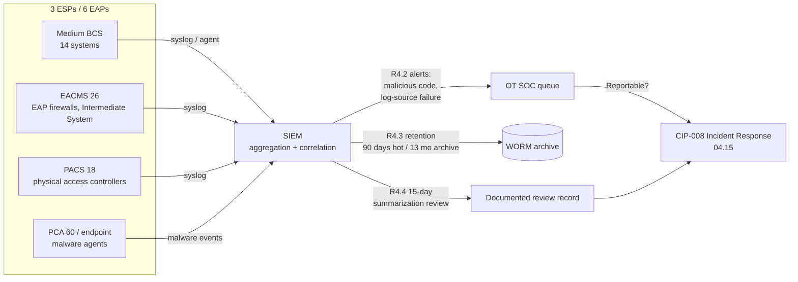

# 04.09 — Security Event Monitoring (CIP-007-6 R4)

| Field | Value |
|---|---|
| Document ID | CIP-04.09 |
| Version | 1.0 |
| Date | 2026-03-02 |
| Classification | BES Cyber System Information (BCSI) // Illustrative Portfolio Sample |
| Owner | Marcus Bell (OT / ICS Security Lead) |
| Author | Advisory Team |
| Status | Approved |

## Purpose

This document defines how GridPoint Energy, Inc. ("GridPoint") satisfies **CIP-007-6 Requirement R4 — Security Event Monitoring** for its **14 Medium-impact BES Cyber Systems (BCS)** and associated **EACMS (26)**, **PACS (18)**, and **PCA (60)**. It establishes per-event-type logging, centralized aggregation and correlation in the Security Information and Event Management (SIEM) platform, alerting on security events, a 15-calendar-day review of logged events, and a minimum 90-day log-retention control. Implementing R4 closes **GAP-07** (event logging incomplete on control-center BCS) and **GAP-31** (log-retention evidence not consistently captured), both drawn from the Phase-02 gap register.

## CIP-007-6 R4 Requirement Parts in Scope

CIP-007-6 R4 comprises four requirement parts. All apply to GridPoint's Medium BCS and associated EACMS/PACS/PCA ("applicable Cyber Assets"). The table maps each part to GridPoint's implementation.

| Part | Requirement (summary) | GridPoint Implementation | Evidence |
|---|---|---|---|
| **R4.1** | Log events at the BCS or Cyber Asset level (per capability) for identification of, and after-the-fact investigation of, Cyber Security Incidents — including (4.1.1) detected successful login attempts, (4.1.2) detected failed access/login attempts, and (4.1.3) detected malicious code | Syslog/agent forwarding from BCS, EAPs, Intermediate System, and endpoint malware tools to the SIEM; per-asset logging capability documented where a device cannot log a given event type | SIEM source inventory; per-asset capability register |
| **R4.2** | Generate alerts for security events that the Responsible Entity determines necessitate an alert — including (4.2.1) detected malicious code from 4.1.3 and (4.2.2) detected failure of Part 4.1 event logging | SIEM correlation rules raise alerts to the OT SOC queue for malicious-code detections and for log-source silence/health failures | Alert rule export; alert ticket history |
| **R4.3** | Where technically feasible, retain applicable event logs identified in 4.1 for at least the last **90 consecutive calendar days** except under CIP Exceptional Circumstances | SIEM hot storage retains ≥ 90 days online; archival to WORM storage extends retention to 13 months for audit | Retention policy; storage configuration screenshot |
| **R4.4** | Review a summarization or sampling of logged events as determined by the Responsible Entity at intervals no greater than **15 calendar days** to identify undetected Cyber Security Incidents | OT SOC performs a documented 15-calendar-day review of a SIEM summarization dashboard; findings logged and dispositioned | Signed 15-day review records |

## Event-Type Logging Detail (R4.1)

GridPoint logs, at minimum, the three CIP-007-6 R4.1 mandated event types plus supporting operational events. Where a legacy relay or RTU cannot natively produce a required log, the capability limitation is documented per Cyber Asset and compensating monitoring (e.g., EAP-level logging or upstream authentication logging) is applied.

| R4.1 Event Type | Source Cyber Assets | Forwarded To |
|---|---|---|
| Detected successful login attempts (4.1.1) | BCS operator consoles, EMS/SCADA hosts, Intermediate System (jump host), EACMS | SIEM |
| Detected failed access / login attempts (4.1.2) | Same as above; EAP firewalls; PACS controllers | SIEM |
| Detected malicious code (4.1.3) | Endpoint malware-prevention agents on applicable BCS/PCA; EAP inspection | SIEM + OT SOC alert |

## Monitoring & Alerting Architecture

## Log Retention Control (R4.3)

The 90-consecutive-calendar-day online retention floor is the CIP-007-6 R4.3 minimum. GridPoint deliberately exceeds it — retaining logs online for 90 days and archiving to write-once storage for 13 months — so that a Reportable Cyber Security Incident spanning the ~3-year RF audit cycle can still be reconstructed and so that after-the-fact investigation under CIP-008 is not constrained by log expiry. Retention configuration and periodic storage-health checks are captured as standing evidence, directly remediating **GAP-31**.

## Roles & Responsibilities

| Role | Person | R4 Responsibility |
|---|---|---|
| OT / ICS Security Lead | Marcus Bell | Owns SIEM, correlation rules, and the 15-day review process |
| IT Security Manager | Priya Nair | Maintains SIEM platform, storage, and alert routing |
| Control Center Operations Manager | James Okafor | Confirms BCS log sources at Millbrook/Easton |
| CIP Senior Manager | Daniel Reyes | Accountable authority; approves the monitoring program |
| Advisory Team | — | Designed the R4 control set and evidence mapping |

## Log-Source Coverage

To make R4.1 defensible, GridPoint maintains a log-source coverage matrix that maps each in-scope population to its logging capability and forwarding status. A source that cannot forward to the SIEM is flagged and a compensating control recorded.

| Population | Count | Primary Events Captured | SIEM Forwarding |
|---|---|---|---|
| Medium BES Cyber Systems | 14 | Logins (4.1.1/4.1.2), malicious code (4.1.3) | Direct / via collector |
| EACMS (EAP firewalls, Intermediate System) | 26 | Auth, connection, rule hits, logging health | Direct |
| PACS (physical access controllers) | 18 | Access grants/denials, tamper | Direct / via collector |
| PCA / endpoints | 60 | Malicious-code detections | Via malware-prevention console |

## 15-Calendar-Day Review Discipline (R4.4)

The R4.4 review is the control most often failed at audit because entities log but never demonstrate review. GridPoint performs a documented review of a SIEM summarization/sampling dashboard at intervals **no greater than 15 calendar days**, records the reviewer, the date, the event population sampled, and any anomalies dispositioned. The review is scheduled with margin inside the 15-day ceiling so a single missed day does not create a violation. Findings that indicate an undetected Cyber Security Incident are escalated immediately to CIP-008 (04.15).

## Alert Triage → Incident Response Linkage

Every R4.2 alert is triaged by the OT SOC against the CIP-008 incident-classification criteria (04.15). If triage determines a Cyber Security Incident has compromised or disrupted a BCS, an ESP, or an EACMS, it is escalated as a candidate **Reportable Cyber Security Incident** subject to the **1-hour E-ISAC / CISA notification**. This tight coupling ensures monitoring is not a passive control but the trigger for the reporting obligations in CIP-008-6 R4.

## Evidence Produced

The SIEM source inventory, correlation-rule export, per-asset logging-capability register, alert ticket history, the signed 15-calendar-day review records, and the retention/storage configuration form the standing evidence set presented against the CIP-007 RSAW at the ReliabilityFirst audit. Together these artifacts close **GAP-07** (complete event logging on control-center BCS) and **GAP-31** (demonstrable log retention).

## Common Pitfalls Avoided

| Pitfall | GridPoint control |
|---|---|
| Logging enabled but never reviewed | Mandatory 15-calendar-day summarization review (R4.4) with signed records |
| Silent log-source failure goes unnoticed | R4.2.2 alert on detected failure of event logging |
| Logs purged before an investigation completes | 90-day hot + 13-month archive retention (exceeds R4.3) |
| Legacy device cannot log a required event | Per-asset capability limitation documented; compensating upstream logging |

## Cross-References

- `04.08-malicious-code-prevention-cip-007-r3.md` — malicious-code detections feed R4.1.3 / R4.2.1
- `04.10-system-access-control-cip-007-r5.md` — authentication events logged under R4.1
- `04.15-incident-response-plan-cip-008.md` — alert escalation and Reportable-incident reporting
- `../02-bes-cyber-system-categorization/02.12-gap-register-and-risk-ranking.md` — GAP-07, GAP-31
- `../01-program-foundation/01.13-document-and-evidence-management-plan.md` — evidence retention

---

[⬅ Previous](04.08-malicious-code-prevention-cip-007-r3.md) · [🏠 Phase README](04.00-README.md) · [Next ➡](04.10-system-access-control-cip-007-r5.md)
