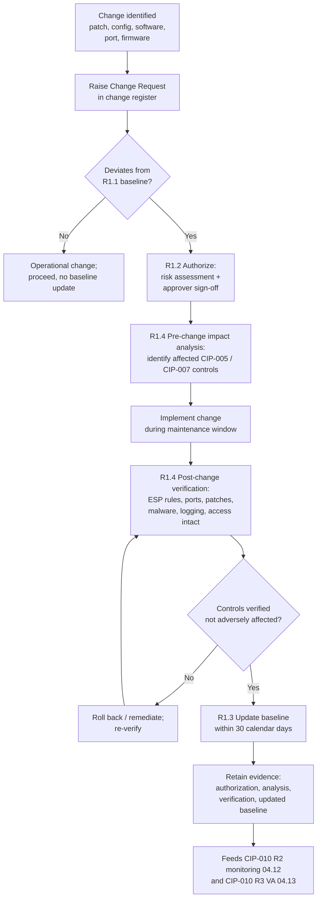

# 04.11 — Configuration Baselines & Change Management (CIP-010-4 R1)

| Field | Value |
|---|---|
| Document ID | CIP-04.11 |
| Version | 1.0 |
| Date | 2026-03-02 |
| Classification | BES Cyber System Information (BCSI) // Illustrative Portfolio Sample |
| Owner | Marcus Bell (OT / ICS Security Lead) |
| Author | Advisory Team |
| Status | Approved |

## Purpose

This document is the **keystone** of GridPoint Energy, Inc.'s ("GridPoint") configuration management program. It defines how GridPoint satisfies **CIP-010-4 Requirement R1 — Configuration Change Management** by establishing a documented **baseline configuration** for each of the **14 Medium-impact BES Cyber Systems (BCS)** and by authorizing, documenting, and controlling every change that deviates from those baselines. Implementing R1 closes **GAP-03 (High)** — configuration baselines incomplete for the 10 Medium substation BCS — and **GAP-33 (Low)** — change-authorization records not consistently retained. Because CIP-010 R1 is the reference point against which CIP-010 R2 (monitoring, 04.12) and CIP-010 R3 (vulnerability assessment, 04.13) operate, a complete and accurate baseline is foundational to the entire configuration-integrity control family.

## Scope: 14 Baselines, One per Medium BCS

GridPoint maintains exactly **14 baseline configurations** — one for each Medium BCS:

| BCS Group | Location | Count | Representative Cyber Assets |
|---|---|---|---|
| Control-center EMS/SCADA & supporting BCS | Millbrook (Primary) | 2 | EMS servers, SCADA front-end processors, HMI consoles |
| Control-center EMS/SCADA & supporting BCS | Easton (Backup) | 2 | Redundant EMS/SCADA, HMI consoles |
| Medium substation protection/control BCS | 8 × 345 kV substations | 10 | Protective relays, RTUs, station gateways, HMIs |
| **Total Medium BCS baselines** | | **14** | |

Associated **EACMS (26)**, **PACS (18)**, and **PCA (60)** are also brought under baseline control as applicable Cyber Assets, since CIP-010-4 R1 applies to the BCS *and* the associated systems within scope.

## CIP-010-4 R1 Requirement Parts

| Part | Requirement (summary) | GridPoint Implementation |
|---|---|---|
| **R1.1** | Develop a baseline configuration for each applicable BCS, individually or by group, containing the five required elements (below) | 14 baselines captured in the configuration-management tool; each item enumerated per Cyber Asset or group |
| **R1.2** | Authorize and document changes that deviate from the existing baseline | Change request raised, risk-assessed, and authorized before implementation; recorded in the change register |
| **R1.3** | For a change that deviates from the baseline, update the baseline as necessary within **30 calendar days** of completing the change | Baseline updated in the tool within 30 days; update timestamp retained as evidence |
| **R1.4** | For a change that deviates, determine required CIP-005 and CIP-007 security controls that could be impacted; verify they are not adversely affected; document the verification | Pre/post verification checklist covering ESP rules (CIP-005), ports/services, patches, malware prevention, logging, access control (CIP-007) |
| **R1.5** | *(High impact only)* Prior to implementing a change in a test environment, model the change and document results | **Not applicable** — GridPoint has no High-impact BCS; noted for completeness |

## The Five Baseline Elements (R1.1)

Every one of the 14 baselines records the five CIP-010-4 R1.1 elements for each in-scope Cyber Asset. A baseline is not considered complete until all five are populated and evidenced.

| # | Baseline Element (R1.1) | GridPoint Capture Method |
|---|---|---|
| 1 | Operating system(s) and version, or firmware where no independent OS exists | Automated inventory agent / manual attestation for embedded relays |
| 2 | Any commercially available or open-source application software (and version) intentionally installed | Software inventory export |
| 3 | Any custom software installed | Engineering record of custom logic / configuration packages |
| 4 | Any logical network accessible ports | Port/service baseline from CIP-007 R1 (04.06) reconciled into the R1.1 baseline |
| 5 | Any security patches applied | Patch state from CIP-007 R2 (04.07) reconciled into the R1.1 baseline |

The R1.1 baseline therefore *incorporates by reference* the CIP-007 R1 ports-and-services baseline and the CIP-007 R2 patch state, keeping a single authoritative configuration record per BCS rather than parallel, divergent lists.

## Change-Control Workflow

## Authorization & Documentation of Changes (R1.2)

Every change that deviates from a baseline is **authorized before implementation** by a designated approver and documented in the change register. The authorization record captures, at minimum:

- Change request identifier and description of the deviation;
- The affected BCS/Cyber Asset(s) and the specific baseline element(s) changing;
- Risk assessment and rationale;
- Named approver and authorization date (before implementation);
- Scheduled implementation window.

This end-to-end record is what remediates **GAP-33** — previously, changes were implemented but authorization was not consistently captured as retained evidence. Emergency changes made under a **CIP Exceptional Circumstance** follow the same substantive controls with authorization documented as soon as practicable after the fact.

## Impact Analysis on CIP-005 / CIP-007 Controls (R1.4)

CIP-010-4 R1.4 requires that, for each deviating change, GridPoint determine which CIP-005 (ESP / remote access) and CIP-007 (system security) controls *could* be affected, verify they were not adversely affected, and document the verification. GridPoint uses a standard verification checklist:

| Control Domain | Verification Item |
|---|---|
| CIP-005 R1 (ESP) | EAP rule set unchanged or re-approved; no new inbound/outbound exposure |
| CIP-005 R2 (IRA) | Intermediate System path and MFA still enforced |
| CIP-007 R1 (ports/services) | No unauthorized logical ports opened; baseline element 4 reconciled |
| CIP-007 R2 (patches) | Patch state consistent; baseline element 5 reconciled |
| CIP-007 R3 (malicious code) | Endpoint malware prevention still active |
| CIP-007 R4 (logging) | Log sources still forwarding to SIEM |
| CIP-007 R5 (access control) | No new default/shared accounts introduced |

## Baseline Update Timeliness (R1.3)

When a deviating change is completed, the corresponding baseline is updated in the configuration-management tool **within 30 calendar days**. GridPoint tracks the completion-to-update interval as a controls metric; the target is well inside 30 days to preserve margin. A stale baseline directly undermines CIP-010 R2 monitoring (a deviation cannot be judged against an out-of-date reference), so timeliness here is treated as a first-order control, not administrative housekeeping.

## Baseline-by-Group Strategy

CIP-010-4 R1.1 permits baselines to be developed **individually or by group**. GridPoint groups where Cyber Assets are genuinely identical (for example, a set of the same relay model, same firmware, and same configuration package across the 345 kV substations) and maintains individual baselines where assets differ. Grouping reduces the maintenance burden and the risk of divergent records, while the group definition explicitly lists its member Cyber Assets so no device escapes coverage. Every one of the 14 Medium BCS resolves to exactly one baseline record, and every applicable EACMS/PACS/PCA is assigned to a baseline (individual or group).

| Grouping Decision | Applied When | Example |
|---|---|---|
| Group baseline | Identical model, firmware, and configuration | Same-model protective relays across 345 kV substations |
| Individual baseline | Unique OS, software, ports, or patch state | Control-center EMS/SCADA servers |

## Change Categories

Not every operational action deviates from a baseline. GridPoint classifies work to determine whether the CIP-010 R1 controls are triggered, preventing both under-control (a real deviation slipping through) and over-control (routine operation buried in change paperwork).

| Category | Deviates from Baseline? | CIP-010 R1 Path |
|---|---|---|
| Security patch installation | Yes (element 5) | Full R1.2 authorization + R1.4 verification + R1.3 update |
| Firmware / OS upgrade | Yes (element 1) | Full R1.2 / R1.4 / R1.3 |
| New/updated application software | Yes (elements 2/3) | Full R1.2 / R1.4 / R1.3 |
| Opening/closing a logical port | Yes (element 4) | Full R1.2 / R1.4 / R1.3 |
| Operational parameter change within existing config | No | Operational control; no baseline update |

## Roles & Responsibilities

| Role | Person | R1 Responsibility |
|---|---|---|
| OT / ICS Security Lead | Marcus Bell | Owns the baseline library and change-control process for OT/BCS |
| IT Security Manager | Priya Nair | Baselines for IT-resident EACMS and supporting systems |
| Substation & Field Engineering Lead | Elena Ruiz | Validates substation relay/RTU baselines and field changes |
| Control Center Operations Manager | James Okafor | Authorizes and validates control-center BCS changes |
| CIP Senior Manager | Daniel Reyes | Accountable authority; approves the configuration-management program |
| Advisory Team | — | Designed the baseline schema, workflow, and evidence mapping |

## Evidence Produced

Each change generates a retained evidence chain: the authorization record (R1.2), the pre-change impact analysis and post-change verification (R1.4), and the dated baseline update (R1.3). The 14 current baselines, plus the change register, are the primary artifacts presented against the CIP-010 RSAW at the ReliabilityFirst audit. This evidence chain is the specific closure of the High-risk **GAP-03**.

## Common Pitfalls Avoided

| Pitfall | GridPoint control |
|---|---|
| Baseline missing one of the five R1.1 elements | Completeness gate — all five elements required before a baseline is accepted |
| Change implemented before authorization | R1.2 authorization is a pre-implementation gate in the workflow |
| Baseline drifts out of date after a change | R1.3 30-day update SLA with tracked interval metric |
| Change silently weakens an ESP or CIP-007 control | Mandatory R1.4 impact analysis and post-change verification checklist |
| Parallel, divergent port/patch lists | R1.1 elements 4 & 5 reconciled from CIP-007 R1/R2 into one baseline |

## Cross-References

- `04.06-ports-and-services-baseline-cip-007-r1.md` — baseline element 4 (logical ports)
- `04.07-patch-management-cip-007-r2.md` — baseline element 5 (security patches)
- `04.12-configuration-monitoring-cip-010-r2.md` — monitoring against these baselines
- `04.13-vulnerability-assessments-cip-010-r3.md` — VA measured against these baselines
- `../02-bes-cyber-system-categorization/02.12-gap-register-and-risk-ranking.md` — GAP-03 (High), GAP-33
- `../02-bes-cyber-system-categorization/02.06-high-medium-low-categorization-list.md` — the 14 Medium BCS

---

[⬅ Previous](04.10-system-access-control-cip-007-r5.md) · [🏠 Phase README](04.00-README.md) · [Next ➡](04.12-configuration-monitoring-cip-010-r2.md)
