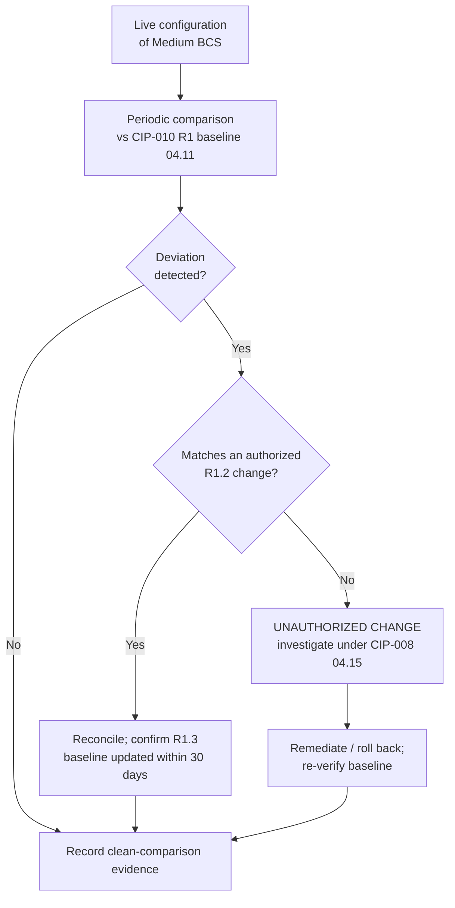

# 04.12 — Configuration Monitoring (CIP-010-4 R2)

| Field | Value |
|---|---|
| Document ID | CIP-04.12 |
| Version | 1.0 |
| Date | 2026-03-02 |
| Classification | BES Cyber System Information (BCSI) // Illustrative Portfolio Sample |
| Owner | Marcus Bell (OT / ICS Security Lead) |
| Author | Advisory Team |
| Status | Approved |

## Purpose

This document defines how GridPoint Energy, Inc. ("GridPoint") addresses **CIP-010-4 Requirement R2 — Configuration Monitoring** and the associated risk it is designed to manage: undetected deviation of a running configuration from its authorized **CIP-010 R1 baseline** (04.11). Implementing a documented configuration-monitoring approach closes **GAP-09** — no systematic baseline-deviation detection was in place — from the Phase-02 gap register.

## Applicability Reality: R2.1 Is a High-Impact-Only Requirement

CIP-010-4 **R2.1 requires monitoring at least once every 35 calendar days for changes to the baseline configuration** and investigation of detected unauthorized changes — **but R2.1 applies only to High-impact BES Cyber Systems and their associated EACMS/PCA.** GridPoint's categorization (CIP-002-5.1a) established **no High-impact BCS** — only **14 Medium** and **38 Low**. Therefore:

| Requirement | Applies To | GridPoint Status |
|---|---|---|
| CIP-010-4 R2.1 — active 35-calendar-day baseline-deviation monitoring | **High impact only** | **Not applicable** — GridPoint has no High BCS |

Stating this plainly matters for audit defensibility: GridPoint does not claim compliance with a requirement part that is out of scope, and it does not create a false obligation. However, the **absence of a mandatory monitoring requirement does not mean the underlying risk disappears** — a Medium BCS can still drift from baseline through an unauthorized or undocumented change. GridPoint therefore applies a **voluntary, risk-based configuration-monitoring approach** to its Medium BCS.

## Risk-Based Configuration Monitoring Applied to Medium BCS

Rather than leave the 14 Medium baselines unmonitored simply because R2.1 is High-only, GridPoint implements a proportionate internal control that detects and investigates deviations. This is the substance of the **GAP-09** closure.

| Control Element | GridPoint Approach | Rationale |
|---|---|---|
| Detection cadence | Configuration-management tool compares live configuration to the R1 baseline on a periodic schedule (targeting a 35-day-equivalent internal cadence) | Mirrors the High-impact rigor voluntarily; keeps drift windows short |
| Scope | 14 Medium BCS baselines + applicable associated EACMS/PACS/PCA | Extends R1 baseline control into ongoing assurance |
| Deviation handling | Any detected deviation is reconciled to an authorized CIP-010 R1.2 change; if none exists, it is treated as an **unauthorized change** | Closes the loop between R1 change authorization and observed state |
| Unauthorized-change response | Investigated as a potential Cyber Security Incident under CIP-008 (04.15); remediated or rolled back; baseline re-verified | Links configuration integrity to incident response |
| Evidence | Deviation reports, reconciliation records, and investigation dispositions retained | Demonstrates the risk-based control at audit |

## Why the Risk-Based Approach, and Its Limits

GridPoint is transparent that this Medium-scope monitoring is a **prudent internal control, not a NERC-mandated R2.1 obligation.** The distinction is documented so that:

- The ReliabilityFirst audit team sees a defensible, deliberate scoping decision (no over- or under-claiming);
- The internal controls program (Phase 06) can mature the cadence and automation over time;
- If GridPoint were ever to acquire or build a High-impact asset, the mandatory 35-day R2.1 control is already substantially in place and can be formalized quickly.

The residual risk accepted is that a very-short-lived unauthorized change between comparison cycles could occur; this is mitigated by CIP-007 R4 security-event monitoring (04.09), which independently alerts on many change-adjacent events (new accounts, logging failures, malicious code) in near real time.

## Relationship to Adjacent Controls

| Adjacent Control | Interaction |
|---|---|
| CIP-010 R1 baselines (04.11) | Provides the authoritative reference the monitoring compares against |
| CIP-007 R1 ports/services (04.06) | Unauthorized open ports surface as baseline deviations |
| CIP-007 R2 patches (04.07) | Patch-state changes reconcile against baseline element 5 |
| CIP-007 R4 monitoring (04.09) | Real-time event alerting complements periodic configuration comparison |
| CIP-008 incident response (04.15) | Unauthorized changes are escalated as potential Cyber Security Incidents |

## Deviation Disposition States

Every comparison result is dispositioned into one of four states, giving the internal controls program (Phase 06) a measurable metric for configuration integrity across the 14 Medium baselines.

| State | Meaning | Action |
|---|---|---|
| Clean | Live configuration matches the R1 baseline | Record clean-comparison evidence |
| Reconciled | Deviation matches an authorized R1.2 change | Confirm R1.3 baseline update within 30 days; close |
| Unauthorized | Deviation with no authorizing change | Investigate under CIP-008 (04.15); remediate/roll back |
| Baseline-stale | Deviation caused by a not-yet-updated baseline | Update baseline (R1.3); re-compare |

## Maturity Path

GridPoint records this Medium-scope monitoring as an internal control at an early maturity level, with a defined path to raise it during Phase 06:

- **Now:** periodic tool-based comparison of live configuration to the 14 R1 baselines, manual disposition.
- **Next:** tighten cadence and automate reconciliation against the change register so that authorized changes clear automatically and only true unauthorized deviations reach an analyst.
- **Trigger to formalize:** acquisition or construction of any High-impact asset immediately converts this voluntary control into the mandatory R2.1 35-calendar-day obligation, which is already substantially operational.

## Roles & Responsibilities

| Role | Person | R2 Responsibility |
|---|---|---|
| OT / ICS Security Lead | Marcus Bell | Owns configuration-monitoring tooling and deviation investigation |
| IT Security Manager | Priya Nair | Monitors IT-resident EACMS configurations |
| Substation & Field Engineering Lead | Elena Ruiz | Investigates substation BCS deviations |
| CIP Senior Manager | Daniel Reyes | Accountable authority; approves the risk-based scoping decision |
| Advisory Team | — | Designed the risk-based monitoring control and documented the R2.1 applicability |

## Common Pitfalls Avoided

| Pitfall | GridPoint control |
|---|---|
| Claiming R2.1 compliance despite no High BCS | Explicit applicability statement — R2.1 documented as Not Applicable |
| Leaving Medium baselines entirely unmonitored | Voluntary risk-based comparison closes GAP-09 |
| Detected deviation with no authorized change ignored | Escalated as unauthorized change → CIP-008 investigation |
| Baseline reference itself out of date | Reconciliation confirms R1.3 30-day baseline updates |

## Cross-References

- `04.11-configuration-baselines-cip-010-r1.md` — the baselines monitored here
- `04.09-security-event-monitoring-cip-007-r4.md` — complementary real-time alerting
- `04.15-incident-response-plan-cip-008.md` — unauthorized-change investigation
- `../02-bes-cyber-system-categorization/02.06-high-medium-low-categorization-list.md` — no High BCS
- `../02-bes-cyber-system-categorization/02.12-gap-register-and-risk-ranking.md` — GAP-09

---

[⬅ Previous](04.11-configuration-baselines-cip-010-r1.md) · [🏠 Phase README](04.00-README.md) · [Next ➡](04.13-vulnerability-assessments-cip-010-r3.md)
