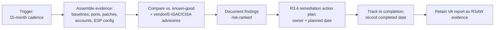

# 04.13 — Vulnerability Assessments (CIP-010-4 R3)

| Field | Value |
|---|---|
| Document ID | CIP-04.13 |
| Version | 1.0 |
| Date | 2026-03-02 |
| Classification | BES Cyber System Information (BCSI) // Illustrative Portfolio Sample |
| Owner | Marcus Bell (OT / ICS Security Lead) |
| Author | Advisory Team |
| Status | Approved |

## Purpose

This document defines how GridPoint Energy, Inc. ("GridPoint") satisfies **CIP-010-4 Requirement R3 — Vulnerability Assessments** for its **14 Medium-impact BES Cyber Systems (BCS)** and associated **EACMS**, **PACS**, and **PCA**. It establishes a **paper (documentation-based) vulnerability assessment performed at least once every 15 calendar months**, the scope and method of that assessment, and the remediation-tracking process for findings. Implementing R3 closes **GAP-17** — no periodic vulnerability assessment process existed — from the Phase-02 gap register.

## CIP-010-4 R3 Requirement Parts & Applicability

| Part | Requirement (summary) | Applies To | GridPoint Status |
|---|---|---|---|
| **R3.1** | At least once every **15 calendar months**, conduct a paper **or** active vulnerability assessment | Medium (and High) | **Applicable** — GridPoint performs a **paper VA every 15 calendar months** |
| **R3.2** | At least once every **36 calendar months**, perform an **active** vulnerability assessment | **High impact only** | **Not applicable** — GridPoint has no High BCS |
| **R3.3** | Prior to adding a new applicable Cyber Asset to a production environment, perform an active VA (with defined exceptions) | **High impact only** (active) | **Not applicable** — GridPoint has no High BCS |
| **R3.4** | Document the results, the action plan to remediate or mitigate deficiencies, and the planned/completed date of each action | Medium (and High) | **Applicable** — findings tracked to closure |

The key applicability point: the **15-month paper VA (R3.1) is GridPoint's binding obligation**; the **36-month active VA (R3.2) and pre-production active VA (R3.3) are High-impact-only and therefore N/A** to GridPoint. This scoping is stated explicitly so GridPoint neither over-claims nor leaves a genuine obligation unaddressed.

## The 15-Month Paper Vulnerability Assessment

A **paper VA** is a documentation-based review that evaluates each Medium BCS against its authorized configuration and known-good security posture, without necessarily running active/intrusive scanning tools against the production BES environment. This method is well-suited to OT/BCS where live scanning could disturb real-time control functions.

| VA Attribute | GridPoint Approach |
|---|---|
| Cadence | At least once every **15 calendar months** (R3.1); next VA scheduled before the 15-month ceiling |
| Type | **Paper** (documentation-based) review |
| Reference point | The CIP-010 R1 **baseline configurations** (04.11) for the 14 Medium BCS |
| Assessor | OT/ICS Security team with Advisory Team facilitation; independence from day-to-day operators preserved |
| Output | Findings register with risk ranking + remediation action plan (R3.4) |

## VA Scope & Method

The paper VA reviews, for each Medium BCS and applicable associated Cyber Asset:

| Review Dimension | Source Evidence | CIP Linkage |
|---|---|---|
| Logical accessible ports & services vs. baseline | CIP-007 R1 baseline (04.06) | Detect unnecessary/unexpected exposure |
| Security-patch status vs. available patches | CIP-007 R2 patch evidence (04.07) | Identify unmitigated known vulnerabilities |
| Malicious-code prevention coverage | CIP-007 R3 (04.08) | Confirm endpoint protection is current |
| Account & authentication posture | CIP-007 R5 (04.10) | Detect residual default/shared accounts |
| ESP / remote-access configuration | CIP-005 R1/R2 (04.02, 04.03) | Confirm perimeter controls intact |
| Configuration drift | CIP-010 R2 monitoring (04.12) | Reconcile deviations |
| Known-vulnerability intelligence | Vendor advisories, E-ISAC bulletins, CISA advisories | Map advisories to installed software/firmware |

## Remediation Tracking (R3.4)

Every finding is documented with a remediation or mitigation action plan, an assigned owner, and a planned completion date. Actions are tracked to closure and the completed date recorded. Higher-risk findings (for example, a missing patch for an actively exploited vulnerability flagged by a CISA advisory) are prioritized and may be escalated into the CIP-007 R2 mitigation-plan process. The VA findings register and its closure evidence are the specific artifacts that remediate **GAP-17** and are presented against the CIP-010 RSAW at the ReliabilityFirst audit.

## Paper vs. Active VA — Why Paper Is Chosen

CIP-010-4 R3.1 permits **either** a paper **or** an active vulnerability assessment for Medium BCS. GridPoint deliberately selects the paper method, and documents the rationale so the choice is defensible at audit.

| Factor | Paper VA (selected) | Active VA |
|---|---|---|
| Method | Documentation-based review vs. known-good and advisories | Live scanning / probing of the asset |
| Operational risk to BES | Minimal — no traffic injected into real-time control | Potential to disturb sensitive OT/relay functions |
| CIP obligation for GridPoint | Satisfies R3.1 (Medium) | Only R3.2/R3.3 require it — **High only, N/A** |
| Evidence produced | Findings register, advisory mapping, remediation plan | Scan output plus remediation plan |

Because active VA is mandated only for High-impact assets (which GridPoint does not have), the paper VA fully discharges GridPoint's R3.1 obligation while avoiding unnecessary operational risk to live BES control systems.

## Cadence Governance

The 15-calendar-month ceiling is tracked in the compliance obligations calendar (Phase 01). GridPoint schedules each VA with deliberate margin before the ceiling and also performs an **event-driven** VA when a material change occurs — for example, a significant configuration change to a Medium BCS, commissioning of a new applicable Cyber Asset, or a high-severity CISA/E-ISAC advisory affecting installed software or firmware. The NERC Compliance Manager confirms both the recurring cadence and the retained evidence.

## Roles & Responsibilities

| Role | Person | R3 Responsibility |
|---|---|---|
| OT / ICS Security Lead | Marcus Bell | Conducts the paper VA; owns the findings register |
| IT Security Manager | Priya Nair | Provides patch/advisory intelligence for EACMS/IT-resident assets |
| Substation & Field Engineering Lead | Elena Ruiz | Supplies substation BCS configuration evidence |
| NERC Compliance Manager | Karen Whitfield | Confirms 15-month cadence and evidence retention |
| CIP Senior Manager | Daniel Reyes | Accountable authority; approves the VA program and remediation priorities |
| Advisory Team | — | Facilitates the VA method and documents applicability |

## Common Pitfalls Avoided

| Pitfall | GridPoint control |
|---|---|
| Claiming a 36-month active VA obligation that doesn't apply | Explicit N/A statement — R3.2/R3.3 are High-only |
| Missing the 15-month ceiling | VA scheduled before the ceiling; tracked in the compliance calendar |
| Active scanning disrupting live BES control | Paper VA method chosen for OT/BCS suitability |
| Findings identified but never closed | R3.4 remediation register tracked to completion with dates |

## Cross-References

- `04.11-configuration-baselines-cip-010-r1.md` — baselines are the VA reference point
- `04.07-patch-management-cip-007-r2.md` — patch findings escalate to mitigation plans
- `04.12-configuration-monitoring-cip-010-r2.md` — drift reconciled during the VA
- `../02-bes-cyber-system-categorization/02.06-high-medium-low-categorization-list.md` — no High BCS
- `../02-bes-cyber-system-categorization/02.12-gap-register-and-risk-ranking.md` — GAP-17
- `../01-program-foundation/01.12-compliance-obligations-calendar.md` — 15-month cadence tracking

---

[⬅ Previous](04.12-configuration-monitoring-cip-010-r2.md) · [🏠 Phase README](04.00-README.md) · [Next ➡](04.14-transient-cyber-assets-cip-010-r4.md)
