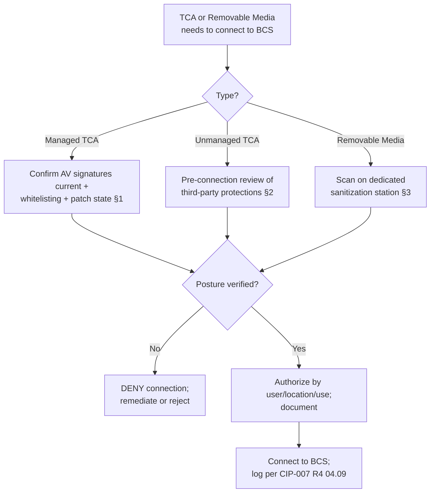

# 04.14 — Transient Cyber Assets & Removable Media (CIP-010-4 R4)

| Field | Value |
|---|---|
| Document ID | CIP-04.14 |
| Version | 1.0 |
| Date | 2026-03-02 |
| Classification | BES Cyber System Information (BCSI) // Illustrative Portfolio Sample |
| Owner | Marcus Bell (OT / ICS Security Lead) |
| Author | Advisory Team |
| Status | Approved |

## Purpose

This document defines how GridPoint Energy, Inc. ("GridPoint") satisfies **CIP-010-4 Requirement R4 and Attachment 1 — Transient Cyber Assets (TCA) and Removable Media**, mitigating the introduction of malicious code to the **14 Medium-impact BES Cyber Systems (BCS)** via portable devices such as maintenance laptops, engineering tablets, USB drives, and CDs. Implementing R4 closes **GAP-24** — TCA and removable-media controls not formally documented — from the Phase-02 gap register.

## What CIP-010-4 R4 Covers

CIP-010-4 R4 requires GridPoint to implement one or more documented plans, per **Attachment 1**, to mitigate the risk of malicious code introduced by:

- **Transient Cyber Assets (TCA)** — Cyber Assets not part of a BES Cyber System, capable of transmitting/transferring executable code, that connect to a BCS or associated PCA for ≤ 30 consecutive calendar days (e.g., a vendor or engineering laptop used for relay maintenance).
- **Removable Media** — storage media (USB flash drives, external drives, optical media) used with a BCS or associated Cyber Asset.

Attachment 1 splits TCA controls into **managed** (Section 1) and **unmanaged / third-party-managed** (Section 2) devices, and addresses **Removable Media** in **Section 3**.

## Managed vs. Unmanaged TCA

| Dimension | **Managed TCA** (Attachment 1 §1) | **Unmanaged TCA** (Attachment 1 §2) |
|---|---|---|
| Definition | GridPoint-owned/controlled portable device | Device managed by a party other than GridPoint (e.g., vendor-owned laptop) |
| Malicious-code mitigation | Ongoing/on-demand: antivirus with current signatures, application whitelisting, or other method | Reviewed **prior to connection**: vendor attestation, GridPoint pre-connection scan/review of the party's protections |
| Authorization | Documented authorization by user, location, and use | Documented per-use review before each connection |
| Patching / vulnerability mitigation | GridPoint applies patching or mitigation to the managed TCA | GridPoint reviews the third party's patch/AV posture before allowing connection |
| Typical GridPoint example | Field engineering laptop imaged and maintained by IT Security | Relay-vendor laptop brought on-site for firmware upgrade |

The central control difference: for **managed** TCA GridPoint *maintains* the protective posture continuously; for **unmanaged** TCA GridPoint cannot control the device, so it *inspects and authorizes at the point of connection* and denies connection if the posture cannot be verified.

## Attachment 1 Controls Implemented

| Section | Control Objective | GridPoint Implementation |
|---|---|---|
| §1.1 | Manage TCA (ongoing or on-demand) | Inventory of managed TCA; authorization by user/location/use |
| §1.2 | Mitigate software vulnerabilities on managed TCA | Patch/AV maintenance applied before use on a BCS |
| §1.3 | Mitigate malicious code on managed TCA | Signature-based AV plus application whitelisting where feasible |
| §1.4 | Mitigate unauthorized use of managed TCA | Access restricted to authorized personnel; device controls |
| §2.1 | Malicious-code mitigation for unmanaged TCA (other party) | Pre-connection vendor attestation or GridPoint review of protections |
| §2.2 | For unmanaged TCA, review the mitigation prior to connecting | Documented pre-connection review at the PSP/ESP boundary |
| §3.1 | Removable Media authorization | Authorized by user and location; only sanctioned media permitted |
| §3.2 | Removable Media malicious-code mitigation | Scanned on a dedicated sanitization/scanning station before use on any BCS |

## Removable Media Handling

GridPoint minimizes removable-media use in the OT environment. Where transfer is unavoidable, only GridPoint-sanctioned, inventoried media are permitted, and every item is scanned on a **dedicated malicious-code scanning/sanitization station** — isolated from the BES production environment — immediately before use on a BCS. Media use is authorized by user and location and logged. This directly mitigates the classic USB-borne malware vector into substation and control-center BCS and is the substance of the **GAP-24** closure.

## TCA & Removable-Media Inventory

GridPoint maintains an inventory of managed TCA and sanctioned Removable Media so that only known, authorized devices interact with the 14 Medium BCS. Unmanaged (third-party) TCA are not inventoried in advance but are logged per connection.

| Device Class | Ownership | Pre-Use Control | Authorization Basis |
|---|---|---|---|
| Field engineering laptop | GridPoint (managed) | Current AV signatures + whitelisting + patch state | User / location / use |
| Configuration tablet | GridPoint (managed) | Managed image; §1.2–§1.4 controls | User / location / use |
| Vendor maintenance laptop | Vendor (unmanaged) | Pre-connection review of vendor protections (§2) | Per-connection review |
| Sanctioned USB drive | GridPoint (managed) | Scan on dedicated sanitization station (§3.2) | User / location |
| Optical media | GridPoint (managed) | Scan before use; minimized | User / location |

## Interaction with the Low-Impact TCA Program

The 30-day TCA definition and the managed/unmanaged distinction described here apply to the Medium BCS in Phase 04. GridPoint's **Low-impact assets** (4 generation plants + 34 substations) are governed separately by the Transient Cyber Assets & Removable Media section of the **CIP-003 Attachment 1 Low-impact security plan** (Phase 03, 03.02). Keeping the two programs consistent — same sanitization station, same vendor-attestation practice — reduces operational error when field staff move between Medium and Low sites.

## Roles & Responsibilities

| Role | Person | R4 Responsibility |
|---|---|---|
| OT / ICS Security Lead | Marcus Bell | Owns the TCA/Removable-Media plan and the scanning station |
| IT Security Manager | Priya Nair | Images and maintains managed TCA; AV/whitelisting posture |
| Substation & Field Engineering Lead | Elena Ruiz | Enforces pre-connection review at substation PSPs |
| Physical Security Manager | Frank Delgado | Controls device entry at Physical Security Perimeters |
| CIP Senior Manager | Daniel Reyes | Accountable authority; approves the TCA/Removable-Media plan |
| Advisory Team | — | Designed the managed/unmanaged control model |

## Common Pitfalls Avoided

| Pitfall | GridPoint control |
|---|---|
| Vendor laptop connected with no posture check | Unmanaged-TCA pre-connection review (§2) or connection denied |
| USB drive used directly on a relay | Mandatory scan on dedicated sanitization station (§3.2) |
| Managed laptop with stale AV signatures | §1.2/§1.3 maintenance before any BCS use |
| Undocumented device connections | Authorization by user/location/use, logged per CIP-007 R4 |

## Cross-References

- `04.08-malicious-code-prevention-cip-007-r3.md` — endpoint malware prevention on BCS
- `04.09-security-event-monitoring-cip-007-r4.md` — connection and malware events logged
- `04.04-physical-security-plan-cip-006-r1.md` — PSP controls device entry
- `../03-policies-governance-personnel/03.02-low-impact-security-plan.md` — TCA controls for Low-impact assets (CIP-003 Att.1)
- `../02-bes-cyber-system-categorization/02.12-gap-register-and-risk-ranking.md` — GAP-24

---

[⬅ Previous](04.13-vulnerability-assessments-cip-010-r3.md) · [🏠 Phase README](04.00-README.md) · [Next ➡](04.15-incident-response-plan-cip-008.md)
