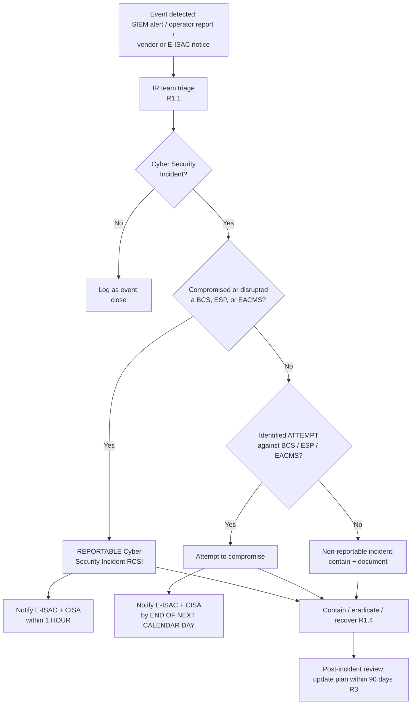

# 04.15 — Incident Response & Reporting Plan (CIP-008-6)

| Field | Value |
|---|---|
| Document ID | CIP-04.15 |
| Version | 1.0 |
| Date | 2026-03-02 |
| Classification | BES Cyber System Information (BCSI) // Illustrative Portfolio Sample |
| Owner | Karen Whitfield (NERC Compliance Manager) |
| Author | Advisory Team |
| Status | Approved |

## Purpose

This document is a **keystone** of GridPoint Energy, Inc.'s ("GridPoint") operational security program: the **Cyber Security Incident Response Plan** required by **CIP-008-6 — Incident Reporting and Response Planning**. It defines how GridPoint identifies, classifies, and responds to Cyber Security Incidents affecting its **14 Medium-impact BES Cyber Systems (BCS)**, its **3 Electronic Security Perimeters (ESPs)**, and its associated **EACMS (26)**; how it determines whether an incident is a **Reportable Cyber Security Incident** or an **attempt to compromise**; and how it meets the mandatory **E-ISAC and CISA reporting timelines**. Implementing CIP-008-6 closes **GAP-13** (no documented, tested incident-response plan); **GAP-27** (incident-response test evidence) remains **in progress** pending completion of the first full 15-month exercise cycle.

## CIP-008-6 Requirements Overview

| Requirement | Subject | GridPoint Implementation |
|---|---|---|
| **R1** | One or more documented Cyber Security Incident response plan(s) | This plan — identification, classification, roles, handling |
| **R2** | Implement and **test** each plan at least once every **15 calendar months**; use/retain records | Tabletop / operational exercise on a ≤ 15-month cycle; records retained |
| **R3** | Review, update, and communicate lessons learned within **90 calendar days** of a test or actual incident | Post-incident review; plan updated and re-communicated |
| **R4** | **Reportable Cyber Security Incident** and **attempt** notifications to **E-ISAC and CISA** | 1-hour / next-calendar-day notification workflow (below) |

## Key Definitions (used exactly)

- **Cyber Security Incident** — a malicious act or suspicious event that compromises, or attempts to compromise, the ESP or PSP, or disrupts the operation of a BES Cyber System.
- **Reportable Cyber Security Incident (RCSI)** — a Cyber Security Incident that **compromised or disrupted** one or more of: (i) a **BES Cyber System** that performs one or more reliability tasks of a functional entity; (ii) an **Electronic Security Perimeter**; or (iii) an **Electronic Access Control or Monitoring System (EACMS)**.
- **Attempt to compromise** — an identified attempt (that did not rise to an RCSI) against a BCS, ESP, or EACMS; introduced in CIP-008-6 and subject to next-calendar-day reporting.

## R1 — Incident Response Plan Content

| R1 Part | Requirement | GridPoint Implementation |
|---|---|---|
| **R1.1** | Process to identify, classify, and respond to Cyber Security Incidents | Detection via CIP-007 R4 SIEM alerts (04.09), operator reports, vendor/E-ISAC notices; triage against classification criteria |
| **R1.2** | Process to determine if an incident is an RCSI and whether it is an attempt to compromise; and initial notification per R4 | Classification decision tree (below) applied by the Incident Commander |
| **R1.3** | Roles and responsibilities of incident-response groups/individuals | Defined IR team with named roles (below) |
| **R1.4** | Incident handling: containment, eradication, and recovery | Playbooks for containment, eradication, recovery; links to CIP-009 recovery (04.16) |

## Incident Classification Decision

## R4 — Reporting Timelines (E-ISAC and CISA)

CIP-008-6 R4 requires notification to the **Electricity Information Sharing and Analysis Center (E-ISAC)** and the **Cybersecurity and Infrastructure Security Agency (CISA)** (successor to ICS-CERT/NCCIC). GridPoint applies these exact timelines:

| Classification | Notify | Deadline (initial notification) |
|---|---|---|
| **Reportable Cyber Security Incident** | E-ISAC **and** CISA | **Within 1 hour** of determination |
| **Attempt to compromise** (not an RCSI) | E-ISAC **and** CISA | **By the end of the next calendar day** after determination |

Each initial notification includes the required attributes to the extent known at the time — **functional impact, attack vector/method, and level of intrusion achieved or attempted** — with the notification supplemented as more information is developed. The determination of the deadline start is the moment GridPoint's IR team determines the incident is reportable (or is a reportable attempt), not necessarily the moment of first detection.

## R1.3 — Roles & Responsibilities

| Role | Person | IR Responsibility |
|---|---|---|
| Incident Commander | Marcus Bell (OT/ICS Security Lead) | Leads response; makes RCSI/attempt classification call |
| NERC Compliance Manager | Karen Whitfield | Owns the plan; ensures R4 reporting timelines are met and evidenced |
| IT Security Manager | Priya Nair | SIEM analysis, containment, eradication support |
| Control Center Operations Manager | James Okafor | Assesses BES operational/functional impact |
| Substation & Field Engineering Lead | Elena Ruiz | Field response at affected substation BCS |
| Physical Security Manager | Frank Delgado | Responds to PSP-related incidents |
| CIP Senior Manager | Daniel Reyes | Accountable authority; external/executive communications |
| Advisory Team | — | Facilitated plan development and exercise design |

## R1.4 — Incident Handling Lifecycle

| Phase | Activities |
|---|---|
| Detection & Analysis | SIEM alert / report intake; triage; classification (R1.1/R1.2) |
| Containment | Isolate affected BCS/ESP segment; preserve evidence/logs (CIP-007 R4 retention) |
| Eradication | Remove malicious code; close exploited vector; validate against baseline (CIP-010 R1) |
| Recovery | Restore per CIP-009 recovery plan (04.16); confirm BES reliability functions |
| Post-Incident | Lessons learned; update plan within 90 days (R3); re-communicate to IR team |

## R2 — Testing Every 15 Months

CIP-008-6 R2 requires each response plan to be **tested at least once every 15 calendar months** — by responding to an actual Reportable Cyber Security Incident, or by a **paper drill / tabletop exercise**, or by an **operational exercise**. GridPoint schedules a tabletop or operational exercise inside every 15-month window, retains the test records (scenario, participants, timeline, notification dry-run, findings), and drives findings into plan updates under R3. Completion of the first full exercise and retention of its evidence is what will move **GAP-27** from *in progress* to *closed* in Phase 05.

## R3 — Review, Update & Lessons Learned

Within **90 calendar days** of completing a test or responding to an actual incident, GridPoint documents lessons learned (or that none were identified), updates the plan and any roles/responsibilities/technology references, and communicates the updates to each person with a defined role. This continuous-improvement loop keeps the plan current with the evolving ESP/EACMS architecture and OT toolset.

## Initial Notification Content

To make the 1-hour deadline achievable under pressure, GridPoint uses a pre-formatted initial-notification template so responders capture the required CIP-008-6 attributes without drafting from scratch. Unknown fields are marked and supplemented as the investigation develops.

| Field | Content |
|---|---|
| Entity & registration | GridPoint Energy, Inc. — NCR11027; Regional Entity ReliabilityFirst |
| Classification | Reportable Cyber Security Incident **or** attempt to compromise |
| Functional impact | Effect on BES reliability tasks / operations, to the extent known |
| Attack vector / method | Observed or attempted vector (e.g., IRA, TCA-borne, malicious code) |
| Level of intrusion | Compromise achieved, attempted, or contained |
| Affected assets | BCS / ESP / EACMS involved (no unnecessary BCSI disclosure) |
| Point of contact | Incident Commander and Compliance Manager |

## Interfaces to the Broader Program

| Interface | Relationship |
|---|---|
| CIP-007 R4 monitoring (04.09) | SIEM alerting is the primary detection trigger for R1.1 |
| CIP-010 R2 monitoring (04.12) | Unauthorized configuration changes are escalated as candidate incidents |
| CIP-009 recovery (04.16) | Executes the recovery phase of the R1.4 lifecycle |
| CIP-003 R1 policy (03.01) | The Incident Reporting & Response policy governs this plan |
| Communications & escalation plan (01.11) | Provides the internal escalation and executive-notification chain |

## Evidence Produced

The plan itself, the 15-month test records, the 90-day review/update records, and — for any actual incident — the classification determination, the timestamped E-ISAC/CISA notifications, and the containment-through-recovery record. These are the primary artifacts presented against the CIP-008 RSAW at the ReliabilityFirst audit and constitute the **GAP-13** closure.

## Common Pitfalls Avoided

| Pitfall | GridPoint control |
|---|---|
| Missing the 1-hour RCSI notification | Pre-built E-ISAC/CISA notification workflow triggered at determination |
| Treating an attempt as non-reportable | Classification tree explicitly routes attempts to next-calendar-day reporting |
| Plan written but never tested | R2 tabletop/operational exercise every ≤ 15 months with retained records |
| Lessons learned lost after an incident | R3 review and plan update within 90 days, re-communicated to the team |
| Evidence purged before investigation | CIP-007 R4 90-day + 13-month log retention preserves incident evidence |

## Cross-References

- `04.09-security-event-monitoring-cip-007-r4.md` — SIEM alerts are the primary detection source
- `04.12-configuration-monitoring-cip-010-r2.md` — unauthorized changes escalate here
- `04.16-recovery-plan-cip-009.md` — recovery phase of the incident lifecycle
- `../03-policies-governance-personnel/03.01-cyber-security-policy-suite.md` — Incident Reporting & Response policy (CIP-003 R1)
- `../02-bes-cyber-system-categorization/02.07-associated-eacms-pacs-pca.md` — EACMS in RCSI scope
- `../02-bes-cyber-system-categorization/02.12-gap-register-and-risk-ranking.md` — GAP-13, GAP-27

---

[⬅ Previous](04.14-transient-cyber-assets-cip-010-r4.md) · [🏠 Phase README](04.00-README.md) · [Next ➡](04.16-recovery-plan-cip-009.md)
