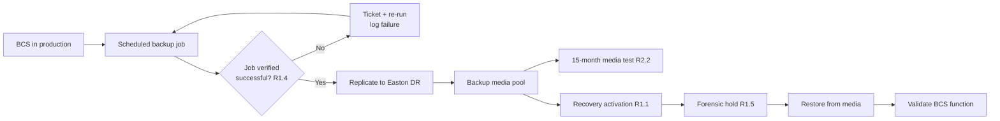

# 04.16 — Recovery Plans for BES Cyber Systems (CIP-009-6)

| Field | Value |
|---|---|
| Document ID | CIP-009-REC-2026-016 |
| Version | 1.0 |
| Date | 2026-03-02 |
| Classification | BES Cyber System Information (BCSI) // Illustrative Portfolio Sample |
| Owner | James Okafor, Control Center Operations Manager (with Marcus Bell, OT / ICS Security Lead) |
| Author | Advisory Team (OT GRC / NERC CIP Advisory) |
| Status | Approved |

## Purpose

This document establishes GridPoint Energy's **recovery plan program for BES Cyber Systems** under **CIP-009-6**. It defines the recovery plan specifications (R1), the recovery-plan implementation and testing regime (R2), and the recovery-plan review, update, and communication requirements (R3) for the **14 Medium-impact BES Cyber Systems** at the Millbrook (Primary) and Easton (Backup) Control Centers and the 8 Medium substations, together with their associated EACMS, PACS, and PCA. It documents backup and restoration procedures, backup media testing, and the **recovery test performed at least once every 15 calendar months**. This work **closes the CIP-009 implementation** except for two items carried as in-progress: **GAP-12 (Moderate)** recovery-plan update following a test, and **GAP-28 (Low)** backup restoration test evidence.

## 1. Regulatory Basis — CIP-009-6

CIP-009-6 requires a Responsible Entity to have one or more documented recovery plans for High- and Medium-impact BES Cyber Systems and their associated EACMS and PACS. GridPoint has **no High-impact assets**; the program applies to the **14 Medium BCS**.

| Requirement | Obligation (summary) | GridPoint Implementation |
|---|---|---|
| R1.1 | Conditions for activation of the recovery plan | Activation criteria tied to declared loss/degradation of a BCS (Section 3) |
| R1.2 | Roles and responsibilities of responders | Recovery Response Team defined (Section 7) |
| R1.3 | One or more processes for **backup and storage** of information required to recover BCS functionality | Documented backup procedures + offsite storage at Easton (Section 4) |
| R1.4 | Verify the successful completion of backup processes and **address any failures** | Automated backup job verification + failure ticketing (Section 4) |
| R1.5 | Preserve data for **determination of cause** of a Cyber Security Incident while allowing recovery | Forensic-hold step before re-image (Section 5) |
| R2.1 | Test each recovery plan at least once every **15 calendar months** | 15-month recovery test, buffered to 12 months (Section 6) |
| R2.2 | Test a representative sample of information used to recover BCS functionality at least once every 15 calendar months (i.e., **backup media testing**) | Backup restoration test on sampled media (Section 6) |
| R2.3 | Test each recovery plan at least once every **36 calendar months** through an operational exercise **(applies to High only — N/A)** | Not applicable; no High-impact BCS |
| R3.1 | Recovery plan review, update within **90 days** of a test/actual event, and communication of changes | Post-test after-action + 90-day update cycle (Section 8) — **GAP-12 in progress** |
| R3.2 | Update roles/responsibilities and notify affected parties within **60 days** of a change | Change-notification workflow (Section 8) |

## 2. Scope of Applicable Systems

| System class | Count | Recovery treatment |
|---|---|---|
| Medium BES Cyber Systems | 14 | Full CIP-009 recovery plan (R1–R3) |
| Associated EACMS | 26 | Backed up; recovery covered by plan |
| Associated PACS | 18 | Backed up; recovery covered by plan |
| Associated PCA | 60 | Configuration captured; restored per plan |
| Low-impact BCS | 38 | Out of CIP-009 scope; CIP-003 Attachment 1 only |

## 3. Recovery Plan Activation (R1.1 / R1.2)

| Trigger condition | Example | Activation authority |
|---|---|---|
| Loss of a Control Center BCS function | SCADA/EMS server cluster failure at Millbrook | Control Center Operations Manager |
| Corruption of a substation BCS baseline | Relay/RTU configuration corruption at a Medium substation | OT / ICS Security Lead |
| Ransomware / malicious event on BCS | Confirmed Reportable Cyber Security Incident (see 04.15) | CIP Senior Manager + IR Lead |
| Facility loss requiring failover | Loss of Millbrook → failover to Easton Backup Control Center | VP Grid Operations |

## 4. Backup & Restoration (R1.3 / R1.4)

| Attribute | Standard |
|---|---|
| Backup scope | Configurations, baselines (CIP-010 R1), OS/application images, EMS/SCADA databases, EACMS/PACS configs |
| Primary backup location | On-site backup infrastructure at each Control Center |
| Offsite/geographic separation | Replicated to the **Easton Backup Control Center** (DR site) |
| Cadence | Daily incremental / weekly full for Control Center BCS; change-triggered for substation BCS |
| Verification (R1.4) | Automated job status monitored via SIEM; failed jobs ticketed and re-run; failure log retained |
| Encryption / handling | Backups contain BCSI — stored, labeled, and access-controlled per CIP-011 (04.17) |
| Retention | Per Document & Evidence Management Plan (01.13) |

## 5. Preservation of Data for Cause Determination (R1.5)

Before any re-image or restoration that would overwrite evidence, the Recovery Response Team executes a **forensic-hold step**: capture volatile/system state, snapshot affected media, and preserve logs. This coordinates with the CIP-008 incident-response process (04.15) so that recovery does not destroy data needed to determine the cause of a Cyber Security Incident.

## 6. Recovery & Backup Media Testing (R2.1 / R2.2)

| Test | Cadence (regulatory) | GridPoint cadence | Method | Evidence |
|---|---|---|---|---|
| Recovery plan test (R2.1) | ≥ once / 15 calendar months | Every 12 months (3-month buffer) | Tabletop + partial technical restore in DR environment | Test plan, participant log, after-action report |
| Backup media / information test (R2.2) | ≥ once / 15 calendar months | Every 12 months | Restore a **representative sample** of backup media to isolated hardware; validate integrity | Restoration record, checksum validation — **GAP-28 in progress** |
| Operational exercise (R2.3) | High only | N/A | Not applicable at GridPoint | — |

## 7. Recovery Response Team (Roles)

| Role | Name | Responsibility |
|---|---|---|
| Recovery Plan Owner | James Okafor | Owns Control Center recovery plan; declares activation |
| OT / ICS Security Lead | Marcus Bell | Substation BCS recovery; forensic-hold coordination |
| IT Security Manager | Priya Nair | Backup infrastructure, restoration execution, verification |
| Substation & Field Engineering Lead | Elena Ruiz | Field recovery of relay/RTU baselines |
| NERC Compliance Manager | Karen Whitfield | Test scheduling, evidence retention, RSAW mapping |
| CIP Senior Manager | Daniel Reyes | Accountable authority; approves plan and updates |

## 8. Review, Update & Communication (R3)

| Trigger | Action | Deadline |
|---|---|---|
| Recovery plan test completed | After-action review; update plan for lessons learned | Within **90 calendar days** (R3.1) — **GAP-12 in progress** |
| Actual recovery event | Same after-action + update cycle | Within 90 calendar days |
| Change to roles/responsibilities or technology | Update plan; notify affected responders | Within **60 calendar days** (R3.2) |
| Annual governance | CIP Senior Manager review/approval | ≤ 15 months (aligned to policy cycle) |

## 9. Gap Closure

| Gap | Description | Status |
|---|---|---|
| GAP-12 (Moderate) | CIP-009 R3 recovery-plan update following test not yet completed | **In progress** — after-action captured; 90-day update underway; validated Phase 05 |
| GAP-28 (Low) | CIP-009 R2.2 backup restoration test evidence incomplete | **In progress** — sampled media restore scheduled; evidence pending |

CIP-009 recovery plan specification (R1), the recovery-plan test regime (R2), and the review/communication framework (R3) are **implemented and evidenced**; the two items above remain in progress and are tracked in 04.21 and carried to Phase 05 for validation.

## Cross-References

| Reference | Purpose |
|---|---|
| [04.11 — Configuration Baselines (CIP-010 R1)](04.11-configuration-baselines-cip-010-r1.md) | Baselines are the recovery target state |
| [04.15 — Incident Response Plan (CIP-008)](04.15-incident-response-plan-cip-008.md) | R1.5 cause-determination / forensic coordination |
| [04.17 — BCSI Information Protection (CIP-011)](04.17-bcsi-information-protection-cip-011.md) | Backups contain BCSI — protection and disposal |
| [04.20 — Implemented Control Evidence Collection](04.20-implemented-control-evidence-collection.md) | Recovery test and backup evidence artifacts |
| [02.12 — Gap Register & Risk Ranking](../02-bes-cyber-system-categorization/02.12-gap-register-and-risk-ranking.md) | GAP-12 / GAP-28 source |
| [01.13 — Document & Evidence Management Plan](../01-program-foundation/01.13-document-and-evidence-management-plan.md) | Backup and evidence retention |

---

[⬅ Previous](04.15-incident-response-plan-cip-008.md) · [🏠 Phase README](04.00-README.md) · [Next ➡](04.17-bcsi-information-protection-cip-011.md)
