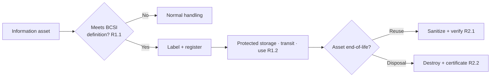

# 04.17 — BES Cyber System Information Protection (CIP-011-3)

| Field | Value |
|---|---|
| Document ID | CIP-011-BCSI-2026-017 |
| Version | 1.0 |
| Date | 2026-03-02 |
| Classification | BES Cyber System Information (BCSI) // Illustrative Portfolio Sample |
| Owner | Marcus Bell, OT / ICS Security Lead (with Priya Nair, IT Security Manager) |
| Author | Advisory Team (OT GRC / NERC CIP Advisory) |
| Status | Approved |

## Purpose

This document establishes GridPoint Energy's **BES Cyber System Information (BCSI) protection program** under **CIP-011-3**. It defines the method to **identify** BCSI (R1.1), the procedures to **protect and securely handle** BCSI during storage, transit, and use (R1.2), and the process to prevent unauthorized retrieval of BCSI from Cyber Assets and media at **reuse and disposal** (R2). The program applies to BCSI pertaining to the **14 Medium-impact BES Cyber Systems** and their associated **EACMS (26)** and **PACS (18)**. It builds on the BCSI labeling standard and CIP-004-7 R6 provisioned-access controls established in Phase 03 (03.09). This work **closes GAP-06 (High)** — BCSI handling on engineering file shares — and **closes GAP-29** (BCSI labeling/handling), completing the item partially addressed in Phase 03.

## 1. Regulatory Basis — CIP-011-3

| Requirement | Obligation (summary) | GridPoint Implementation |
|---|---|---|
| R1 | One or more documented **information protection program(s)** | This document + BCSI handling procedure (Sections 3–5) |
| R1.1 | **Method(s) to identify** BCSI | BCSI identification criteria + designated storage register (Section 3) |
| R1.2 | **Method(s) to protect and securely handle** BCSI, including storage, transit, and use | Handling matrix across lifecycle (Section 4) |
| R2 | Prior to **release for reuse** or **disposal**, prevent unauthorized retrieval of BCSI | Media sanitization + disposal procedure (Section 5) |
| R2.1 | **Reuse:** take action to prevent unauthorized BCSI retrieval before release for reuse outside the entity | Sanitize/verify before redeployment (Section 5) |
| R2.2 | **Disposal:** take action to prevent unauthorized BCSI retrieval before disposal | Destroy/degauss + certificate of destruction (Section 5) |

## 2. Scope — Where BCSI Lives

| BCSI repository | Contents | Access control |
|---|---|---|
| OT engineering file share (restricted) | ESP/network diagrams, relay/RTU configs | Provisioned per CIP-004 R6; encrypted; restricted ACL — **remediated under GAP-06** |
| Configuration management repository | CIP-010 baselines, change records | Role-based; audit-logged |
| Privileged access management (PAM) vault | Credentials, account inventories | MFA; break-glass logged |
| Compliance evidence repository | Categorization list, RSAW evidence (~260 artifacts) | BCSI-controlled; see 04.20 |
| Backup / DR media (Easton) | BCS images and databases | Encrypted; physical PSP; disposal per R2 |
| Physical BCSI (printed) | Cover-sheeted documents | Locked cabinet within a PSP |

## 3. Identification of BCSI (R1.1)

BCSI is information about a BES Cyber System that could be used to gain unauthorized access to, or pose a security threat to, the BES Cyber System, and that is **not** publicly available. GridPoint applies the following identification method:

| Step | Action | Owner |
|---|---|---|
| 1 | Author/originator assesses content against the BCSI definition and examples | Content owner |
| 2 | If BCSI, apply the **BCSI label** (03.09 labeling standard) and storage-location tag | Content owner |
| 3 | Register the artifact/location in the **BCSI storage-location register** | Karen Whitfield |
| 4 | Periodic sweep of engineering shares to detect unlabeled BCSI | Marcus Bell / Priya Nair |

## 4. Protection & Secure Handling (R1.2)

| Lifecycle state | Control | Standard |
|---|---|---|
| Storage | Encryption at rest; restricted ACLs; designated storage locations only | AES-256 or platform-equivalent |
| Transit (electronic) | Encrypted transport (TLS/VPN); no BCSI over unencrypted email | Encrypted channels only |
| Transit (physical) | Sealed, labeled, tracked chain of custody | Courier log / hand-carry receipt |
| Use | Least-privilege; no BCSI on unauthorized/personal devices; screen-lock | CIP-004 R6 provisioned access |
| Sharing with vendors | NDA + CIP-013 procurement controls; minimum necessary | See 04.18 |
| Copies / working files | Discouraged; if made, labeled and tracked; deleted when done | Handling procedure |

## 5. Reuse & Disposal (R2)

| Scenario | Action | Verification / Evidence |
|---|---|---|
| Redeploy a Cyber Asset internally | Sanitize BCSI-bearing media (secure wipe) | Wipe log; verification scan |
| Release for reuse outside GridPoint | Secure wipe to standard; prevent retrieval (R2.1) | Sanitization certificate |
| Disposal of failed/retired media | Physical destruction / degauss (R2.2) | Certificate of destruction; asset-disposal record |
| Printed BCSI disposal | Cross-cut shred | Destruction log |

## 6. Roles & Responsibilities

| Role | Name | Responsibility |
|---|---|---|
| OT / ICS Security Lead | Marcus Bell | Program owner; OT share remediation (GAP-06); identification sweeps |
| IT Security Manager | Priya Nair | Encryption, ACLs, media sanitization/disposal execution |
| NERC Compliance Manager | Karen Whitfield | BCSI storage-location register; evidence; RSAW mapping |
| HR / PRA Coordinator | Sandra Lee | Prerequisite training/PRA for BCSI access (CIP-004) |
| CIP Senior Manager | Daniel Reyes | Accountable authority; approves the protection program |

## 7. Relationship to CIP-004-7 R6

CIP-004-7 R6 (03.09) governs **who** may have provisioned access to designated BCSI storage locations and the 15-month verification of that access. **CIP-011-3** governs **how** the information itself is identified, handled, and destroyed across its lifecycle. Together they form the complete BCSI control set.

## 8. Gap Closure

| Gap | Description | Status |
|---|---|---|
| GAP-06 (High) | CIP-011 R1 BCSI handling procedure not applied to engineering file shares | **Closed** — shares encrypted, ACL-restricted, labeled, swept for unlabeled BCSI |
| GAP-29 (Low) | CIP-011 BCSI labeling/handling (partially closed in Phase 03) | **Closed** — full identification, handling, reuse/disposal program delivered |

## Cross-References

| Reference | Purpose |
|---|---|
| [03.09 — BCSI Access Management (CIP-004 R6)](../03-policies-governance-personnel/03.09-bcsi-access-management.md) | Provisioned-access half + labeling standard |
| [04.16 — Recovery Plans (CIP-009)](04.16-recovery-plan-cip-009.md) | Backups contain BCSI |
| [04.18 — Supply Chain Risk Management (CIP-013)](04.18-supply-chain-risk-management-cip-013.md) | Sharing BCSI with vendors |
| [04.20 — Implemented Control Evidence Collection](04.20-implemented-control-evidence-collection.md) | BCSI-controlled evidence repository |
| [02.12 — Gap Register & Risk Ranking](../02-bes-cyber-system-categorization/02.12-gap-register-and-risk-ranking.md) | GAP-06 / GAP-29 source |
| [01.13 — Document & Evidence Management Plan](../01-program-foundation/01.13-document-and-evidence-management-plan.md) | Storage, retention, disposal alignment |

---

[⬅ Previous](04.16-recovery-plan-cip-009.md) · [🏠 Phase README](04.00-README.md) · [Next ➡](04.18-supply-chain-risk-management-cip-013.md)
