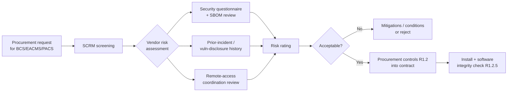

# 04.18 — Supply Chain Risk Management (CIP-013-2)

| Field | Value |
|---|---|
| Document ID | CIP-013-SCRM-2026-018 |
| Version | 1.0 |
| Date | 2026-03-02 |
| Classification | BES Cyber System Information (BCSI) // Illustrative Portfolio Sample |
| Owner | Priya Nair, IT Security Manager (with Karen Whitfield, NERC Compliance Manager) |
| Author | Advisory Team (OT GRC / NERC CIP Advisory) |
| Status | Approved |

## Purpose

This document establishes GridPoint Energy's **supply chain cyber security risk management (SCRM) plan** under **CIP-013-2**. It defines how GridPoint identifies and assesses cyber security risk from vendor products and services (R1.1), the security concepts embedded into procurement and contracting (R1.2), and the periodic review and CIP Senior Manager approval of the plan (R2/R3). The plan applies to the planning and procurement of **Medium-impact BES Cyber Systems** and their associated **EACMS and PACS**. This work **closes GAP-14 (Moderate)**; **GAP-32 (Low)** — completing vendor contract security clauses across the existing supplier base — remains **in progress**.

## 1. Regulatory Basis — CIP-013-2

| Requirement | Obligation (summary) | GridPoint Implementation |
|---|---|---|
| R1 | Develop documented **supply chain cyber security risk management plan(s)** for Medium/High BCS and associated EACMS/PACS | This SCRM plan (Sections 3–6) |
| R1.1 | Process to identify and assess cyber security risk from **(i) procuring and installing** vendor equipment/software and **(ii) transitions** between vendors | Vendor risk-assessment methodology (Section 3) |
| R1.2 | Process to address, in procurement, the six security concepts (R1.2.1–R1.2.6) | Procurement control set (Section 4) |
| R1.2.1 | Vendor **notification of vendor-identified incidents** | Contract clause + intake workflow |
| R1.2.2 | Coordination of response to vendor-identified incidents | Joint response provisions |
| R1.2.3 | Vendor **notification when remote/onsite access should no longer be granted** | Access-termination notice clause |
| R1.2.4 | Disclosure of **known vulnerabilities** | Vulnerability disclosure clause |
| R1.2.5 | **Software integrity and authenticity** verification | Hash/signature verification (Section 5) |
| R1.2.6 | Coordination of controls for **vendor remote access** (interactive and system-to-system) | Ties to CIP-005 R2 (04.03) |
| R2 | Implement the plan; procurement obligation | Applied to all in-scope procurements |
| R3 | CIP Senior Manager review/approve the plan at least once every **15 calendar months** | Governance cycle (Section 6) |

## 2. Vendor Population in Scope

| Category | Example | In scope |
|---|---|---|
| BCS OEM / EMS-SCADA vendor | Control-center EMS/SCADA platform | Yes |
| Relay / RTU manufacturers | Substation protection & control | Yes |
| EACMS / firewall vendors | ESP firewalls, Intermediate System | Yes |
| PACS vendors | Badge/access-control systems | Yes |
| Managed-service / remote-support vendors | Vendor Interactive Remote Access | Yes |
| General IT / office suppliers | Non-BCS commodity IT | No (out of CIP-013 scope) |

Vendors/contractors with authorized access carried from Phase 03: **18**.

## 3. Vendor Risk Assessment (R1.1)

| Assessment element | Detail |
|---|---|
| Trigger | Procurement or installation of vendor BCS/EACMS/PACS equipment or software; vendor transitions |
| Inputs | Security questionnaire, SBOM, incident/vulnerability history, financial/geopolitical risk |
| Output | Documented risk rating with required mitigations/conditions |
| Reassessment | On renewal, major change, or a vendor-reported incident |

## 4. Procurement Controls (R1.2)

| Concept | Contract / procurement control | Reference |
|---|---|---|
| R1.2.1 Incident notification | Vendor must notify GridPoint of vendor-identified incidents affecting delivered products/services | Section 2 clause |
| R1.2.2 Coordinated response | Defined roles/contacts for joint incident response | CIP-008 alignment (04.15) |
| R1.2.3 Access termination notice | Vendor notifies when its personnel no longer need remote/onsite access | CIP-004 R5 alignment |
| R1.2.4 Vulnerability disclosure | Vendor discloses known vulnerabilities in delivered products | VA program (04.13) |
| R1.2.5 Software integrity/authenticity | Verify hashes/digital signatures before install/update | Section 5 |
| R1.2.6 Vendor remote access | Coordinate controls for interactive and system-to-system remote access | CIP-005 R2 (04.03) |

## 5. Software Integrity & Authenticity (R1.2.5)

| Step | Action |
|---|---|
| 1 | Obtain software/firmware and vendor-published hash/signature from a trusted source |
| 2 | Verify digital signature and/or compare cryptographic hash before installation |
| 3 | Reject or quarantine artifacts that fail verification; notify vendor |
| 4 | Record verification result in the change record (CIP-010 R1, 04.11) |

## 6. Governance, Review & Roles (R2 / R3)

| Attribute | Value |
|---|---|
| Plan review & approval | CIP Senior Manager (Daniel Reyes) at least once every **15 calendar months** |
| Internal cadence | Annual review with quarterly SCRM intake reporting |
| Evidence | Risk assessments, contract clauses, integrity-verification records → RSAW-mapped (04.20) |

| Role | Name | Responsibility |
|---|---|---|
| SCRM Plan Owner | Priya Nair | Vendor assessments, software integrity, plan maintenance |
| NERC Compliance Manager | Karen Whitfield | Evidence, 15-month review scheduling, RSAW mapping |
| OT / ICS Security Lead | Marcus Bell | Vendor remote-access coordination (R1.2.6) |
| Procurement / Contracts | Contracts function | Embeds R1.2 clauses; tracks GAP-32 backfill |
| CIP Senior Manager | Daniel Reyes | Reviews and approves the SCRM plan |

## 7. Gap Closure

| Gap | Description | Status |
|---|---|---|
| GAP-14 (Moderate) | CIP-013 SCRM plan and procurement controls not established | **Closed** — SCRM plan, risk methodology, and R1.2 controls implemented |
| GAP-32 (Low) | CIP-013 vendor contract security clauses incomplete across existing suppliers | **In progress** — new procurements compliant; legacy-contract backfill underway; validated Phase 05 |

## Cross-References

| Reference | Purpose |
|---|---|
| [04.03 — Interactive Remote Access (CIP-005 R2)](04.03-interactive-remote-access-cip-005-r2.md) | R1.2.6 vendor remote-access coordination |
| [04.13 — Vulnerability Assessments (CIP-010 R3)](04.13-vulnerability-assessments-cip-010-r3.md) | R1.2.4 vulnerability disclosure intake |
| [04.15 — Incident Response Plan (CIP-008)](04.15-incident-response-plan-cip-008.md) | R1.2.1/R1.2.2 incident coordination |
| [04.17 — BCSI Information Protection (CIP-011)](04.17-bcsi-information-protection-cip-011.md) | Sharing BCSI with vendors |
| [02.12 — Gap Register & Risk Ranking](../02-bes-cyber-system-categorization/02.12-gap-register-and-risk-ranking.md) | GAP-14 / GAP-32 source |
| [01.04 — Applicable Reliability Standards Register](../01-program-foundation/01.04-applicable-reliability-standards-register.md) | CIP-013-2 applicability |

---

[⬅ Previous](04.17-bcsi-information-protection-cip-011.md) · [🏠 Phase README](04.00-README.md) · [Next ➡](04.19-critical-station-physical-security-cip-014.md)
