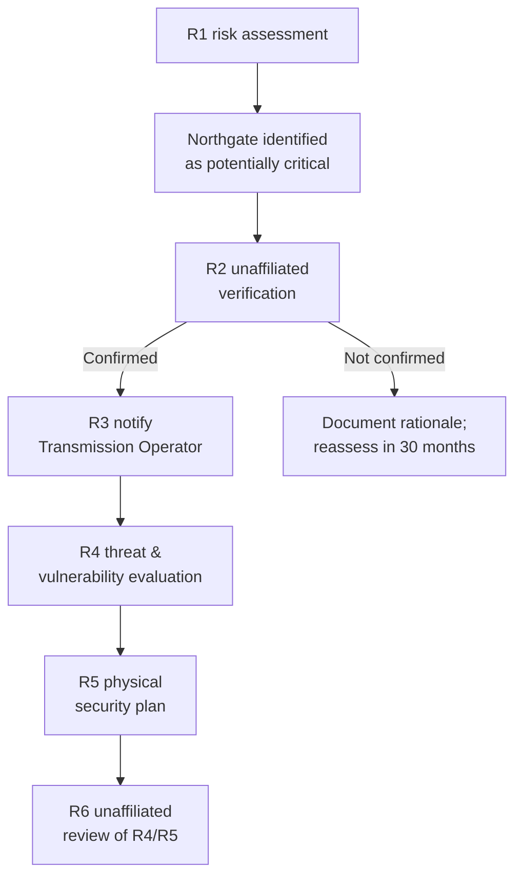

# 04.19 — Critical Transmission Station Physical Security (CIP-014-3)

| Field | Value |
|---|---|
| Document ID | CIP-014-PHYS-2026-019 |
| Version | 1.0 |
| Date | 2026-03-02 |
| Classification | BES Cyber System Information (BCSI) // Illustrative Portfolio Sample |
| Owner | Frank Delgado, Physical Security Manager (with Elena Ruiz, Substation & Field Engineering Lead) |
| Author | Advisory Team (OT GRC / NERC CIP Advisory) |
| Status | Approved |

## Purpose

This document establishes GridPoint Energy's approach under **CIP-014-3**, which addresses the **physical security of Transmission stations and substations that, if rendered inoperable or damaged, could result in instability, uncontrolled separation, or Cascading** within an Interconnection. It documents the **applicability evaluation (R1)**, the requirement for **independent third-party verification (R2)**, the **threat and vulnerability evaluation and physical security plan (R4/R5)** for any station that survives verification, and the associated third-party review of that plan (R6). GridPoint's initial R1 evaluation identified **one (1) potentially critical 345 kV substation — Northgate** — as the candidate requiring verification.

> CIP-014 is distinct from CIP-006. CIP-006 protects the **Physical Security Perimeters around BES Cyber Systems**; CIP-014 protects the **physical integrity of the station itself** against physical attack (e.g., firearms, forced entry) where loss of the station could cascade across the grid.

## 1. Regulatory Basis — CIP-014-3

| Requirement | Obligation (summary) | GridPoint status |
|---|---|---|
| R1 | Perform a **risk assessment** to identify Transmission stations/substations meeting the applicability criteria that could cause instability/separation/Cascading; reassess every **30 months** (with unaffiliated verification) | Completed; 1 candidate — **Northgate** (Section 3) |
| R2 | Have an **unaffiliated third party verify** the R1 risk assessment | Independent licensed engineering firm engaged; verification **scheduled** (Section 4) |
| R3 | If verification confirms criticality, notify the applicable **Transmission Operator** of primary control | Notification process defined (Section 4) |
| R4 | Conduct an **evaluation of threats and vulnerabilities** (physical attack) for each confirmed station | Methodology defined; runs on confirmation (Section 5) |
| R5 | Develop and implement a **documented physical security plan** for each confirmed station | Plan framework prepared (Section 6) |
| R6 | Have an **unaffiliated third party review** the R4 evaluation and R5 physical security plan | Third-party review scheduled post-confirmation |

## 2. Applicability Universe

CIP-014 applies to Transmission stations/substations operated at **500 kV**, or at **200 kV–499 kV** meeting the interconnection/weighting thresholds of CIP-014-3 Attachment 1 criteria, plus certain primary-control Control Centers. GridPoint's footprint:

| Asset class | Count | CIP-014 candidacy |
|---|---|---|
| 345 kV Medium substations | 8 | Screened against R1 criteria |
| Highest-consequence 345 kV node | 1 — **Northgate** | **Potentially critical** — proceeds to R2 verification |
| Remaining 345 kV substations | 7 | Not identified as critical in R1 |
| 138 kV / Low substations | 34 | Below CIP-014 voltage/consequence thresholds |
| Control Centers | 2 | Not primary-control per the R1 criteria applied |

## 3. R1 Risk Assessment — Northgate 345 kV Substation

| Attribute | Detail |
|---|---|
| Station | **Northgate 345 kV Substation** |
| Why identified | Highest-consequence node; power-flow/contingency screening indicated potential for instability, uncontrolled separation, or Cascading if rendered inoperable |
| Method | Transmission planning contingency analysis (steady-state and dynamic) consistent with CIP-014-3 R1 guidance |
| Result | **1** station identified as potentially critical; proceeds to R2 |
| Reassessment cadence | At least once every **30 months** (subsequent cycles with unaffiliated verification) |

## 4. Independent Third-Party Verification (R2 / R3)

| Attribute | Detail |
|---|---|
| Verifier | An **independent licensed engineering firm** (unaffiliated with GridPoint), with appropriate transmission-planning or physical-security expertise |
| Scope | Verify the R1 risk-assessment methodology and conclusions for Northgate |
| Possible outcomes | (a) Concur — Northgate confirmed critical → proceed to R4/R5/R6; (b) Recommend changes — GridPoint modifies or documents rationale |
| Documentation | Verifier findings and GridPoint's disposition retained as evidence |
| R3 notification | If confirmed, notify the **Transmission Operator** that has operational control of Northgate |

## 5. Threat & Vulnerability Evaluation (R4)

Runs upon R2 confirmation. The evaluation of potential physical-attack threats and vulnerabilities considers:

| Factor | Consideration |
|---|---|
| Threat sources | Prior incidents/intelligence, standoff attack (firearms), forced entry, insider |
| Site vulnerabilities | Sightlines, perimeter, critical-equipment exposure (transformers, control house) |
| Consequence | Restoration time, spares/long-lead equipment, grid impact |
| Existing controls | Fencing, lighting, surveillance, intrusion detection, response times |

## 6. Physical Security Plan (R5) & Third-Party Review (R6)

| Plan element (R5) | Content |
|---|---|
| Resiliency / security measures | Layered deterrence, detection, delay, and response for the confirmed station |
| Law-enforcement coordination | Contacts and notification protocols with local/utility police |
| Timeline | Implementation schedule with milestones |
| Provisions for evolving threat | Periodic re-evaluation as threats change |
| R6 review | Unaffiliated third party reviews the R4 evaluation and R5 plan; findings dispositioned |

## 7. Roles & Responsibilities

| Role | Name | Responsibility |
|---|---|---|
| Physical Security Manager | Frank Delgado | Owns CIP-014 program; R4/R5 development and implementation |
| Substation & Field Engineering Lead | Elena Ruiz | R1 contingency analysis; station engineering input |
| VP Grid Operations | Robert Tan | Transmission planning oversight; TOP notification (R3) |
| NERC Compliance Manager | Karen Whitfield | Verifier engagement, evidence, RSAW mapping |
| CIP Senior Manager | Daniel Reyes | Accountable authority; approves plan |
| Independent Verifier | Independent licensed engineering firm | R2 verification and R6 review |

## 8. Relationship to CIP-006

| Standard | Protects | GridPoint scope |
|---|---|---|
| CIP-006-6 (04.04, 04.05) | Physical Security Perimeters around BES Cyber Systems | **10 PSPs** (2 control centers + 8 Medium substations) |
| CIP-014-3 (this document) | Physical integrity of critical Transmission stations against physical attack | **1** candidate station — Northgate |

## 9. Status

CIP-014-3 R1 risk assessment is **complete** (1 potentially critical station — Northgate); R2 independent verification is **scheduled** with an independent licensed engineering firm. R4/R5/R6 activities are framework-ready and execute upon confirmation. This is an applicability-and-readiness deliverable rather than a Phase-02 gap closure; status is tracked in 04.21 and carried to Phase 05.

## Cross-References

| Reference | Purpose |
|---|---|
| [04.04 — Physical Security Plan (CIP-006 R1)](04.04-physical-security-plan-cip-006-r1.md) | Distinction from PSP protection |
| [04.05 — Physical Access Monitoring (CIP-006 R2)](04.05-physical-access-monitoring-cip-006-r2.md) | Monitoring at Medium substations |
| [02.06 — High/Medium/Low Categorization List](../02-bes-cyber-system-categorization/02.06-high-medium-low-categorization-list.md) | 345 kV substation identification |
| [04.20 — Implemented Control Evidence Collection](04.20-implemented-control-evidence-collection.md) | CIP-014 evidence artifacts |
| [01.04 — Applicable Reliability Standards Register](../01-program-foundation/01.04-applicable-reliability-standards-register.md) | CIP-014-3 applicability |

---

[⬅ Previous](04.18-supply-chain-risk-management-cip-013.md) · [🏠 Phase README](04.00-README.md) · [Next ➡](04.20-implemented-control-evidence-collection.md)
