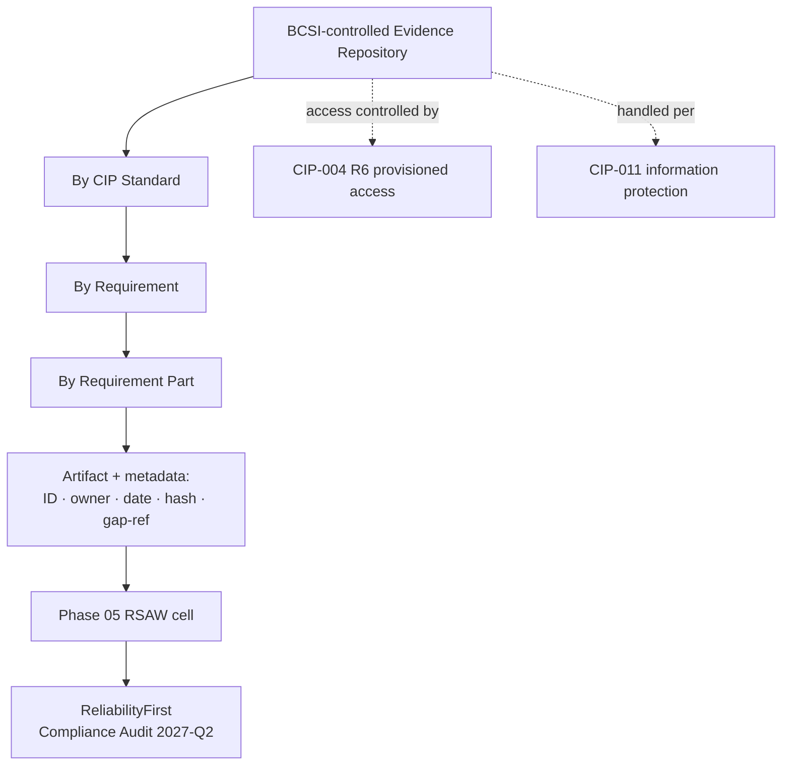

# 04.20 — Implemented Control Evidence Collection

| Field | Value |
|---|---|
| Document ID | CIP-EVID-2026-020 |
| Version | 1.0 |
| Date | 2026-03-02 |
| Classification | BES Cyber System Information (BCSI) // Illustrative Portfolio Sample |
| Owner | Karen Whitfield, NERC Compliance Manager (with Marcus Bell, OT / ICS Security Lead) |
| Author | Advisory Team (OT GRC / NERC CIP Advisory) |
| Status | Approved |

## Purpose

This is the **keystone evidence document** for Phase 04. It describes GridPoint Energy's **implemented-control evidence program**: the **~260 evidence artifacts** collected during technical and physical control implementation, how each artifact is **mapped to the specific CIP Standard and Requirement part** it substantiates, the **evidence types** collected, the **BCSI-controlled evidence repository** and its access model, the **chain-of-custody** discipline that preserves audit defensibility, and how the corpus **maps forward to the Reliability Standard Audit Worksheets (RSAWs)** assembled in **Phase 05**. Well-organized evidence is what converts implemented controls into a defensible position before the **ReliabilityFirst Compliance Audit (2027-Q2)**.

## 1. Evidence Program Objectives

| Objective | How met |
|---|---|
| Every applicable requirement part is substantiated | Artifacts mapped to the 118 applicable requirement parts (Medium + Low) |
| Evidence is authentic and tamper-evident | Chain of custody, hashing, versioning (Section 6) |
| Evidence is retrievable for RSAW assembly | Structured repository indexed by Standard → Requirement → Part (Section 4) |
| Evidence is itself protected | BCSI-controlled repository; CIP-004 R6 provisioned access; CIP-011 handling |
| Evidence demonstrates *operation*, not just design | Dated logs, signed reviews, test records, screenshots over the measurement period |

## 2. Evidence Volume & Coverage

| Metric | Value |
|---|---|
| Total evidence artifacts collected & mapped | **~260** |
| Applicable CIP requirement parts (Medium + Low) | **118** |
| Requirement parts met at baseline (Phase 02) | 84 (71%) |
| Gaps identified at baseline | 34 |
| Gaps closed cumulatively (Phase 03 + Phase 04) | **28 of 34** |
| Gaps in progress (validated Phase 05, mitigated Phase 06) | **6** |
| CIP-014 critical-station candidates evidenced | **1** (Northgate) |

## 3. Evidence-by-Standard Map

The ~260 artifacts distribute across the applicable Standards as follows (illustrative allocation; each artifact is individually indexed to its requirement part).

| CIP Standard | Version | Primary requirement parts evidenced | Representative artifacts | Approx. artifacts |
|---|---|---|---|---|
| CIP-002 Categorization | 5.1a | R1, R2 | Categorization list, asset inventory, 15-month review record | ~15 |
| CIP-003 Security Mgmt Controls | 8 | R1, R2 (Att.1 Lows) | 9-policy suite, Low-impact plan, CIP SM approvals | ~20 |
| CIP-004 Personnel & Training | 7 | R1–R6 | Training records, PRA register, access authorizations, quarterly reviews | ~30 |
| CIP-005 ESP & Remote Access | 7 | R1, R2, R3 | ESP diagrams, EAP configs, Intermediate System/MFA, IRA logs | ~25 |
| CIP-006 Physical Security | 6 | R1, R2, R3 | PSP definitions, PACS logs (≥90 days), visitor logs, maintenance/testing | ~20 |
| CIP-007 System Security Mgmt | 6 | R1–R5 | Ports/services baselines, 35-day patch records, malware prevention, SIEM, account mgmt | ~35 |
| CIP-008 Incident Reporting & Response | 6 | R1–R4 | IR plan, test/after-action, E-ISAC/CISA notification procedure | ~12 |
| CIP-009 Recovery Plans | 6 | R1–R3 | Recovery plan, backup verification, recovery & media test records | ~15 |
| CIP-010 Config & Vuln Mgmt | 4 | R1–R4 | 14 baselines, change records, monitoring, 15-month VA, TCA/RM | ~30 |
| CIP-011 Information Protection | 3 | R1, R2 | BCSI ID method, handling procedure, sanitization/disposal certs | ~12 |
| CIP-013 Supply Chain | 2 | R1–R3 | SCRM plan, vendor risk assessments, integrity-verification records | ~10 |
| CIP-014 Physical Security | 3 | R1–R6 | R1 risk assessment (Northgate), verifier engagement | ~6 |
| **Total** | — | **118 parts** | — | **~260** |

## 4. Evidence Types & Repository Structure

| Evidence type | Examples | Demonstrates |
|---|---|---|
| Documented processes/plans | Policies, plans, procedures | Design of the control (existence) |
| Records/logs | PACS access logs, IRA session logs, SIEM alerts, backup job logs | Operation of the control over time |
| Signed attestations/reviews | Quarterly access reviews, 15-month policy/plan approvals | Governance and periodic performance |
| Test artifacts | IR test after-action, recovery test, media restore | Control tested at required cadence |
| Configuration exports | Baselines, firewall rules, account inventories | Technical state of BCS/EACMS |
| Screenshots/photographs | MFA prompts, PSP hardware, badge readers | Point-in-time verification |
| Certificates | Sanitization/destruction, third-party verification | Assured completion |

The **evidence repository** is organized so any RSAW line can be traced to its backing artifacts:

## 5. Artifact Metadata Standard

Every artifact carries a metadata record so it is self-describing and audit-traceable.

| Field | Purpose |
|---|---|
| Artifact ID | Unique identifier (Standard-Req-Part-seq) |
| CIP mapping | Standard → Requirement → Part substantiated |
| Evidence type | From the Section 4 taxonomy |
| Owner / custodian | Accountable individual |
| Date / measurement period | Supports cadence proof (e.g., 15-month, quarterly, ≥90-day retention) |
| Integrity hash | SHA-256 checksum for tamper-evidence |
| Version | Change history |
| Gap reference | Linked GAP-xx if the artifact closes/tracks a gap |
| Classification | BCSI // Illustrative Portfolio Sample |

## 6. Chain of Custody & Integrity

| Control | Standard |
|---|---|
| Ingestion | Artifacts logged into the repository with owner, source system, and timestamp |
| Integrity | SHA-256 hash recorded at ingestion; re-verified before RSAW submission |
| Versioning | Superseded artifacts retained; no silent overwrite |
| Access | CIP-004 R6 provisioned access; least-privilege; access reviewed every 15 months |
| Handling | CIP-011 protection in storage/transit/use; BCSI labeling |
| Retention | Per Document & Evidence Management Plan (01.13); through audit period + margin |
| Custody transfer | Logged hand-off when shared with RF audit team (read-only, controlled) |

## 7. Mapping to RSAWs (Phase 05)

The **Reliability Standard Audit Worksheet (RSAW)** is the form ReliabilityFirst uses per Standard. Each RSAW requires the entity to describe its compliance and cite evidence. GridPoint's repository is pre-indexed to RSAW structure so Phase 05 assembles rather than hunts.

| Phase 04 output | Phase 05 use |
|---|---|
| Standard → Requirement → Part index | Directly populates each RSAW's evidence cells |
| Artifact metadata (date/period) | Demonstrates cadence and continuous operation |
| Gap references | Feeds mitigation narrative for the 6 in-progress gaps |
| Integrity hashes | Supports authenticity assertions during the audit |

| Standard | RSAW readiness | Notes |
|---|---|---|
| CIP-002 / 003 / 004 | Ready | Established in Phases 02–03; evidence current |
| CIP-005 / 006 / 007 / 010 | Ready | High gaps GAP-01/03/04 closed; GAP-21 IRA logging in progress |
| CIP-008 | Ready | GAP-27 IR test evidence in progress |
| CIP-009 | Ready | GAP-12 update / GAP-28 media test in progress |
| CIP-011 | Ready | GAP-06 / GAP-29 closed |
| CIP-013 | Ready | GAP-14 closed; GAP-32 contract clauses in progress |
| CIP-014 | Partial | R1 done (Northgate); R2 verification scheduled |

## 8. Evidence Supporting Gap Closure

| Category | Gaps | Evidence status |
|---|---|---|
| High (5 remaining into Phase 04) | GAP-01, 02, 03, 04, 06 | **All closed** — each backed by dated implementation + operating evidence |
| Moderate | 10 of 12 closed | GAP-12, GAP-21 in progress (evidence being accrued) |
| Low | 5 of 9 closed | GAP-27, GAP-28, GAP-32, GAP-29 — GAP-29 now closed; 3 in progress |
| **Cumulative** | **28 of 34 closed** | **6 in progress**, evidence tracked to closure |

## 9. Roles & Responsibilities

| Role | Name | Responsibility |
|---|---|---|
| Evidence Program Owner | Karen Whitfield | Repository, indexing, RSAW mapping, retention |
| OT / ICS Security Lead | Marcus Bell | Technical evidence (CIP-005/007/010) custody |
| IT Security Manager | Priya Nair | System exports, integrity hashing, backups |
| Physical Security Manager | Frank Delgado | CIP-006/014 physical evidence |
| CIP Senior Manager | Daniel Reyes | Accountable authority; attests evidence completeness |

## Cross-References

| Reference | Purpose |
|---|---|
| [04.21 — Control Implementation Status Tracker](04.21-control-implementation-status-tracker.md) | Status behind the evidence |
| [04.15 — Incident Response Plan (CIP-008)](04.15-incident-response-plan-cip-008.md) | CIP-008 evidence source |
| [04.16 — Recovery Plans (CIP-009)](04.16-recovery-plan-cip-009.md) | Recovery/backup evidence |
| [04.17 — BCSI Information Protection (CIP-011)](04.17-bcsi-information-protection-cip-011.md) | Repository handling controls |
| [02.10 — Applicability Matrix](../02-bes-cyber-system-categorization/02.10-applicability-matrix.md) | 118 applicable requirement parts |
| [02.12 — Gap Register & Risk Ranking](../02-bes-cyber-system-categorization/02.12-gap-register-and-risk-ranking.md) | Gap references on artifacts |
| [01.13 — Document & Evidence Management Plan](../01-program-foundation/01.13-document-and-evidence-management-plan.md) | Retention and custody baseline |
| [05.00 — Internal Compliance Assessment README](../05-internal-compliance-assessment/05.00-README.md) | RSAW assembly consumes this corpus |

---

[⬅ Previous](04.19-critical-station-physical-security-cip-014.md) · [🏠 Phase README](04.00-README.md) · [Next ➡](04.21-control-implementation-status-tracker.md)
