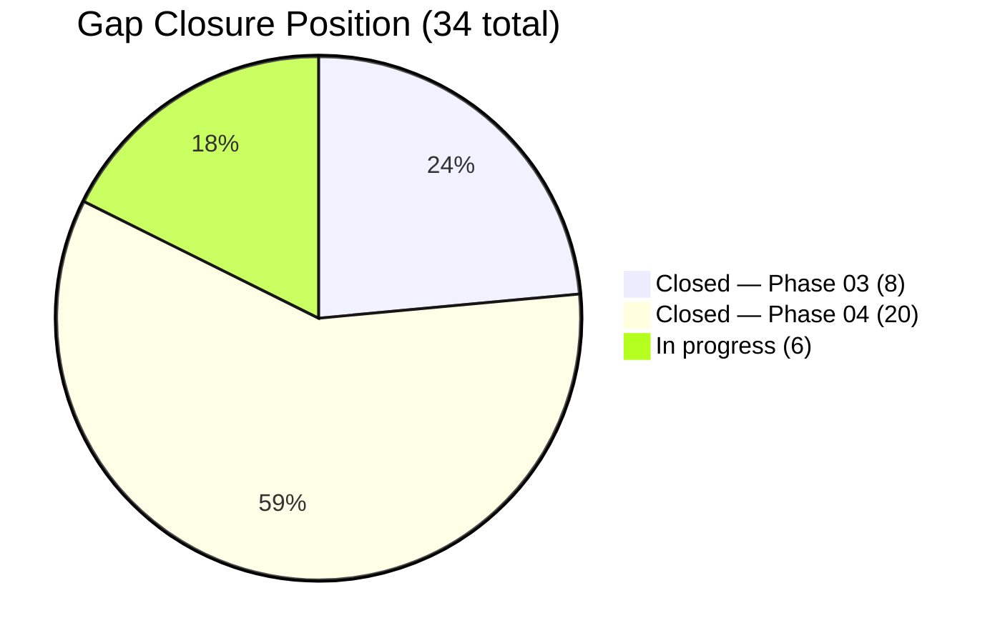
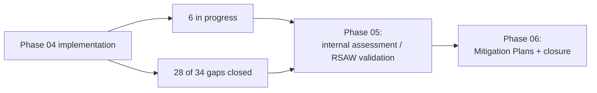

# 04.21 — Control Implementation Status Tracker

| Field | Value |
|---|---|
| Document ID | CIP-STATUS-2026-021 |
| Version | 1.0 |
| Date | 2026-03-02 |
| Classification | BES Cyber System Information (BCSI) // Illustrative Portfolio Sample |
| Owner | Karen Whitfield, NERC Compliance Manager (with Daniel Reyes, CIP Senior Manager) |
| Author | Advisory Team (OT GRC / NERC CIP Advisory) |
| Status | Approved |

## Purpose

This document provides the **consolidated control implementation status** across all applicable NERC CIP Standards and requirements for GridPoint Energy's **14 Medium-impact BES Cyber Systems**, **38 Low-impact BCS**, and associated **EACMS (26)**, **PACS (18)**, and **PCA (60)**. It reports control status by Standard, the **cumulative gap-closure position (28 of 34 gaps closed; 6 in progress)**, and the disposition of the **6 remaining gaps** carried into Phase 05 (validation) and Phase 06 (mitigation). It is the single-pane status companion to the evidence corpus in 04.20.

## 1. Overall Position

| Metric | Value |
|---|---|
| Applicable CIP requirement parts (Medium + Low) | **118** |
| Baseline met (Phase 02) | 84 (71%) |
| Gaps at baseline | 34 (6 High · 15 Moderate · 13 Low) |
| Closed in Phase 03 | 8 |
| Closed in Phase 04 | 20 |
| **Cumulative closed** | **28 of 34** |
| **In progress** | **6** (2 Moderate + 4 Low) |
| Remaining High gaps | **0** — all closed |
| Evidence artifacts collected | ~260 |

## 2. Status by CIP Standard

| Standard | Version | Applicability | Implementation status | Phase 04 doc |
|---|---|---|---|---|
| CIP-002 Categorization | 5.1a | Med + Low | Complete (baselined Phase 02) | 02.09 |
| CIP-003 Security Mgmt Controls | 8 | Med + Low | Complete (Phase 03) | 03.01 / 03.02 |
| CIP-004 Personnel & Training | 7 | Medium | Complete (Phase 03) | 03.03–03.10 |
| CIP-005 ESP & Remote Access | 7 | Medium | **Implemented** — 3 ESPs, 6 EAPs, IRA via Intermediate System + MFA | 04.02 / 04.03 |
| CIP-006 Physical Security | 6 | Medium | **Implemented** — 10 PSPs, PACS logs ≥90 days | 04.04 / 04.05 |
| CIP-007 System Security Mgmt | 6 | Medium | **Implemented** — ports/services, 35-day patch, malware, SIEM, accounts | 04.06–04.10 |
| CIP-008 Incident Reporting & Response | 6 | Med + Low | **Implemented** — E-ISAC/CISA 1-hour reporting; test cadence | 04.15 |
| CIP-009 Recovery Plans | 6 | Medium | **Implemented** — backup/restore, 15-month test (GAP-12/28 in progress) | 04.16 |
| CIP-010 Config & Vuln Mgmt | 4 | Medium | **Implemented** — 14 baselines, monitoring, 15-month VA, TCA/RM | 04.11–04.14 |
| CIP-011 Information Protection | 3 | Medium | **Implemented** — BCSI ID, handling, reuse/disposal | 04.17 |
| CIP-013 Supply Chain | 2 | Medium | **Implemented** — SCRM plan (GAP-32 in progress) | 04.18 |
| CIP-014 Physical Security | 3 | 1 station | **R1 complete** (Northgate); R2 verification scheduled | 04.19 |

## 3. High-Risk Gap Disposition (All Closed)

| Gap | Standard / part | Description | Closure |
|---|---|---|---|
| GAP-01 | CIP-005 R2 | Vendor IRA lacked Intermediate System / MFA at 2 substations | **Closed** — all IRA via Intermediate System + MFA + encryption |
| GAP-02 | CIP-007 R2 | Patch-evaluation cycle exceeded 35 days | **Closed** — 35-day cycle with patch sources + mitigation plans |
| GAP-03 | CIP-010 R1 | Config baselines incomplete for 10 Medium substation BCS | **Closed** — 14 baselines complete with change management |
| GAP-04 | CIP-006 R1 | Physical access controls at 1 Medium substation not fully monitored | **Closed** — PACS monitoring extended; logs ≥90 days |
| GAP-05 | CIP-004 R4/R5 | Access authorization/revocation records incomplete | **Closed in Phase 03** |
| GAP-06 | CIP-011 R1 | BCSI handling not applied to engineering file shares | **Closed** — encrypted, ACL-restricted, labeled, swept |

## 4. Moderate & Low Closures in Phase 04

| Severity | Closed in Phase 04 | Count |
|---|---|---|
| Moderate | GAP-07, 08, 09, 10, 13, 14, 15, 16, 17, 19 | 10 of 12 |
| Low | GAP-23, 24, 25, 31, 33 (+ GAP-29 completed) | 5 of 9 |

## 5. Remaining Gaps In Progress (6)

| Gap | Severity | Standard / part | Description | Path to closure |
|---|---|---|---|---|
| GAP-12 | Moderate | CIP-009 R3 | Recovery-plan update following test | 90-day update underway → Phase 05 validate |
| GAP-21 | Moderate | CIP-005 R2 | IRA session logging completeness | Log source tuning → Phase 05 validate |
| GAP-27 | Low | CIP-008 R2 | IR test evidence | Test after-action being finalized |
| GAP-28 | Low | CIP-009 R2.2 | Backup restoration test evidence | Sampled media restore scheduled |
| GAP-32 | Low | CIP-013 R1.2 | Vendor contract security clauses (legacy) | Contract backfill in procurement |
| GAP-29 | Low | CIP-011 | BCSI final handling | **Now closed** in 04.17 — remaining items rolled into GAP-27/28/32 tracking |

> Net in-progress items validated in Phase 05 and formally mitigated in Phase 06: **GAP-12, GAP-21, GAP-27, GAP-28, GAP-32** plus CIP-014 R2 verification completion — **6 open workstreams**.

## 6. Roles & Responsibilities

| Role | Name | Responsibility |
|---|---|---|
| Status Tracker Owner | Karen Whitfield | Maintains tracker; reconciles to evidence (04.20) |
| OT / ICS Security Lead | Marcus Bell | Technical control status (CIP-005/007/009/010) |
| Physical Security Manager | Frank Delgado | CIP-006/014 status |
| IT Security Manager | Priya Nair | CIP-011/013 supporting status |
| CIP Senior Manager | Daniel Reyes | Accountable authority; approves status position |

## Cross-References

| Reference | Purpose |
|---|---|
| [04.20 — Implemented Control Evidence Collection](04.20-implemented-control-evidence-collection.md) | Evidence behind each status |
| [04.16 — Recovery Plans (CIP-009)](04.16-recovery-plan-cip-009.md) | GAP-12 / GAP-28 detail |
| [04.18 — Supply Chain Risk Management (CIP-013)](04.18-supply-chain-risk-management-cip-013.md) | GAP-32 detail |
| [02.12 — Gap Register & Risk Ranking](../02-bes-cyber-system-categorization/02.12-gap-register-and-risk-ranking.md) | Master gap register |
| [02.13 — Pre-Implementation Remediation Roadmap](../02-bes-cyber-system-categorization/02.13-pre-implementation-remediation-roadmap.md) | Original remediation plan |
| [05.00 — Internal Compliance Assessment README](../05-internal-compliance-assessment/05.00-README.md) | Validation of in-progress gaps |

---

[⬅ Previous](04.20-implemented-control-evidence-collection.md) · [🏠 Phase README](04.00-README.md) · [Next ➡](04.22-phase-summary-and-transition.md)
