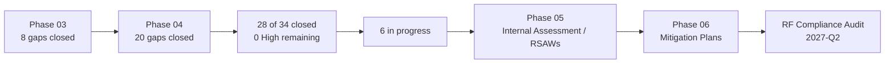

# 04.22 — Phase Summary & Transition

| Field | Value |
|---|---|
| Document ID | CIP-P04-SUMMARY-2026-022 |
| Version | 1.0 |
| Date | 2026-03-02 |
| Classification | BES Cyber System Information (BCSI) // Illustrative Portfolio Sample |
| Owner | Daniel Reyes, CIP Senior Manager |
| Author | Advisory Team (OT GRC / NERC CIP Advisory) |
| Status | Approved |

## Purpose

This document closes **Phase 04 — Technical & Physical Control Implementation** for GridPoint Energy and transitions the program to **Phase 05 — Internal Compliance Assessment (RSAWs)**. It summarizes the controls implemented for the 14 Medium-impact BES Cyber Systems and associated EACMS/PACS/PCA, the gap-closure position, the evidence base assembled, and the readiness posture for internal assessment ahead of the **ReliabilityFirst Compliance Audit (2027-Q2)**.

## 1. What Phase 04 Delivered

| Domain | Standard | Outcome |
|---|---|---|
| Electronic Security Perimeter & remote access | CIP-005-7 | 3 ESPs, 6 EAPs; all IRA via Intermediate System + MFA + encryption |
| Physical security | CIP-006-6 | 10 PSPs; monitored PACS; access logs retained ≥90 days |
| System security management | CIP-007-6 | Ports/services baselines, 35-day patch cycle, malware prevention, SIEM, account control |
| Incident response | CIP-008-6 | IR plan; E-ISAC/CISA 1-hour reporting; 15-month test cadence |
| Recovery | CIP-009-6 | Backup/restoration, 15-month recovery & media testing |
| Config & vulnerability | CIP-010-4 | 14 baselines, change monitoring, 15-month paper VA, TCA/RM controls |
| Information protection | CIP-011-3 | BCSI identification, handling, reuse/disposal program |
| Supply chain | CIP-013-2 | SCRM plan; vendor risk, procurement controls, software integrity |
| Critical-station physical security | CIP-014-3 | R1 complete — 1 candidate (Northgate); R2 verification scheduled |
| Evidence | All | **~260 artifacts** mapped to requirement parts; RSAW-ready |

## 2. Gap Closure Position

| Measure | Value |
|---|---|
| Remaining High gaps at Phase 04 start | 5 |
| **High gaps closed in Phase 04** | **All 5** (GAP-01, 02, 03, 04, 06) |
| Cumulative gaps closed (Phase 03 + 04) | **28 of 34** |
| In progress into Phase 05 | **6** (2 Moderate + 4 Low) |

## 3. Remaining In-Progress Items

| Gap | Severity | Standard | Disposition |
|---|---|---|---|
| GAP-12 | Moderate | CIP-009 R3 | Recovery-plan update (90-day) underway |
| GAP-21 | Moderate | CIP-005 R2 | IRA session logging completeness |
| GAP-27 | Low | CIP-008 R2 | IR test evidence finalization |
| GAP-28 | Low | CIP-009 R2.2 | Backup restoration test evidence |
| GAP-32 | Low | CIP-013 R1.2 | Legacy vendor contract clause backfill |
| CIP-014 R2 | N/A | CIP-014-3 | Independent third-party verification of Northgate |

All six are validated in Phase 05 and formally mitigated in Phase 06.

## 4. Readiness for Phase 05

| Readiness factor | Status |
|---|---|
| Controls implemented & operating | Yes — all applicable Medium/Low controls |
| Evidence collected & indexed to requirement parts | Yes — ~260 artifacts, BCSI-controlled repository |
| Evidence pre-mapped to RSAW structure | Yes — Standard → Requirement → Part |
| Open items tracked with owners and paths | Yes — 6 in-progress workstreams |
| CIP Senior Manager attestation | Approved by Daniel Reyes |

## 5. Key Figures at Phase Close

| Figure | Value |
|---|---|
| Medium BES Cyber Systems controlled | 14 |
| Low BES Cyber Systems (CIP-003 Att.1) | 38 |
| Associated EACMS / PACS / PCA | 26 / 18 / 60 |
| ESPs / EAPs | 3 / 6 |
| PSPs (control centers + Medium substations) | 10 |
| CIP-010 baselines | 14 |
| CIP-014 critical-station candidates | 1 (Northgate) |
| Evidence artifacts | ~260 |
| Gaps closed cumulatively | 28 of 34 |
| Gaps in progress | 6 |

## 6. Sign-Off

| Role | Name | Attestation |
|---|---|---|
| CIP Senior Manager | Daniel Reyes | Approves Phase 04 controls, evidence, and status position |
| NERC Compliance Manager | Karen Whitfield | Confirms evidence corpus indexed and RSAW-ready |
| OT / ICS Security Lead | Marcus Bell | Confirms technical controls implemented and operating |
| Physical Security Manager | Frank Delgado | Confirms CIP-006/014 physical controls |

## 7. Transition to Phase 05

Phase 05 (**Internal Compliance Assessment**) performs a mock audit: complete the **RSAWs** per Standard using the Phase 04 evidence corpus, test control operation, validate the 6 in-progress items, and surface any residual findings before the ReliabilityFirst audit. The evidence index (04.20) and status tracker (04.21) are the direct inputs. Any findings feed **Phase 06 Mitigation Plans**, keeping GridPoint on track for a no-violation outcome at the **2027-Q2** audit.

## Cross-References

| Reference | Purpose |
|---|---|
| [04.20 — Implemented Control Evidence Collection](04.20-implemented-control-evidence-collection.md) | Evidence corpus for RSAWs |
| [04.21 — Control Implementation Status Tracker](04.21-control-implementation-status-tracker.md) | Detailed status and gaps |
| [04.00 — Phase 04 README](04.00-README.md) | Phase overview |
| [02.12 — Gap Register & Risk Ranking](../02-bes-cyber-system-categorization/02.12-gap-register-and-risk-ranking.md) | Master gap register |
| [05.00 — Internal Compliance Assessment README](../05-internal-compliance-assessment/05.00-README.md) | Next phase entry point |

---

[⬅ Previous](04.21-control-implementation-status-tracker.md) · [🏠 Phase README](04.00-README.md) · [Next ➡](../05-internal-compliance-assessment/05.00-README.md)
