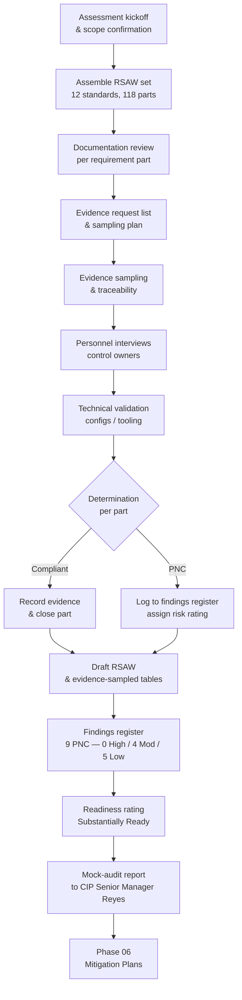

# 05.01 — Internal Assessment Plan & Methodology

| Field | Value |
|---|---|
| Document ID | CIP-05.01 |
| Version | 1.0 |
| Date | 2026-03-02 |
| Classification | BES Cyber System Information (BCSI) // Illustrative Portfolio Sample |
| Owner | Karen Whitfield (NERC Compliance Manager) |
| Author | Advisory Team |
| Status | Approved |

## Purpose

This document defines the plan and methodology for GridPoint Energy's **internal (mock) compliance assessment** — the structured rehearsal conducted before the **ReliabilityFirst (RF) Compliance Audit scheduled for 2027-Q2**. The internal assessment applies the same instruments RF will use — the **Reliability Standard Audit Worksheet (RSAW)** for each applicable standard — to independently review documentation, sample and validate evidence, interview control owners, and test controls. The output is a **findings register of Potential Noncompliance (PNC)** and a program **readiness rating** that feeds Mitigation Plan development in Phase 06.

This assessment operates within the **Compliance Monitoring and Enforcement Program (CMEP)** framework and treats the internal review as a *self-assessment* monitoring method, deliberately mirroring a Compliance Audit so that GridPoint is audit-ready with defensible, mapped evidence.

## Scope

| Scope element | Value |
|---|---|
| Registered Entity | GridPoint Energy, Inc. (NCR11027) |
| Regional Entity | ReliabilityFirst (RF) |
| Functional registrations assessed | GO, GOP, TO, TOP, DP |
| Impact levels in scope | Medium (14 BCS) and Low (38 BCS) — **52 BES Cyber Systems**, no High |
| Applicable CIP requirement **parts** assessed | **118** |
| RSAWs produced | **12** (CIP-002, -003, -004, -005, -006, -007, -008, -009, -010, -011, -013) |
| CIP-014 | Assessed **separately as in-progress** (Northgate risk assessment + independent verification pending) |
| Assessment period | Audit period covering control implementation through 2026-Q4 |
| Associated systems in scope | EACMS 26 · PACS 18 · PCA 60 · BCAs ~420 |

The 118 requirement parts derive directly from the Phase-02 applicability matrix and baseline gap assessment. The assessment reconciles each part to at least one evidence artifact drawn from the **~260 artifacts** collected in Phase 04.

### Standards-to-RSAW mapping

| RSAW | Standard (version) | Primary requirements covered |
|---|---|---|
| RSAW CIP-002 | CIP-002-5.1a | R1 (categorization), R2 (15-month review) |
| RSAW CIP-003 | CIP-003-8 | R1 (policies), R2 (Low-impact Attachment 1), R3/R4 (CIP Senior Manager, delegations) |
| RSAW CIP-004 | CIP-004-7 | R1–R6 (awareness, training, PRA, access mgmt, revocation, BCSI) |
| RSAW CIP-005 | CIP-005-7 | R1 (ESP), R2 (IRA / vendor remote access), R3 (malicious-comms detection) |
| RSAW CIP-006 | CIP-006-6 | R1 (physical security plan), R2 (visitor control / monitoring), R3 (PACS maintenance/testing) |
| RSAW CIP-007 | CIP-007-6 | R1 (ports/services), R2 (patch mgmt), R3 (malicious code), R4 (event monitoring), R5 (system access control) |
| RSAW CIP-008 | CIP-008-6 | R1–R4 (IR plan, implementation, review/update, notification) |
| RSAW CIP-009 | CIP-009-6 | R1–R3 (recovery plan, implementation/testing, review/update) |
| RSAW CIP-010 | CIP-010-4 | R1 (baselines), R2 (monitoring), R3 (VA), R4 (TCA/RM) |
| RSAW CIP-011 | CIP-011-3 | R1 (information protection), R2 (reuse/disposal) |
| RSAW CIP-013 | CIP-013-2 | R1 (SCRM plan), R2 (implementation), R3 (15-month review) |

## Assessment Methods

The internal assessment uses the four evidence-gathering methods RF auditors apply, per CMEP practice:

1. **RSAW documentation review** — For each standard, complete the RF-published RSAW: restate each requirement part, describe GridPoint's implementation in the *Registered Entity Response*, and list cited evidence. The assessor records a **compliance determination** (Compliant / Potential Noncompliance) per part.
2. **Evidence sampling** — Rather than review every record, the assessor pulls a defensible sample per requirement part (see 05.03 for sampling methodology) and traces each sampled item to source. Sampling targets high-population, recurring controls (quarterly reviews, patch cycles, access logs, PRAs).
3. **Personnel interviews** — Structured walkthroughs with control owners to confirm the documented process matches operating practice and to test for undocumented compensating controls or hidden gaps.
4. **Technical validation** — Direct inspection of configurations and tooling (ESP firewall rulesets, Intermediate System MFA enforcement, SIEM log retention, PACS access logs, baseline management) to confirm controls operate as documented rather than merely as written.

### Determination criteria

| Determination | Meaning |
|---|---|
| **Compliant** | Requirement part met; evidence complete, dated, and traceable across the audit period. |
| **Potential Noncompliance (PNC)** | Evidence gap, control lapse, or documentation deficiency that, if presented to RF, could be assessed as a possible violation. Logged to the findings register with a risk rating (High / Moderate / Low). |
| **Area of Concern** | Not a PNC, but a weakness that could mature into one; noted for internal tracking. |

## Interview Schedule (Control Owners)

| Control owner | Role | RSAW areas |
|---|---|---|
| Marcus Bell | OT / ICS Security Lead | CIP-005, CIP-007, CIP-010 |
| Priya Nair | IT Security Manager | CIP-005, CIP-007 (EACMS), CIP-011 |
| Frank Delgado | Physical Security Manager | CIP-006, CIP-014 |
| Sandra Lee | HR / PRA Coordinator | CIP-004 (R3 PRA, R4/R5 access) |
| Elena Ruiz | Substation & Field Engineering Lead | CIP-002, CIP-006, CIP-010 |
| James Okafor | Control Center Operations Manager | CIP-008, CIP-009 |
| Daniel Reyes | CIP Senior Manager | CIP-003 (policy approval, delegations); receives final mock-audit report |

## Assessment Process Flow

## Schedule

| Stage | Timing | Output |
|---|---|---|
| Planning & scoping | 2026-Q4, weeks 1–2 | This plan; RSAW set assembled |
| Documentation review | Weeks 2–5 | Draft RSAW Registered Entity Responses |
| Evidence sampling & validation | Weeks 4–8 | Populated evidence-sampled tables |
| Interviews & technical testing | Weeks 5–8 | Walkthrough notes; config inspection results |
| Findings consolidation | Weeks 8–9 | Findings register (9 PNC) |
| Reporting & readiness rating | Weeks 9–10 | Mock-audit report to Daniel Reyes |
| Transition to remediation | 2026-Q4 close | Handoff to Phase 06 Mitigation Plans |

## Roles & Responsibilities

| Role | Party | Responsibility |
|---|---|---|
| Assessment lead | Advisory Team | Design methodology, run RSAWs, render determinations |
| Compliance authority | Karen Whitfield | Coordinate evidence, own findings register, liaise to RF |
| Independent reviewers | Advisory Team + Whitfield | Objective assessment, **independent of implementers** (Bell/Nair) — see 05.02 |
| Control owners | Bell, Nair, Delgado, Lee, Ruiz, Okafor | Produce evidence, support interviews, validate technical claims |
| Accountable authority | Daniel Reyes (CIP Senior Manager) | Receives mock-audit report; sponsors Mitigation Plans |

## Expected Outcome

The assessment confirms the **6 in-progress Phase-04 gaps** (2 Moderate + 4 Low) and independently surfaces additional items during sampling, producing **9 PNC findings (0 High · 4 Moderate · 5 Low)** and an overall readiness rating of **"Substantially Ready."** Because no High-risk finding exists and all 9 PNCs are remediable via Mitigation Plans before 2027-Q2, GridPoint enters the RF audit window with a defensible posture.

## Cross-References

- [`../02-bes-cyber-system-categorization/02.10-applicability-matrix.md`](../02-bes-cyber-system-categorization/02.10-applicability-matrix.md) — source of the 118 applicable parts.
- [`../02-bes-cyber-system-categorization/02.12-gap-register-and-risk-ranking.md`](../02-bes-cyber-system-categorization/02.12-gap-register-and-risk-ranking.md) — gap register the PNCs reconcile against.
- [`../04-technical-physical-control-implementation/04.20-implemented-control-evidence-collection.md`](../04-technical-physical-control-implementation/04.20-implemented-control-evidence-collection.md) — ~260 evidence artifacts.
- [`05.02-assessment-team-and-independence.md`](05.02-assessment-team-and-independence.md) — team and independence.
- [`05.15-findings-register-and-risk-exposure.md`](05.15-findings-register-and-risk-exposure.md) — consolidated 9 PNCs.

---
[⬅ Previous](05.00-README.md) · [🏠 Phase README](05.00-README.md) · [Next ➡](05.02-assessment-team-and-independence.md)
