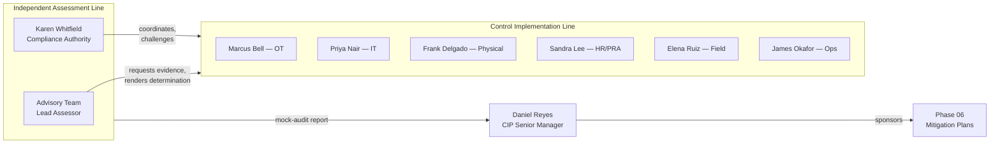

# 05.02 — Assessment Team & Independence

| Field | Value |
|---|---|
| Document ID | CIP-05.02 |
| Version | 1.0 |
| Date | 2026-03-02 |
| Classification | BES Cyber System Information (BCSI) // Illustrative Portfolio Sample |
| Owner | Karen Whitfield (NERC Compliance Manager) |
| Author | Advisory Team |
| Status | Approved |

## Purpose

This document identifies the **internal assessment team**, defines each member's role, and — most importantly — establishes the **independence of the assessors from the control implementers**. Independence is the single most valuable property of a mock audit: it forces the same skeptical, evidence-first posture that ReliabilityFirst (RF) auditors will apply in 2027-Q2. If the people who built and operate the controls also grade them, the assessment loses objectivity and the RF audit becomes the first genuine test — precisely the outcome this phase exists to prevent.

## Assessment Team

| Member | Function | Role in the assessment | Independent of implementation? |
|---|---|---|---|
| Advisory Team | OT-GRC / NERC CIP advisory (external) | Assessment lead; designs methodology, executes RSAWs, renders compliance determinations, drafts the mock-audit report | **Yes** — external advisor, did not build or operate GridPoint's OT controls |
| Karen Whitfield | NERC Compliance Manager | Compliance authority; coordinates evidence collection, owns the findings register, mirrors the RF single-point-of-contact role | **Yes** — compliance/oversight function, not a control operator |

The two-party structure mirrors an RF audit team: an **independent lead assessor** (Advisory Team) paired with the **entity's compliance liaison** (Whitfield), who marshals evidence and answers on behalf of the Registered Entity. This is a rehearsal for exactly how GridPoint will interact with RF.

## Control Implementers (Assessed, Not Assessing)

The following control owners are **subjects** of the assessment. They provide evidence and support interviews and technical validation, but they do **not** render determinations on their own work.

| Implementer | Role | Controls they own (assessed) |
|---|---|---|
| Marcus Bell | OT / ICS Security Lead | CIP-005 ESP & IRA, CIP-007 system security, CIP-010 baselines |
| Priya Nair | IT Security Manager | EACMS, IRA infrastructure, event monitoring, BCSI systems |
| Frank Delgado | Physical Security Manager | CIP-006 PSPs, PACS, CIP-014 |
| Sandra Lee | HR / PRA Coordinator | CIP-004 PRA, access authorization/revocation records |
| Elena Ruiz | Substation & Field Engineering Lead | CIP-002 asset data, substation physical/config controls |
| James Okafor | Control Center Operations Manager | CIP-008 incident response, CIP-009 recovery |

## Independence Model

The key separation: the **assessment line** (Advisory Team + Whitfield) is organizationally distinct from the **implementation line** (Bell, Nair, and the other control owners). Determinations flow *up* to the CIP Senior Manager, **Daniel Reyes**, who receives the mock-audit report as the single accountable authority (CIP-003 R1). Reyes sponsors remediation but did not perform the assessment, preserving a clean separation between accountability, assessment, and implementation.

## Why Independence Matters — as an RF Audit Rehearsal

| Reason | Explanation |
|---|---|
| **Objectivity** | Assessors have no stake in a "pass" verdict, so they surface uncomfortable findings (e.g., PNC-06 audit-log review gaps, PNC-02 IRA logging) rather than rationalize them away. |
| **Evidence discipline** | An independent reviewer accepts only what an RF auditor would accept — dated, complete, traceable records — not the implementer's assurance that "it's handled." |
| **Realistic rehearsal** | RF auditors are strangers to GridPoint's controls. An independent internal team reproduces that cold-eyes scrutiny, so the RF audit holds no surprises. |
| **Segregation of duties** | Separating "build" from "check" is itself an internal-controls best practice and a positive signal of program maturity to RF. |
| **Defensible findings** | Findings rendered independently carry more weight with the CIP Senior Manager and RF than self-graded results, strengthening the Mitigation Plan case. |

## Assessor Competencies

An assessment is only as credible as the assessors' ability to read evidence the way RF will. The team's relevant competencies:

| Competency area | Applied to |
|---|---|
| NERC CIP standards & CMEP practice | RSAW construction, determination criteria, RF audit expectations |
| OT / ICS security | CIP-005 ESP/IRA, CIP-007 hardening, CIP-010 baselines technical validation |
| Physical security assessment | CIP-006 PSP/PACS review, CIP-014 applicability |
| Personnel-security & records audit | CIP-004 PRA, access authorization/revocation sampling |
| Evidence & records management | Traceability, retention, attribution testing |

The Advisory Team brings cross-portfolio audit experience (the same team supports GridPoint's FedRAMP, HIPAA, and Banking portfolios), while Whitfield brings entity-specific and RF-relationship knowledge. The pairing reproduces the "external skepticism + internal knowledge" balance of a real RF engagement.

## Assessment RACI

| Activity | Advisory Team | Whitfield | Control owners | Reyes |
|---|---|---|---|---|
| Design methodology | **R/A** | C | I | I |
| Execute RSAWs & determinations | **R/A** | C | C | I |
| Coordinate & produce evidence | C | **R** | **R** | I |
| Own findings register | C | **R/A** | I | I |
| Receive mock-audit report | R | R | I | **A** |
| Sponsor Mitigation Plans | C | C | R | **R/A** |

*(R = Responsible, A = Accountable, C = Consulted, I = Informed.)*

## Conflict-of-Interest Controls

- Assessors did **not** author the Phase-04 implementation documents they evaluate; they test them against evidence.
- Where the Advisory Team supported earlier phases, the assessment role is walled from the drafting role, and Whitfield independently validates determinations.
- Any evidence produced by an implementer is corroborated through a second method (technical validation or interview) before a **Compliant** determination is recorded.
- Findings are logged verbatim to the register (05.15) regardless of implementer objection; disputes are noted, not suppressed.

## Independence Attestation

The assessment team attests that determinations in RSAWs 05.04–05.14 were rendered **independently of the control implementers**, that no implementer graded their own control, and that all **9 PNC findings** were recorded without alteration by an implementing party. This attestation is part of the mock-audit report delivered to Daniel Reyes.

## Cross-References

- [`05.01-internal-assessment-plan-and-methodology.md`](05.01-internal-assessment-plan-and-methodology.md) — overall plan and interview schedule.
- [`../01-program-foundation/01.06-cip-senior-manager-designation-and-delegations.md`](../01-program-foundation/01.06-cip-senior-manager-designation-and-delegations.md) — Reyes as accountable authority.
- [`../01-program-foundation/01.07-governance-structure-and-raci.md`](../01-program-foundation/01.07-governance-structure-and-raci.md) — organizational separation.
- [`05.16-mock-audit-report-and-readiness-rating.md`](05.16-mock-audit-report-and-readiness-rating.md) — report recipient and readiness rating.

---
[⬅ Previous](05.01-internal-assessment-plan-and-methodology.md) · [🏠 Phase README](05.00-README.md) · [Next ➡](05.03-rsaw-preparation-approach.md)
