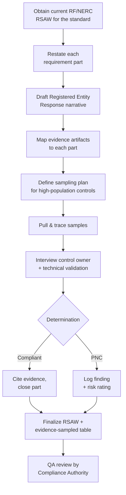

# 05.03 — RSAW Preparation Approach

| Field | Value |
|---|---|
| Document ID | CIP-05.03 |
| Version | 1.0 |
| Date | 2026-03-02 |
| Classification | BES Cyber System Information (BCSI) // Illustrative Portfolio Sample |
| Owner | Karen Whitfield (NERC Compliance Manager) |
| Author | Advisory Team |
| Status | Approved |

## Purpose

This document defines **how each Reliability Standard Audit Worksheet (RSAW) is prepared**, how evidence is **mapped** to requirement parts, and the **sampling methodology** the assessment applies. It standardizes the structure used across RSAWs 05.04–05.14 so that every determination is rendered consistently and every cited artifact is traceable — exactly as ReliabilityFirst (RF) will expect when it requests the same RSAWs during the 2027-Q2 Compliance Audit.

## What an RSAW Is

The **RSAW** is the RF/NERC-published worksheet that structures a Compliance Audit for a single standard. For each requirement (and sub-part), it contains:

| RSAW element | Purpose |
|---|---|
| Requirement text | Verbatim restatement of the standard's requirement part |
| Registered Entity Response | The entity's narrative describing how it meets the requirement |
| Evidence reference | Pointer(s) to the specific artifact(s) proving compliance |
| Compliance Assessment (auditor) | The auditor's finding — here rendered by the independent assessment team as **Compliant** or **Potential Noncompliance (PNC)** |
| Notes / questions | Follow-ups, samples pulled, interview references |

GridPoint prepares one RSAW per applicable standard — **12 RSAWs** covering **118 requirement parts** — and mirrors the auditor's *Compliance Assessment* column internally so gaps are found before RF finds them.

## RSAW Preparation Workflow



## Evidence Mapping

Every requirement part must map to **at least one** dated, attributable artifact drawn from the **~260 evidence artifacts** collected in Phase 04. Mapping follows a strict traceability chain:

```
Standard → Requirement Part → Control → Evidence Artifact(s) → Sample(s) → Determination
```

| Mapping attribute | Requirement |
|---|---|
| Uniqueness | Each artifact carries a stable evidence ID (from the Phase-04 evidence collection). |
| Sufficiency | The artifact must actually prove the *specific* obligation, not merely relate to it. |
| Currency | The artifact must fall within the audit period and, for recurring controls, cover the full interval (e.g., all 4 calendar quarters). |
| Attribution | The artifact must show who performed the action and when (signatures, timestamps, system logs). |
| Retention | The artifact must meet the standard's retention floor (e.g., physical access logs ≥90 days; CIP-004 records per the data-retention section). |

An artifact that fails **currency** or **attribution** is the most common source of PNC — for example, an **unsigned quarterly access review (PNC-09)** fails attribution, and **incomplete IRA session logs (PNC-02)** fail sufficiency/currency.

## Sampling Methodology

Assessing all records for high-population controls is impractical and unnecessary; RF uses sampling and so does this assessment. The method:

| Control population type | Sampling approach |
|---|---|
| Low population (≤ ~15 items) | **Census** — review 100% (e.g., 14 Medium BCS baselines, 10 PSPs, 3 ESPs). |
| Periodic/recurring controls | **Interval census** — verify each occurrence in the audit period (e.g., all 4 quarterly access reviews, all patch-evaluation cycles). |
| High population, homogeneous | **Judgmental + random sample** — a targeted subset weighted toward higher-risk assets, plus a random draw for coverage. |
| Personnel records | **Stratified sample** across the **142** personnel + **18** vendors, ensuring recent joiners/leavers are included (tests CIP-004 R4/R5). |

### Sampling parameters used

| Parameter | Setting |
|---|---|
| Sampling unit | The individual control instance (a review, a log entry, a PRA, a change record) |
| Coverage bias | Weighted toward recurring controls and recent staffing/config changes — where lapses concentrate |
| Sample sufficiency | A sample is sufficient when it either (a) confirms consistent compliance or (b) surfaces a defect worth logging as PNC |
| Exception handling | Any sampled item failing a mapping attribute is escalated to full-population review to size the finding |

A single sampled exception does not automatically equal a systemic violation, but it **does** trigger a widen-the-sample step to determine whether the defect is isolated (e.g., **one** unsigned quarterly review — PNC-09, Low) or pervasive (which would raise the risk rating).

## Determination & Risk Rating

| Determination | Criteria | Register action |
|---|---|---|
| **Compliant** | All mapped evidence complete, current, attributable across the period | Cited; no finding |
| **PNC — Low** | Isolated documentation/timing defect, low reliability impact | Logged; Mitigation Plan |
| **PNC — Moderate** | Recurring documentation gap or control weakness with tangible evidence impact | Logged; Mitigation Plan; management attention |
| **PNC — High** | Missing control or systemic failure with reliability impact | Logged; expedited (none identified — 0 High) |

The consolidated result across all 12 RSAWs is **9 PNC findings (0 High · 4 Moderate · 5 Low)**, of which **5 confirm Phase-04 in-progress gaps** and **4 are newly identified during sampling**.

## Standard RSAW Document Template (05.04–05.14)

Each RSAW document in this phase follows a fixed structure:

1. **Brief standard summary** — scope, version, applicability to GridPoint.
2. **Requirement-by-requirement compliance determination table** — every part marked Compliant or PNC.
3. **Evidence-sampled table** — artifacts pulled, sample size, source, result.
4. **PNC linkage** — where a finding lands, referenced to the findings register (05.15).
5. Cross-references and footer navigation.

## Cross-References

- [`05.01-internal-assessment-plan-and-methodology.md`](05.01-internal-assessment-plan-and-methodology.md) — methods and schedule.
- [`../04-technical-physical-control-implementation/04.20-implemented-control-evidence-collection.md`](../04-technical-physical-control-implementation/04.20-implemented-control-evidence-collection.md) — evidence artifact inventory.
- [`../02-bes-cyber-system-categorization/02.10-applicability-matrix.md`](../02-bes-cyber-system-categorization/02.10-applicability-matrix.md) — 118 applicable parts.
- [`05.15-findings-register-and-risk-exposure.md`](05.15-findings-register-and-risk-exposure.md) — consolidated findings.

---
[⬅ Previous](05.02-assessment-team-and-independence.md) · [🏠 Phase README](05.00-README.md) · [Next ➡](05.04-cip-002-rsaw-and-evidence.md)
