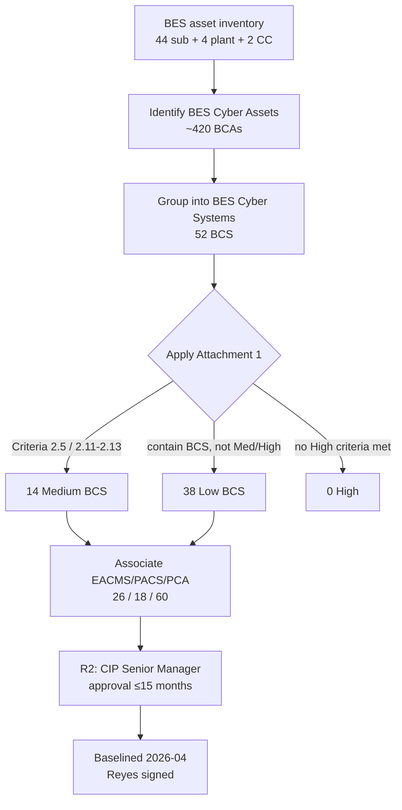

# 05.04 — CIP-002 RSAW & Evidence

| Field | Value |
|---|---|
| Document ID | CIP-05.04 |
| Version | 1.0 |
| Date | 2026-03-02 |
| Classification | BES Cyber System Information (BCSI) // Illustrative Portfolio Sample |
| Owner | Elena Ruiz (Substation & Field Engineering Lead) |
| Author | Advisory Team |
| Status | Approved |

## Purpose

This document records the internal assessment of **CIP-002-5.1a — BES Cyber System Categorization** using the Reliability Standard Audit Worksheet (RSAW). It restates each requirement part, presents the **compliance determination**, and lists the **evidence sampled**. CIP-002 is the foundation of the entire program — every downstream applicability determination inherits from it — so the assessment scrutinizes the categorization of **52 BES Cyber Systems (14 Medium + 38 Low)** and the 15-month review obligation. **Result: Compliant** on all parts.

## Standard Summary

CIP-002-5.1a requires the Registered Entity to **identify and categorize** its BES Cyber Systems by impact (High / Medium / Low) using the **Attachment 1** impact-rating criteria, and to **review and approve** the categorization at least once every **15 calendar months**. GridPoint has no High-impact assets; its footprint is Medium and Low only.

| Applicability item | GridPoint value |
|---|---|
| Control Centers | 2 (Millbrook Primary, Easton Backup) → Medium |
| Medium substations | 8 (345 kV, Attachment 1 Criterion 2.5) |
| Low substations | 34 (contain BES Cyber Systems) |
| Distribution-only substations | 2 (no BCS → out of CIP scope) |
| Generation plants | 4 (Millbrook CC, Easton CC, Cedar Falls Hydro, Sunfield Solar) → Low |
| BES Cyber Systems | **14 Medium + 38 Low = 52 BCS** (no High) |
| Associated systems | EACMS 26 · PACS 18 · PCA 60 · BCAs ~420 |

## Requirement-by-Requirement Compliance Determination

| Req. Part | Requirement (CIP-002-5.1a) | GridPoint implementation | Determination |
|---|---|---|---|
| **R1** | Implement a process to identify and categorize BES Cyber Systems and associated assets | Documented CIP-002 methodology; asset reconciliation; categorization list | **Compliant** |
| **R1.1** | Identify each **High-impact** BCS per Attachment 1 | Evaluated; **none** meet High criteria (no criterion 1.x thresholds met) | **Compliant** |
| **R1.2** | Identify each **Medium-impact** BCS per Attachment 1 | 14 Medium BCS: 4 at 2 Control Centers (Criteria 2.11/2.12/2.13) + 10 across 8 Medium substations (Criterion 2.5) | **Compliant** |
| **R1.3** | Identify each **Low-impact** BCS (list of assets containing Low BCS) | 38 Low BCS: 4 generation plants + 34 Low substations; asset list maintained (discrete BCS list not required for Low) | **Compliant** |
| **R2** | CIP Senior Manager (or delegate) reviews & approves categorization at least once every **15 calendar months** | Categorization baselined 2026-04; reviewed and approved by CIP Senior Manager Daniel Reyes; 15-month review schedule established | **Compliant** |
| **R2 (approval)** | Dated approval evidence of the identifications required by R1 | Signed approval record by Daniel Reyes on the categorization document | **Compliant** |

**No PNC identified for CIP-002.** The categorization is complete, correctly applies Attachment 1, and carries a current, signed CIP Senior Manager approval.

## Attachment 1 Criteria Applied (Sampled Verification)

| Asset class | Attachment 1 criterion | Assessor verification |
|---|---|---|
| Control Centers (2) | 2.12 (TOP functional obligations for Medium Facilities); 2.11/2.13 (GOP) | Confirmed functional obligations via TOP/GOP registration and EMS scope |
| Medium substations (8) | 2.5 (200–499 kV, 3+ connections or aggregate weighted value) | Verified 345 kV operation and connection counts against one-line diagrams |
| Low assets (38) | Contain BCS, not meeting Medium/High | Confirmed presence of BCS; CIP-003 Attachment 1 applicability only |
| Distribution-only (2) | No BES Cyber Systems | Confirmed no BCS present → correctly excluded |

## Evidence Sampled

| Evidence ID | Artifact | Sampling method | Sample | Source / owner | Result |
|---|---|---|---|---|---|
| EV-002-01 | CIP-002 categorization document (signed) | Census | 1 of 1 | Categorization doc / Reyes | Current, signed — pass |
| EV-002-02 | BES asset inventory reconciliation | Census | 44 substations + 4 plants + 2 CC | Asset register / Ruiz | Reconciled — pass |
| EV-002-03 | Medium BCS list (14) with criterion mapping | Census | 14 of 14 | BCS identification / Bell, Ruiz | Complete — pass |
| EV-002-04 | Low BCS asset list (38) | Census | 38 of 38 | Low asset list / Ruiz | Complete — pass |
| EV-002-05 | EACMS/PACS/PCA association list | Census | 26 / 18 / 60 | Associated-systems list / Nair, Delgado | Complete — pass |
| EV-002-06 | R2 15-month review & approval record | Census | 1 of 1 | Review schedule / Reyes | Approved, dated — pass |
| EV-002-07 | Distribution-only exclusion rationale | Census | 2 of 2 | Scoping memo / Ruiz | Justified — pass |

Because the population is small, a **census (100%) sample** was used for every evidence class rather than a subset — appropriate for foundational categorization records.

## Categorization Process (Assessed)

## Retention & Currency Check

| Check | Requirement | Result |
|---|---|---|
| Approval currency | R2 review ≤ 15 calendar months | Within window (baselined 2026-04) |
| Record retention | Since last audit or 3 calendar years (CIP-002 data retention) | Retained |
| Change tracking | Re-categorization on asset baseline change (new solar, 2 new substations) | Reflected in current list |

## Interview & Technical Validation

- **Elena Ruiz (Field Engineering):** walkthrough of substation one-line diagrams confirmed the 8 Medium substations operate at 345 kV and meet Criterion 2.5 connection thresholds.
- **Marcus Bell (OT):** confirmed the 4 Control-Center Medium BCS map to EMS/SCADA functions supporting TOP/GOP obligations.
- **Technical validation:** cross-checked the associated EACMS/PACS/PCA counts (26/18/60) against the boundary overview and Phase-04 implementation records — consistent.

## Findings Linkage

| Finding | Status |
|---|---|
| PNC (CIP-002) | **None** |

CIP-002 contributes **zero PNCs** to the findings register. The categorization is audit-ready and provides a defensible applicability baseline for all downstream RSAWs.

## Cross-References

- [`../02-bes-cyber-system-categorization/02.09-cip-002-categorization-document.md`](../02-bes-cyber-system-categorization/02.09-cip-002-categorization-document.md) — signed categorization.
- [`../02-bes-cyber-system-categorization/02.05-impact-rating-attachment-1-criteria.md`](../02-bes-cyber-system-categorization/02.05-impact-rating-attachment-1-criteria.md) — Attachment 1 application.
- [`../02-bes-cyber-system-categorization/02.14-cip-002-15-month-review-schedule.md`](../02-bes-cyber-system-categorization/02.14-cip-002-15-month-review-schedule.md) — R2 review cadence.
- [`05.03-rsaw-preparation-approach.md`](05.03-rsaw-preparation-approach.md) — RSAW & sampling method.
- [`05.15-findings-register-and-risk-exposure.md`](05.15-findings-register-and-risk-exposure.md) — findings register.

---
[⬅ Previous](05.03-rsaw-preparation-approach.md) · [🏠 Phase README](05.00-README.md) · [Next ➡](05.05-cip-003-rsaw-and-evidence.md)
