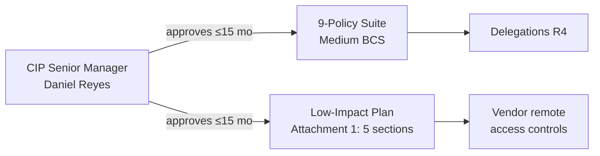

# 05.05 — CIP-003 RSAW & Evidence

| Field | Value |
|---|---|
| Document ID | CIP-05.05 |
| Version | 1.0 |
| Date | 2026-03-02 |
| Classification | BES Cyber System Information (BCSI) // Illustrative Portfolio Sample |
| Owner | Daniel Reyes (CIP Senior Manager) |
| Author | Advisory Team |
| Status | Approved |

## Purpose

This document records the internal assessment of **CIP-003-8 — Security Management Controls** using the RSAW. It evaluates the **cyber security policy suite** for Medium-impact BES Cyber Systems, the **Low-impact security plan (Attachment 1)**, and the **CIP Senior Manager** designation and delegation obligations. **Result: Compliant** on all parts — the policy suite is complete (9 topics), the Low-impact plan covers all 5 required sections, and approvals are current within 15 months.

## Standard Summary

CIP-003-8 requires: (R1) one or more documented **cyber security policies** — for High/Medium a policy addressing each of **9 topics** — reviewed and approved by the **CIP Senior Manager** at least every **15 calendar months**; (R2) for assets containing **Low-impact** BCS, implementation of the **Attachment 1** security plan; (R3) a **single CIP Senior Manager** with overall responsibility; and (R4) documented **delegations** where authority is delegated.

| Applicability | GridPoint value |
|---|---|
| Medium BCS (policy suite applies) | 14 |
| Low assets (Attachment 1 applies) | 4 plants + 34 substations |
| CIP Senior Manager | Daniel Reyes (VP Security & Compliance) |
| Policy review cadence | ≤ 15 calendar months |

## Requirement-by-Requirement Compliance Determination

| Req. Part | Requirement (CIP-003-8) | GridPoint implementation | Determination |
|---|---|---|---|
| **R1.1** | Cyber security policy addressing the **9 topics** for High/Medium BCS | Complete 9-policy suite: Personnel & Training; ESP incl. IRA; Physical Security; System Security Mgmt; Incident Reporting & Response; Recovery Plans; Config Change Mgmt & VA; Information Protection; CIP Exceptional Circumstances | **Compliant** |
| **R1.2** | Cyber security policy for assets with **Low-impact** BCS (awareness; physical; electronic access; incident response; TCA/RM; vendor electronic remote access) | Low-impact policy covering all Attachment 1 subject areas | **Compliant** |
| **R2 / Att.1 §1** | Low-impact **cyber security awareness** reinforced ≥ every 15 months | Awareness material delivered and documented for Low assets | **Compliant** |
| **R2 / Att.1 §2** | Low-impact **physical security controls** | Physical access controls at generation plants and 34 Low substations | **Compliant** |
| **R2 / Att.1 §3** | Low-impact **electronic access controls** (inbound/outbound; authentication for Dial-up) | Electronic access controls documented and implemented | **Compliant** |
| **R2 / Att.1 §4** | Low-impact **Cyber Security Incident response** | Low-impact IR plan with test/update cadence | **Compliant** |
| **R2 / Att.1 §5** | **Transient Cyber Assets & Removable Media** malicious-code mitigation | TCA/RM controls for Low assets | **Compliant** |
| **R2 / Att.1 (vendor)** | **Vendor electronic remote access** controls for Lows (determine active; disable) | Vendor remote access controls documented for Low assets | **Compliant** |
| **R3** | Identify a **single CIP Senior Manager** by name/title | Daniel Reyes designated; dated designation record | **Compliant** |
| **R4** | Document **delegations** of CIP Senior Manager authority | Delegation register maintained and signed | **Compliant** |

**No PNC identified for CIP-003.** All policies exist for the 9 topics, the Low-impact plan addresses all 5 Attachment 1 sections plus vendor remote access, and the CIP Senior Manager approval is current within the 15-month window.

## Policy Suite Coverage (Sampled Verification)

## Evidence Sampled

| Evidence ID | Artifact | Sampling method | Sample | Source / owner | Result |
|---|---|---|---|---|---|
| EV-003-01 | 9-policy cyber security suite (approved) | Census | 9 of 9 policies | Policy suite / Reyes | All present, approved — pass |
| EV-003-02 | CIP Senior Manager approval records (R1) | Interval census | Latest approval cycle | Governance record / Reyes | Within 15 months — pass |
| EV-003-03 | Low-impact security plan (Attachment 1) | Census | 5 sections + vendor | Low-impact plan / Reyes | Complete — pass |
| EV-003-04 | Low-impact awareness delivery records | Judgmental | 5 sampled sites | Awareness log / Whitfield | Delivered, dated — pass |
| EV-003-05 | CIP Senior Manager designation (R3) | Census | 1 of 1 | Designation record / Reyes | Named, dated — pass |
| EV-003-06 | Delegation register (R4) | Census | All active delegations | Delegation register / Reyes | Signed, current — pass |
| EV-003-07 | Low-impact vendor remote access procedure | Census | 1 of 1 | Procedure / Nair | Documented — pass |

## 9-Policy Suite Verification (Sampled)

| # | Policy topic (CIP-003-8 R1.1) | Present | Approved ≤15 mo |
|---|---|---|---|
| 1 | Personnel & Training | Yes | Yes |
| 2 | Electronic Security Perimeters incl. Interactive Remote Access | Yes | Yes |
| 3 | Physical Security of BES Cyber Systems | Yes | Yes |
| 4 | System Security Management | Yes | Yes |
| 5 | Incident Reporting & Response | Yes | Yes |
| 6 | Recovery Plans | Yes | Yes |
| 7 | Configuration Change Management & Vulnerability Assessments | Yes | Yes |
| 8 | Information Protection | Yes | Yes |
| 9 | Declaring & responding to CIP Exceptional Circumstances | Yes | Yes |

## Low-Impact Attachment 1 Verification (Sampled)

| Section | Attachment 1 subject | Result |
|---|---|---|
| 1 | Cyber security awareness | Documented, reinforced ≤15 months |
| 2 | Physical security controls | Implemented at plants + Low substations |
| 3 | Electronic access controls | Documented inbound/outbound controls |
| 4 | Cyber Security Incident response | Low-impact IR plan with test cadence |
| 5 | Transient Cyber Assets & Removable Media | Malicious-code mitigation controls |
| + | Vendor electronic remote access | Determine-active + disable controls |

## Interview & Technical Validation

- **Daniel Reyes (CIP Senior Manager):** confirmed personal review and dated approval of the full 9-policy suite and the Low-impact plan within the 15-month cycle; walked through the delegation register.
- **Karen Whitfield (Compliance):** confirmed Low-impact awareness reinforcement is tracked and evidenced across generation plants and Low substations.
- **Technical validation:** spot-checked Low-impact electronic access controls documentation against implemented controls — consistent.

## Findings Linkage

| Finding | Status |
|---|---|
| PNC (CIP-003) | **None** |

CIP-003 contributes **zero PNCs**. The security-management foundation — policies, Low-impact plan, and CIP Senior Manager governance — is audit-ready.

## Cross-References

- [`../03-policies-governance-personnel/03.01-cyber-security-policy-suite.md`](../03-policies-governance-personnel/03.01-cyber-security-policy-suite.md) — 9-policy suite.
- [`../03-policies-governance-personnel/03.02-low-impact-security-plan.md`](../03-policies-governance-personnel/03.02-low-impact-security-plan.md) — Attachment 1 plan.
- [`../03-policies-governance-personnel/03.11-policy-governance-review-approval.md`](../03-policies-governance-personnel/03.11-policy-governance-review-approval.md) — approval cadence.
- [`../01-program-foundation/01.06-cip-senior-manager-designation-and-delegations.md`](../01-program-foundation/01.06-cip-senior-manager-designation-and-delegations.md) — R3/R4.
- [`05.15-findings-register-and-risk-exposure.md`](05.15-findings-register-and-risk-exposure.md) — findings register.

---
[⬅ Previous](05.04-cip-002-rsaw-and-evidence.md) · [🏠 Phase README](05.00-README.md) · [Next ➡](05.06-cip-004-rsaw-and-evidence.md)
