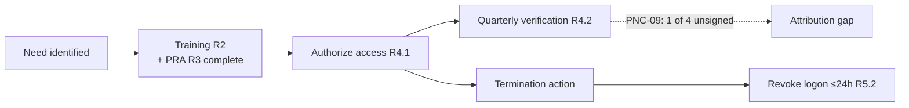

# 05.06 — CIP-004 RSAW & Evidence

| Field | Value |
|---|---|
| Document ID | CIP-05.06 |
| Version | 1.0 |
| Date | 2026-03-02 |
| Classification | BES Cyber System Information (BCSI) // Illustrative Portfolio Sample |
| Owner | Sandra Lee (HR / PRA Coordinator) |
| Author | Advisory Team |
| Status | Approved |

## Purpose

This document records the internal assessment of **CIP-004-7 — Personnel & Training** using the RSAW, covering **R1 (awareness)**, **R2 (training)**, **R3 (personnel risk assessment)**, **R4 (access management)**, **R5 (access revocation)**, and **R6 (BCSI access management)**. Most parts are **Compliant**, but evidence sampling surfaced **one Low-risk finding — PNC-09** — a single quarterly access-privilege review record that was completed but **left unsigned**, failing the attribution mapping attribute.

## Standard Summary

CIP-004-7 protects BES Cyber Systems from personnel risk. Key obligations for GridPoint's Medium BCS:

| Req. | Obligation | Cadence / threshold |
|---|---|---|
| R1 | Security awareness reinforcement | ≥ once each calendar quarter |
| R2 | Role-based cyber security training | before access + ≥ every 15 months |
| R3 | Personnel Risk Assessment (identity + 7-year criminal history) | before access + ≥ every 7 years |
| R4 | Access authorization (need + training + PRA) and **quarterly access-privilege verification** | quarterly |
| R5 | Access revocation on termination | remove logon within 24 hours |
| R6 | BCSI access authorization and verification | authorize + verify |

| Population | Value |
|---|---|
| Personnel with authorized access to Medium BCS | **142** |
| Vendors/contractors with authorized access | **18** |
| Training completion | 100% of in-scope personnel |
| PRAs current | All 142 + 18 |

## Requirement-by-Requirement Compliance Determination

| Req. Part | Requirement (CIP-004-7) | GridPoint implementation | Determination |
|---|---|---|---|
| **R1.1** | Quarterly security awareness reinforcement | Awareness delivered each calendar quarter; completion tracked | **Compliant** |
| **R2.1–R2.3** | Role-based training content; before access; ≥ every 15 months | Role-based curriculum; 100% completion; 15-month renewal tracked | **Compliant** |
| **R3.1–R3.4** | Identity verification + 7-year criminal history; before access; ≥ every 7 years | PRA program with tracking register; all 142 + 18 current | **Compliant** |
| **R4.1** | Authorize electronic/physical/BCSI access based on need | Documented authorizations tied to need + training + PRA | **Compliant** |
| **R4.2** | **Verify at least once each calendar quarter** that access privileges are correct | Quarterly access-privilege reviews performed for all 4 quarters | **PNC — Low (PNC-09)** |
| **R4.3** | Verify (≥ every 15 months) that BCSI access privileges are correct | BCSI access verification performed and documented | **Compliant** |
| **R5.1** | Process to revoke access upon termination | Documented revocation process (initiate at termination action) | **Compliant** |
| **R5.2** | Remove ability for **interactive access within 24 hours** of termination | Revocation within 24 hours; timing evidence retained | **Compliant** |
| **R5.3** | Revoke user accounts (timely, per process) | Account revocation tracked | **Compliant** |
| **R6.1–R6.2** | Authorize and verify **BCSI access** (electronic and physical) | BCSI access authorized and verified | **Compliant** |

## PNC-09 Detail (Low)

| Attribute | Detail |
|---|---|
| Finding | **PNC-09 (Low)** — one **quarterly access-privilege review (CIP-004 R4.2)** was performed but the reviewer **signature/approval was not captured**, so the record is unattributable. |
| Origin | **Newly identified** during evidence sampling (not a Phase-04 carry-over gap). |
| Mapping attribute failed | **Attribution** — the review content exists and matches the access list, but lacks a dated reviewer sign-off. |
| Scope of exception | Sampling was widened to all 4 quarterly reviews; **3 of 4** are properly signed. The defect is **isolated to one quarter**, supporting a **Low** risk rating. |
| Reliability impact | Minimal — access list itself was correct; the gap is documentary, not a control failure. |
| Remediation path | Re-attest and sign the affected review; add a completion-checklist gate requiring signature capture. Mitigation Plan in Phase 06. |

## Evidence Sampled

| Evidence ID | Artifact | Sampling method | Sample | Source / owner | Result |
|---|---|---|---|---|---|
| EV-004-01 | Quarterly awareness delivery records (R1) | Interval census | 4 of 4 quarters | Awareness log / Whitfield | Complete — pass |
| EV-004-02 | Training completion records (R2) | Stratified | 30 of 142 + 5 of 18 | LMS / Lee | 100% complete — pass |
| EV-004-03 | PRA records (R3) — identity + 7-yr check | Stratified | 25 of 142 + 5 of 18 | PRA register / Lee | Current — pass |
| EV-004-04 | Access authorization records (R4.1) | Stratified (incl. recent joiners) | 20 of 160 | Access register / Lee | Authorized — pass |
| EV-004-05 | **Quarterly access-privilege reviews (R4.2)** | Interval census | **4 of 4 quarters** | Access review / Lee | **1 of 4 unsigned → PNC-09** |
| EV-004-06 | Revocation records (R5) — 24-hour timing | Judgmental (recent leavers) | 8 of 8 leavers | Revocation log / Lee, Nair | Within 24h — pass |
| EV-004-07 | BCSI access authorization/verification (R6) | Stratified | 15 sampled | BCSI register / Nair | Verified — pass |

## Access Lifecycle (Assessed)

## Sample Coverage Summary

| Requirement | Population | Sample basis | Exceptions |
|---|---|---|---|
| R1 awareness | 4 quarters | Interval census | 0 |
| R2 training | 142 + 18 | Stratified (35) | 0 |
| R3 PRA | 142 + 18 | Stratified (30) | 0 |
| R4.1 authorization | 160 | Stratified (20) | 0 |
| R4.2 quarterly review | 4 quarters | Interval census | **1 (PNC-09)** |
| R5 revocation | recent leavers | Judgmental (8) | 0 |
| R6 BCSI | in-scope | Stratified (15) | 0 |

## Interview & Technical Validation

- **Sandra Lee (HR/PRA):** confirmed the quarterly review *was* performed for the affected quarter; the reviewer completed the check but the sign-off field was left blank at close — a process-capture gap, not a skipped control.
- **Priya Nair (IT):** technical validation of revocation timing showed logon disablement within 24 hours for all sampled leavers.
- Sampling widened per methodology (05.03): the exception is isolated to **one** quarterly review, sizing the finding at **Low**.

## Findings Linkage

| Finding | Risk | Req. | Origin |
|---|---|---|---|
| **PNC-09** | Low | CIP-004 R4.2 | New (sampling) — one quarterly access review unsigned |

CIP-004 contributes **one Low PNC (PNC-09)** to the findings register.

## Cross-References

- [`../03-policies-governance-personnel/03.07-access-authorization-program.md`](../03-policies-governance-personnel/03.07-access-authorization-program.md) — R4 access management.
- [`../03-policies-governance-personnel/03.08-access-revocation-program.md`](../03-policies-governance-personnel/03.08-access-revocation-program.md) — R5 revocation.
- [`../03-policies-governance-personnel/03.06-personnel-risk-assessment-program.md`](../03-policies-governance-personnel/03.06-personnel-risk-assessment-program.md) — R3 PRA.
- [`05.15-findings-register-and-risk-exposure.md`](05.15-findings-register-and-risk-exposure.md) — PNC-09.

---
[⬅ Previous](05.05-cip-003-rsaw-and-evidence.md) · [🏠 Phase README](05.00-README.md) · [Next ➡](05.07-cip-005-rsaw-and-evidence.md)
