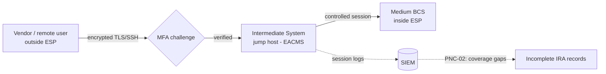

# 05.07 — CIP-005 RSAW & Evidence

| Field | Value |
|---|---|
| Document ID | CIP-05.07 |
| Version | 1.0 |
| Date | 2026-03-02 |
| Classification | BES Cyber System Information (BCSI) // Illustrative Portfolio Sample |
| Owner | Marcus Bell (OT / ICS Security Lead) |
| Author | Advisory Team |
| Status | Approved |

## Purpose

This document records the internal assessment of **CIP-005-7 — Electronic Security Perimeter(s) & Interactive Remote Access** using the RSAW, covering **R1 (ESP)**, **R2 (Interactive Remote Access / vendor remote access)**, and **R3 (malicious-communications detection)**. The ESP controls are **Compliant**; evidence sampling of IRA session records surfaced **one Moderate finding — PNC-02** — **IRA session logging is incomplete**, confirming the Phase-04 in-progress gap **GAP-21**.

## Standard Summary

CIP-005-7 requires Medium-impact BES Cyber Systems **with External Routable Connectivity** to reside within a defined **Electronic Security Perimeter (ESP)** with controlled **Electronic Access Points (EAPs)**, and requires all **Interactive Remote Access (IRA)** to be brokered through an **Intermediate System** with **encryption** and **multi-factor authentication (MFA)**, plus the ability to determine and disable active vendor sessions.

| Applicability | GridPoint value |
|---|---|
| ESPs | **3** (Millbrook CC, Easton CC, substation aggregation) |
| Electronic Access Points (EAPs) | **6** |
| Medium BCS with External Routable Connectivity | 14 |
| IRA model | Intermediate System (jump host) + MFA + encryption |
| Vendors with remote access | 18 |

## Requirement-by-Requirement Compliance Determination

| Req. Part | Requirement (CIP-005-7) | GridPoint implementation | Determination |
|---|---|---|---|
| **R1.1** | All applicable Cyber Assets connected to a network via a routable protocol reside within a defined **ESP** | 3 ESPs enclose all 14 Medium BCS + associated PCA | **Compliant** |
| **R1.2** | All External Routable Connectivity through an identified **EAP** | 6 EAPs identified and controlled | **Compliant** |
| **R1.3** | Inbound and outbound access permissions with **deny-by-default**; document reason for granted access | EAP rulesets enforce deny-by-default; documented justifications | **Compliant** |
| **R1.4** | Where technically feasible, **authenticate** Dial-up connectivity | No Dial-up in scope / authenticated where present | **Compliant** |
| **R1.5** | Detect known/suspected **malicious communications** for inbound and outbound (R3 detection function) | Malicious-communications detection at EAPs (IDS/monitoring) | **Compliant** |
| **R2.1** | Utilize an **Intermediate System** so clients do not directly access BCS | Hardened jump-host cluster brokers all IRA; no direct routable path | **Compliant** |
| **R2.2** | **Encryption** terminating at the Intermediate System | TLS/SSH tunnels terminate on the jump host; no clear-text sessions | **Compliant** |
| **R2.3** | **Multi-factor authentication** for all IRA sessions | MFA enforced at the Intermediate System for all users incl. vendors | **Compliant** |
| **R2.4** | Method(s) to **determine active vendor remote access** sessions | Session dashboard identifies active vendor sessions | **Compliant** |
| **R2.5** | Method(s) to **disable active vendor remote access** | Documented ability to terminate/revoke vendor sessions | **Compliant** |
| **R2 (logging)** | Retain complete records evidencing IRA sessions across the period | Session logging enabled, but **records incomplete for part of the period** | **PNC — Moderate (PNC-02)** |
| **R3** | Malicious-communications detection method(s) for EAPs | Implemented at all 6 EAPs | **Compliant** |

## PNC-02 Detail (Moderate)

| Attribute | Detail |
|---|---|
| Finding | **PNC-02 (Moderate)** — **IRA session logging is incomplete**: session records for the Intermediate System do not fully cover all IRA/vendor sessions across the audit period, so continuous evidence of who accessed which BCS, when, cannot be reconstructed for every session. |
| Origin | **Confirms Phase-04 in-progress gap GAP-21** (IRA session logging completeness). |
| Mapping attribute failed | **Sufficiency / currency** — the control (Intermediate System, MFA, encryption) operates correctly, but the *evidentiary logging* has coverage gaps. |
| Reliability impact | Moderate — access itself is properly brokered and authenticated (no unauthorized-access evidence), but incomplete logs weaken detection/forensics and would draw an RF finding on evidence retention. |
| Remediation path | Enable/verify full session logging on the Intermediate System and EAPs; centralize to SIEM with retention checks; backfill coverage validation. Mitigation Plan in Phase 06. |

## IRA Data Flow (Assessed)

## Evidence Sampled

| Evidence ID | Artifact | Sampling method | Sample | Source / owner | Result |
|---|---|---|---|---|---|
| EV-005-01 | ESP definitions & diagrams (R1.1) | Census | 3 of 3 ESPs | Boundary docs / Bell | Defined — pass |
| EV-005-02 | EAP inventory & rulesets (R1.2/R1.3) | Census | 6 of 6 EAPs | Firewall config / Nair | Deny-by-default — pass |
| EV-005-03 | Malicious-comms detection config (R1.5/R3) | Census | 6 of 6 EAPs | IDS/monitoring / Nair | Enabled — pass |
| EV-005-04 | Intermediate System MFA enforcement (R2.3) | Technical validation | Live config test | Jump host / Bell | MFA enforced — pass |
| EV-005-05 | Encryption config (R2.2) | Technical validation | Session inspection | Jump host / Bell | Encrypted — pass |
| EV-005-06 | Active-session determine/disable (R2.4/R2.5) | Walkthrough | Live demo | Session dashboard / Nair | Demonstrated — pass |
| EV-005-07 | **IRA session logs (R2 logging)** | Judgmental + interval | Sessions across period | SIEM / Bell, Nair | **Coverage gaps → PNC-02** |

## Sample Coverage Summary

| Requirement | Population | Sample basis | Exceptions |
|---|---|---|---|
| R1.1 ESP | 3 ESPs | Census | 0 |
| R1.2/R1.3 EAP rulesets | 6 EAPs | Census | 0 |
| R1.5/R3 malicious-comms | 6 EAPs | Census | 0 |
| R2.1–R2.3 IS / MFA / encryption | Intermediate System | Technical validation | 0 |
| R2.4/R2.5 vendor session control | live demo | Walkthrough | 0 |
| R2 session logging | period sessions | Judgmental + interval | **coverage gaps (PNC-02)** |

## Distinction — Control vs. Evidence

A key nuance recorded for the CIP Senior Manager: PNC-02 is **not** a failure of the access control itself. Every IRA session is brokered through the Intermediate System with MFA and encryption (R2.1–R2.3 all Compliant), and vendor sessions can be determined and disabled (R2.4/R2.5 Compliant). The finding is that the **logging/retention evidence** proving each session cannot be fully reconstructed for the whole period. RF assesses evidence adequacy strictly, so this is logged as a **Moderate** PNC even though no unauthorized access occurred.

## Interview & Technical Validation

- **Marcus Bell (OT):** confirmed all IRA is brokered through the Intermediate System with MFA and encryption; acknowledged the logging pipeline had periods where session records were not fully captured/retained — the basis for PNC-02.
- **Priya Nair (IT):** demonstrated live determination and disablement of an active vendor session (R2.4/R2.5) and deny-by-default rulesets at EAPs.
- Sampling of session logs against the vendor access list showed sessions for which corresponding complete log records could not be produced — sizing the finding at **Moderate**.

## Findings Linkage

| Finding | Risk | Req. | Origin |
|---|---|---|---|
| **PNC-02** | Moderate | CIP-005 R2 (logging) | Confirms GAP-21 — IRA session logging incomplete |

CIP-005 contributes **one Moderate PNC (PNC-02)**. The perimeter and remote-access *controls* are strong; the gap is evidentiary logging completeness.

## Cross-References

- [`../04-technical-physical-control-implementation/04.02-electronic-security-perimeter-cip-005-r1.md`](../04-technical-physical-control-implementation/04.02-electronic-security-perimeter-cip-005-r1.md) — ESP (R1).
- [`../04-technical-physical-control-implementation/04.03-interactive-remote-access-cip-005-r2.md`](../04-technical-physical-control-implementation/04.03-interactive-remote-access-cip-005-r2.md) — IRA (R2), GAP-21.
- [`../02-bes-cyber-system-categorization/02.12-gap-register-and-risk-ranking.md`](../02-bes-cyber-system-categorization/02.12-gap-register-and-risk-ranking.md) — GAP-21.
- [`05.15-findings-register-and-risk-exposure.md`](05.15-findings-register-and-risk-exposure.md) — PNC-02.

---
[⬅ Previous](05.06-cip-004-rsaw-and-evidence.md) · [🏠 Phase README](05.00-README.md) · [Next ➡](05.08-cip-006-rsaw-and-evidence.md)
