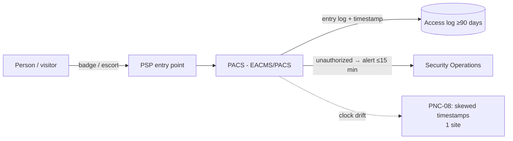

# 05.08 — CIP-006 RSAW & Evidence

| Field | Value |
|---|---|
| Document ID | CIP-05.08 |
| Version | 1.0 |
| Date | 2026-03-02 |
| Classification | BES Cyber System Information (BCSI) // Illustrative Portfolio Sample |
| Owner | Frank Delgado (Physical Security Manager) |
| Author | Advisory Team |
| Status | Approved |

## Purpose

This document records the internal assessment of **CIP-006-6 — Physical Security of BES Cyber Systems** using the RSAW, covering **R1 (physical security plan / Physical Security Perimeters)**, **R2 (visitor control & access monitoring)**, and **R3 (PACS maintenance and testing)**. The physical access controls are **Compliant**; evidence sampling of physical access logs surfaced **one Low finding — PNC-08** — a **Physical Access Control System (PACS) clock drift** that skews log timestamps at one site.

## Standard Summary

CIP-006-6 requires a documented **physical security plan** defining **Physical Security Perimeters (PSPs)** around Medium BES Cyber Systems, controlled and **monitored** physical access, **visitor control** (escort and logging), and **maintenance/testing** of PACS and locally mounted hardware.

| Applicability | GridPoint value |
|---|---|
| Physical Security Perimeters (PSPs) | **10** (2 Control Centers + 8 Medium substations) |
| PACS | 18 |
| Physical access log retention | **≥ 90 days** |

## Requirement-by-Requirement Compliance Determination

| Req. Part | Requirement (CIP-006-6) | GridPoint implementation | Determination |
|---|---|---|---|
| **R1.1** | Define operational/procedural controls to restrict physical access | Physical security plan defines controls for all 10 PSPs | **Compliant** |
| **R1.2** | Issue authorized unescorted physical access only per CIP-004 | Access tied to CIP-004 authorization list | **Compliant** |
| **R1.3** | Where technically feasible, **two or more** physical access controls (defense-in-depth) | Layered controls (badge + secondary) at PSPs | **Compliant** |
| **R1.4** | **Monitor** for unauthorized access through a physical access point | PACS monitoring + alarms at PSPs | **Compliant** |
| **R1.5** | Issue an **alarm or alert** on detected unauthorized access within 15 minutes | Alarm/alert workflow to security operations | **Compliant** |
| **R1.6–R1.7** | Monitor each **Physical Access Control System** and respond to detected failures | PACS health monitoring; response process | **Compliant** |
| **R1.8** | **Log** (per entry) physical access into a PSP | PACS logs entries with identity + timestamp | **PNC — Low (PNC-08)** |
| **R1.9** | Retain physical access logs **≥ 90 calendar days** | Logs retained ≥ 90 days | **Compliant** |
| **R2.1** | **Escort** visitors within a PSP at all times | Visitor escort procedure enforced | **Compliant** |
| **R2.2** | **Log** visitor entry/exit (name, date, time, point of contact) | Visitor logs maintained | **Compliant** |
| **R2.3** | Retain **visitor logs ≥ 90 days** | Retained ≥ 90 days | **Compliant** |
| **R3.1** | **Maintenance and testing** of PACS and locally mounted hardware ≥ every 24 months | PACS maintenance/testing program | **Compliant** |

## PNC-08 Detail (Low)

| Attribute | Detail |
|---|---|
| Finding | **PNC-08 (Low)** — a **PACS clock at one PSP has drifted**, causing **physical access log timestamps to be inaccurate** relative to true time and to correlated systems (SIEM, video). |
| Origin | **Newly identified** during evidence sampling (not a Phase-04 carry-over gap). |
| Mapping attribute failed | **Attribution/currency** — entries are logged and retained, but timestamp accuracy is compromised, weakening cross-system correlation. |
| Scope of exception | Isolated to **one** PACS/site; other sites' clocks verified against time source. Access control itself unaffected (badging still enforced). |
| Reliability impact | Low — no loss of physical control; the defect is timestamp fidelity for forensic correlation. |
| Remediation path | Synchronize the affected PACS to the authoritative time source (NTP); add periodic clock-drift monitoring across all PACS. Mitigation Plan in Phase 06. |

## Physical Access & Logging (Assessed)

## Evidence Sampled

| Evidence ID | Artifact | Sampling method | Sample | Source / owner | Result |
|---|---|---|---|---|---|
| EV-006-01 | Physical security plan (R1) | Census | 1 of 1 | Physical plan / Delgado | Complete — pass |
| EV-006-02 | PSP definitions & access-point inventory | Census | 10 of 10 PSPs | Boundary docs / Delgado | Defined — pass |
| EV-006-03 | PACS monitoring & alarm config (R1.4–R1.7) | Judgmental | 6 of 18 PACS | PACS / Delgado | Monitored — pass |
| EV-006-04 | **Physical access logs (R1.8)** | Interval + judgmental | Logs across period, all PSPs | PACS logs / Delgado | **1 site clock drift → PNC-08** |
| EV-006-05 | Log retention verification (R1.9/R2.3) | Sampling | 4 sites | PACS / Delgado | ≥ 90 days — pass |
| EV-006-06 | Visitor escort & logs (R2) | Judgmental | 12 visitor entries | Visitor log / Delgado | Escorted, logged — pass |
| EV-006-07 | PACS maintenance/testing records (R3) | Interval census | Latest cycle | Maintenance log / Delgado | Within 24 months — pass |

## Sample Coverage Summary

| Requirement | Population | Sample basis | Exceptions |
|---|---|---|---|
| R1 plan & PSPs | 10 PSPs | Census | 0 |
| R1.4–R1.7 monitoring/alarms | 18 PACS | Judgmental (6) | 0 |
| R1.8 access logging | all PSPs | Interval + judgmental | **1 site clock drift (PNC-08)** |
| R1.9/R2.3 retention ≥90d | 4 sites | Sampling | 0 |
| R2 visitor escort/logs | visitor entries | Judgmental (12) | 0 |
| R3 PACS maintenance/testing | latest cycle | Interval census | 0 |

## Distinction — Control vs. Evidence

PNC-08 is a **timestamp-fidelity** issue, not a loss of physical control. Badging and escort are enforced at all 10 PSPs, access is logged, and retention exceeds 90 days. The single defect is that one PACS clock drifted from the authoritative time source, so its log timestamps are offset — weakening cross-correlation with SIEM and video during an investigation. It is logged as **Low** because the control operates and the exception is isolated to one site.

## Interview & Technical Validation

- **Frank Delgado (Physical Security):** confirmed badging, escort, and monitoring operate at all 10 PSPs; identified that one site's PACS clock had drifted from the time source, producing offset timestamps — the basis for PNC-08.
- **Technical validation:** compared PACS log timestamps against the authoritative time source across sampled sites; one site showed a measurable offset while others matched.

## Findings Linkage

| Finding | Risk | Req. | Origin |
|---|---|---|---|
| **PNC-08** | Low | CIP-006 R2 (log timestamps) | New (sampling) — PACS clock drift |

CIP-006 contributes **one Low PNC (PNC-08)**. Physical controls are effective; the gap is timestamp accuracy at a single PACS.

## Cross-References

- [`../04-technical-physical-control-implementation/04.04-physical-security-plan-cip-006-r1.md`](../04-technical-physical-control-implementation/04.04-physical-security-plan-cip-006-r1.md) — R1 plan.
- [`../04-technical-physical-control-implementation/04.05-physical-access-monitoring-cip-006-r2.md`](../04-technical-physical-control-implementation/04.05-physical-access-monitoring-cip-006-r2.md) — R2 monitoring.
- [`05.15-findings-register-and-risk-exposure.md`](05.15-findings-register-and-risk-exposure.md) — PNC-08.

---
[⬅ Previous](05.07-cip-005-rsaw-and-evidence.md) · [🏠 Phase README](05.00-README.md) · [Next ➡](05.09-cip-007-rsaw-and-evidence.md)
