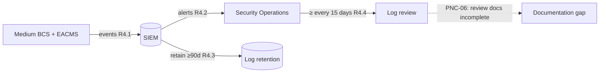

# 05.09 — CIP-007 RSAW & Evidence

| Field | Value |
|---|---|
| Document ID | CIP-05.09 |
| Version | 1.0 |
| Date | 2026-03-02 |
| Classification | BES Cyber System Information (BCSI) // Illustrative Portfolio Sample |
| Owner | Marcus Bell (OT / ICS Security Lead) |
| Author | Advisory Team |
| Status | Approved |

## Purpose

This document records the internal assessment of **CIP-007-6 — System Security Management** using the RSAW, covering **R1 (ports & services)**, **R2 (patch management)**, **R3 (malicious code prevention)**, **R4 (security event monitoring)**, and **R5 (system access control)**. Most parts are **Compliant**; evidence sampling of the security-event-monitoring records surfaced **one Moderate finding — PNC-06** — **documentation gaps in the audit-log review under R4**.

## Standard Summary

CIP-007-6 hardens the applicable Cyber Assets: restrict logical **ports and services** to those needed; **evaluate patches every 35 days** and apply or mitigate; prevent/deter/detect **malicious code**; **log and monitor** security events and **review** the logs; and enforce **system access controls** (accounts, credentials, and identification of default/shared accounts).

| Applicability | GridPoint value |
|---|---|
| Medium BCS (and associated EACMS/PCA) | 14 BCS |
| Patch evaluation cycle (R2) | **35 days**; mitigation plans if not applied |
| Event monitoring (R4) | SIEM; log review obligation |

## Requirement-by-Requirement Compliance Determination

| Req. Part | Requirement (CIP-007-6) | GridPoint implementation | Determination |
|---|---|---|---|
| **R1.1** | Enable only **logical network accessible ports** deemed needed; document | Ports/services baseline per BCS; needed-only | **Compliant** |
| **R1.2** | Protect against use of unnecessary **physical I/O ports** | Physical port controls documented | **Compliant** |
| **R2.1** | Patch **source(s)** identified for each applicable Cyber Asset | Patch sources catalogued | **Compliant** |
| **R2.2** | **Evaluate** security patches at least once every **35 calendar days** | 35-day evaluation cycle operating (closes prior GAP-02) | **Compliant** |
| **R2.3** | Within 35 days of evaluation completion, **apply** patch or create a dated **mitigation plan** | Applied or mitigation-planned; dated records | **Compliant** |
| **R2.4** | Implement/revise the mitigation plan within the timeframe specified | Mitigation plans tracked to completion | **Compliant** |
| **R3.1** | **Deploy method(s)** to deter, detect, or prevent malicious code | Endpoint malware prevention on applicable BCS | **Compliant** |
| **R3.2** | **Mitigate** the threat of detected malicious code | Response process defined | **Compliant** |
| **R3.3** | **Update** signatures/patterns for the method(s) | Signature update process | **Compliant** |
| **R4.1** | **Log events** at the BCS level for identification of, and after-the-fact investigation of, Cyber Security Incidents | SIEM collects security events from BCS/EACMS | **Compliant** |
| **R4.2** | **Generate alerts** for security events determined to necessitate an alert | Alerting configured in SIEM | **Compliant** |
| **R4.3** | **Retain** event logs (≥ 90 days per the standard) | Log retention configured | **Compliant** |
| **R4.4** | **Review** a summarization or sampling of logged events at least every **15 calendar days** to identify undetected incidents | Log review performed, but **review documentation incomplete/inconsistent** | **PNC — Moderate (PNC-06)** |
| **R5.1–R5.2** | Have method(s) to enforce **authentication**; identify and inventory **default/generic/shared** accounts | Account inventory; authentication enforced | **Compliant** |
| **R5.3–R5.4** | Identify individuals with access to **shared accounts**; change **default passwords** | Shared-account custody documented; defaults changed | **Compliant** |
| **R5.5–R5.7** | **Password** parameters; where technically feasible, enforce and limit **failed login attempts** | Password policy + lockout thresholds enforced | **Compliant** |

## PNC-06 Detail (Moderate)

| Attribute | Detail |
|---|---|
| Finding | **PNC-06 (Moderate)** — **audit-log review documentation gaps** under **CIP-007 R4.4**: the required ≥15-day review of logged security events was performed, but the **records evidencing each review** (who reviewed, when, and disposition of flagged events) are **incomplete/inconsistent** across the audit period. |
| Origin | **Newly identified** during evidence sampling (not a Phase-04 carry-over gap). |
| Mapping attribute failed | **Attribution / sufficiency** — logging and alerting operate, but the *documented evidence of the periodic review* cannot be produced for every 15-day interval. |
| Reliability impact | Moderate — event data exists, but without consistent review documentation GridPoint cannot demonstrate the R4.4 review actually occurred each interval, which is a common RF finding area. |
| Remediation path | Standardize a review log (reviewer, date, event summary, disposition) tied to each 15-day cycle; backfill/attest recent cycles; SIEM-generated review checklists. Mitigation Plan in Phase 06. |

## Security Event Monitoring (Assessed)

## Evidence Sampled

| Evidence ID | Artifact | Sampling method | Sample | Source / owner | Result |
|---|---|---|---|---|---|
| EV-007-01 | Ports/services baselines (R1) | Census | 14 of 14 BCS | Baseline mgmt / Bell | Needed-only — pass |
| EV-007-02 | Patch source catalogue (R2.1) | Census | 14 of 14 BCS | Patch program / Nair | Sources identified — pass |
| EV-007-03 | Patch evaluation records — 35-day cycle (R2.2/R2.3) | Interval census | All cycles in period | Patch log / Nair | Within 35 days — pass |
| EV-007-04 | Patch mitigation plans (R2.3/R2.4) | Judgmental | Sampled deferred patches | Mitigation records / Nair | Dated, tracked — pass |
| EV-007-05 | Malicious code prevention config (R3) | Judgmental | 8 of 14 BCS | Endpoint / Bell | Deployed, updated — pass |
| EV-007-06 | **Audit-log review records (R4.4)** | Interval census | 15-day review cycles | SIEM / review log / Bell, Nair | **Docs incomplete → PNC-06** |
| EV-007-07 | Event logging & alerting config (R4.1/R4.2) | Technical validation | SIEM inspection | SIEM / Nair | Logging/alerting active — pass |
| EV-007-08 | Account inventory & password controls (R5) | Judgmental | 20 accounts | IAM / Nair | Enforced — pass |

## Sample Coverage Summary

| Requirement | Population | Sample basis | Exceptions |
|---|---|---|---|
| R1 ports/services | 14 BCS | Census | 0 |
| R2.2 35-day patch evaluation | all cycles | Interval census | 0 |
| R2.3/R2.4 apply/mitigate | deferred patches | Judgmental | 0 |
| R3 malicious code | 14 BCS | Judgmental (8) | 0 |
| R4.4 audit-log review | 15-day cycles | Interval census | **doc gaps (PNC-06)** |
| R5 accounts/passwords | accounts | Judgmental (20) | 0 |

## Distinction — Control vs. Evidence

PNC-06 concerns the **documentation of the R4.4 review**, not the logging or alerting itself. Events are collected, alerts fire, and logs are retained (R4.1–R4.3 Compliant). The gap is that the periodic (≥15-day) review of logged events cannot be consistently evidenced with reviewer, date, and disposition across every interval. Because R4.4 requires demonstrable review — and RF frequently tests this exact obligation — it is logged as **Moderate**. It also stands as a validation that the prior CIP-007 R2 patch self-log (GAP-02) is genuinely closed: the 35-day cycle sampled clean.

## Interview & Technical Validation

- **Marcus Bell (OT) & Priya Nair (IT):** confirmed SIEM logging, alerting, and retention operate; acknowledged the ≥15-day log reviews were conducted but not consistently documented with reviewer/date/disposition — the basis for PNC-06.
- **Technical validation:** confirmed the 35-day patch evaluation cycle is operating (evidencing closure of the prior GAP-02 self-log) and that event logging/alerting is active in the SIEM.

## Findings Linkage

| Finding | Risk | Req. | Origin |
|---|---|---|---|
| **PNC-06** | Moderate | CIP-007 R4.4 | New (sampling) — audit-log review documentation gaps |

CIP-007 contributes **one Moderate PNC (PNC-06)**. The technical hardening controls are sound; the gap is review-evidence documentation.

## Cross-References

- [`../04-technical-physical-control-implementation/04.07-patch-management-cip-007-r2.md`](../04-technical-physical-control-implementation/04.07-patch-management-cip-007-r2.md) — R2 patch cycle (GAP-02 closed).
- [`../04-technical-physical-control-implementation/04.09-security-event-monitoring-cip-007-r4.md`](../04-technical-physical-control-implementation/04.09-security-event-monitoring-cip-007-r4.md) — R4 monitoring.
- [`../04-technical-physical-control-implementation/04.10-system-access-control-cip-007-r5.md`](../04-technical-physical-control-implementation/04.10-system-access-control-cip-007-r5.md) — R5 access control.
- [`05.15-findings-register-and-risk-exposure.md`](05.15-findings-register-and-risk-exposure.md) — PNC-06.

---
[⬅ Previous](05.08-cip-006-rsaw-and-evidence.md) · [🏠 Phase README](05.00-README.md) · [Next ➡](05.10-cip-008-rsaw-and-evidence.md)
