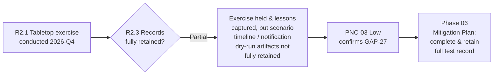

# 05.10 — CIP-008 RSAW & Evidence (Incident Reporting and Response Planning)

| Field | Value |
|---|---|
| Document ID | CIP-05.10 |
| Version | 1.0 |
| Date | 2026-03-02 |
| Classification | BES Cyber System Information (BCSI) // Illustrative Portfolio Sample |
| Owner | Karen Whitfield (NERC Compliance Manager) |
| Author | Advisory Team |
| Status | Approved |

## Purpose

This document records GridPoint Energy, Inc.'s ("GridPoint") internal (mock) assessment of **CIP-008-6 — Cyber Security Incident Reporting and Response Planning**, prepared on the official **Reliability Standard Audit Worksheet (RSAW)** template ahead of the **ReliabilityFirst (RF) Compliance Audit** scheduled for **2027-Q2**. It captures the requirement-by-requirement compliance determination, the evidence sampled by the Advisory Team and NERC Compliance Manager (Karen Whitfield), and the single **Potential Noncompliance (PNC)** identified for this standard — **PNC-03 (Low)**, incident-response test evidence not retained (confirms **GAP-27**). All other CIP-008 requirement parts were assessed **Compliant**.

## Standard Summary

CIP-008-6 requires each applicable Registered Entity to document, implement, test, and maintain one or more Cyber Security Incident response plan(s), and to notify the **Electricity Information Sharing and Analysis Center (E-ISAC)** and the **Cybersecurity and Infrastructure Security Agency (CISA)** of Reportable Cyber Security Incidents and attempts to compromise. The standard is **applicable to GridPoint's 14 Medium-impact BES Cyber Systems (BCS)**, the associated **26 EACMS**, and the **3 Electronic Security Perimeters (ESPs)**. Implementation is documented in `../04-technical-physical-control-implementation/04.15-incident-response-plan-cip-008.md`.

| Requirement | VRF | Subject |
|---|---|---|
| **R1** | Lower | One or more documented Cyber Security Incident response plan(s) |
| **R2** | Lower | Implement and **test** each plan every **15 calendar months**; retain records |
| **R3** | Lower | Review/update and communicate lessons learned within **90 calendar days** |
| **R4** | Lower | Notify **E-ISAC and CISA** of RCSIs (1 hour) and attempts (next calendar day) |

## Requirement-by-Requirement Compliance Determination

| Part | Requirement (abridged) | Assessment Method | Determination |
|---|---|---|---|
| **R1.1** | Process to identify, classify, and respond to Cyber Security Incidents | Doc review; interview (Bell) | **Compliant** |
| **R1.2** | Determine RCSI / attempt to compromise; initial notification process | Doc review; walkthrough of decision tree | **Compliant** |
| **R1.3** | Roles and responsibilities of incident-response groups/individuals | Doc review; interview (Whitfield) | **Compliant** |
| **R1.4** | Incident handling — containment, eradication, recovery | Doc review; playbook sampling | **Compliant** |
| **R2.1** | Test each plan every 15 calendar months (actual / drill / operational) | Evidence sampling | **Compliant** |
| **R2.2** | Use of the plan / document deviations during a test or actual response | Doc review | **Compliant** |
| **R2.3** | **Retain records** related to each Reportable Cyber Security Incident and each test | Evidence sampling | **PNC-03 (Low)** |
| **R3.1** | Document lessons learned (or none) within 90 days of a test / incident | Doc review | **Compliant** |
| **R3.2** | Update plan and communicate updates to those with a defined role | Doc review | **Compliant** |
| **R4.1** | Initial notification attributes (functional impact, vector, intrusion level) | Template review | **Compliant** |
| **R4.2** | Notify per required timelines after determination | Interview; workflow review | **Compliant** |
| **R4.3** | Notification deadlines (1 hour RCSI / end of next calendar day for attempts) | Doc review | **Compliant** |

## Evidence Sampled

| Evidence ID | Requirement Part | Description | Sample Result |
|---|---|---|---|
| EV-008-01 | R1.1–R1.4 | Cyber Security Incident Response Plan v1.0 (04.15) | Present; complete against all R1 parts |
| EV-008-02 | R1.3 | IR team roster with named roles (Bell IC, Whitfield, Nair, Okafor, Ruiz, Delgado, Reyes) | Present; current |
| EV-008-03 | R1.2 | Classification decision tree (RCSI vs. attempt) | Present; consistent with CIP-008-6 |
| EV-008-04 | R2.1 | Tabletop exercise agenda & participant sign-in (2026-Q4 window) | Present |
| EV-008-05 | R2.3 | **Retained test records** (scenario timeline, notification dry-run, findings) | **Incomplete — see PNC-03** |
| EV-008-06 | R3.1 | Lessons-learned memo within 90 days of exercise | Present |
| EV-008-07 | R4.1 | Pre-formatted E-ISAC / CISA initial-notification template | Present; captures required attributes |
| EV-008-08 | R4.3 | Reporting-timeline procedure (1 hour / next calendar day) | Present |

## PNC-03 (Low) — Incident-Response Test Evidence Not Retained

| Attribute | Detail |
|---|---|
| Finding ID | **PNC-03** |
| Standard / Part | CIP-008-6 **R2 (R2.3)** |
| Risk | **Low** |
| Confirms | **GAP-27** (Phase-04 in-progress item) |
| Condition | The 15-month IR plan test was performed and lessons learned were documented, but the **full retained test record** (complete scenario timeline and E-ISAC/CISA notification dry-run artifacts) was not fully preserved for the sampled exercise. |
| Cause | First exercise executed under the newly implemented plan; retention checklist not yet embedded in the exercise-closeout procedure. |
| Impact | Low — the test occurred and is corroborated by participant sign-in and the lessons-learned memo; only completeness of the retained artifact is deficient. No reliability impact; no missed reporting obligation. |
| Recommendation | Add a retention checklist to the exercise closeout; re-run or reconstruct the retained record and file it in the evidence repository. Track to closure via a Phase-06 Mitigation Plan. |
| Owner | Marcus Bell (OT/ICS Security Lead) with Karen Whitfield (Compliance Manager) |
| Target | Phase 06 — `../06-gap-remediation-mitigation-plans/06.00-README.md` |

## RSAW Compliance Narrative (Registered Entity Response Summary)

For the ReliabilityFirst audit, GridPoint's Registered Entity Response for CIP-008-6 will present the documented Cyber Security Incident Response Plan (R1) with its identification/classification decision tree (R1.1/R1.2), named IR-team roles (R1.3), and handling playbooks (R1.4); the 15-month exercise records (R2.1/R2.2); the 90-day lessons-learned/update cycle (R3); and the E-ISAC/CISA notification workflow with its 1-hour and next-calendar-day timelines (R4). Detection is sourced from CIP-007 R4 SIEM alerting, and the plan interfaces to CIP-009 recovery for the recovery phase of the lifecycle. The reviewer should note that all R1, R3, and R4 obligations are evidenced without exception; the only exception is the R2.3 record-retention completeness described below.

## Areas of Concern & Recommendations

| Item | Requirement | Assessor Recommendation |
|---|---|---|
| Retained test-record completeness | R2.3 | Embed a retention checklist in the exercise-closeout procedure so scenario timeline and notification dry-run artifacts are captured every cycle |
| Notification dry-run evidence | R4 / R2 | Retain a timestamped dry-run log for each tabletop to demonstrate the 1-hour capability under test conditions |
| First-cycle maturity | R2 | Because this is the first full 15-month cycle under the new plan, schedule an interim internal check before the RF audit to confirm the retention fix holds |

## Assessor Notes

The CIP-008 program is otherwise well-developed: R1 plan content is complete, R4 reporting timelines (1-hour RCSI to E-ISAC and CISA; next-calendar-day for attempts to compromise) are correctly documented with a pre-built notification template, and the 90-day R3 review loop is evidenced. The only deficiency is the **completeness of retained R2.3 test records**, rated **Low** because the underlying test demonstrably occurred. This finding carries to the consolidated register (05.15) and the mock-audit report (05.16), and is expected to close early in Phase 06 given its administrative nature.

## Reliability & Violation Severity Consideration

Had this been an actual audit finding, the R2 record-retention deficiency would most plausibly map to a **Lower VSL** given the test occurred and lessons learned were documented — the gap is evidentiary completeness, not an untested plan. The internal **Low** risk rating is consistent with that severity view. No minimal or moderate reliability impact arises because no reporting obligation was missed and detection/response capability remained intact throughout the assessment window.

## Cross-References

- `../04-technical-physical-control-implementation/04.15-incident-response-plan-cip-008.md` — implemented CIP-008 plan
- `../04-technical-physical-control-implementation/04.09-security-event-monitoring-cip-007-r4.md` — SIEM detection source
- `../02-bes-cyber-system-categorization/02.12-gap-register-and-risk-ranking.md` — GAP-27 origin
- `05.15-findings-register-and-risk-exposure.md` — consolidated PNC register (PNC-03)
- `05.16-mock-audit-report-and-readiness-rating.md` — mock-audit report
- `trackers/findings-register-pnc.xlsx` — machine-readable PNC register

---

[⬅ Previous](05.09-cip-007-rsaw-and-evidence.md) · [🏠 Phase README](05.00-README.md) · [Next ➡](05.11-cip-009-rsaw-and-evidence.md)
