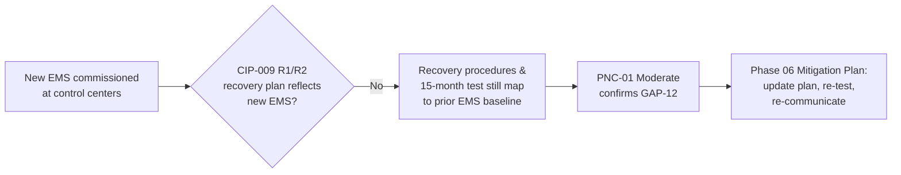

# 05.11 — CIP-009 RSAW & Evidence (Recovery Plans for BES Cyber Systems)

| Field | Value |
|---|---|
| Document ID | CIP-05.11 |
| Version | 1.0 |
| Date | 2026-03-02 |
| Classification | BES Cyber System Information (BCSI) // Illustrative Portfolio Sample |
| Owner | Karen Whitfield (NERC Compliance Manager) |
| Author | Advisory Team |
| Status | Approved |

## Purpose

This document records GridPoint Energy, Inc.'s ("GridPoint") internal (mock) assessment of **CIP-009-6 — Recovery Plans for BES Cyber Systems**, prepared on the official **Reliability Standard Audit Worksheet (RSAW)** template ahead of the **ReliabilityFirst (RF) Compliance Audit** (2027-Q2). It captures the requirement-by-requirement compliance determination, the evidence sampled, and the **two Potential Noncompliance (PNC)** findings identified for this standard — **PNC-01 (Moderate)**, recovery plan not updated for the new Energy Management System (EMS) (confirms **GAP-12**), and **PNC-04 (Low)**, backup restoration test overdue (confirms **GAP-28**).

## Standard Summary

CIP-009-6 requires each applicable Registered Entity to document, implement, and test recovery plan(s) for its BES Cyber Systems, including the processes to back up and restore, and to preserve data for post-event analysis. The standard is **applicable to GridPoint's 14 Medium-impact BES Cyber Systems (BCS)** and associated EACMS/PACS. Implementation is documented in `../04-technical-physical-control-implementation/04.16-recovery-plan-cip-009.md`.

| Requirement | VRF | Subject |
|---|---|---|
| **R1** | Medium | Recovery plan specifications — conditions for activation, roles, backup/restore, data preservation |
| **R2** | Lower | **Implement and test** recovery plans (15-month exercise; **backup media test**; representative-environment restore) |
| **R3** | Lower | Review/update recovery plans within **90 calendar days** and communicate updates |

## Requirement-by-Requirement Compliance Determination

| Part | Requirement (abridged) | Assessment Method | Determination |
|---|---|---|---|
| **R1.1** | Conditions for activation of the recovery plan | Doc review | **Compliant** |
| **R1.2** | Roles and responsibilities of responders | Doc review; interview (Okafor) | **Compliant** |
| **R1.3** | One or more processes for the **backup and storage** of information required to recover BCS functionality | Doc review; interview (Nair) | **Compliant** |
| **R1.4** | Process to **verify the successful completion** of backup processes and address failures | Evidence sampling | **Compliant** |
| **R1.5** | One or more processes to **preserve data** for determining the cause of an event triggering recovery | Doc review | **Compliant** |
| **R2.1** | **Test** each recovery plan at least once every **15 calendar months** | Evidence sampling | **PNC-01 (Moderate)** |
| **R2.2** | Test a **representative sample of information used to recover** (backup media) every 15 months | Evidence sampling | **PNC-04 (Low)** |
| **R2.3** | Test each recovery plan in a **representative environment** (or with an actual recovery) every 36 months | Doc review | **Compliant** |
| **R3.1** | Document lessons learned / update recovery plan within 90 days of a test or actual recovery | Doc review | **Compliant** |
| **R3.2** | Communicate updates to each person with a defined role | Doc review | **Compliant** |

## Evidence Sampled

| Evidence ID | Requirement Part | Description | Sample Result |
|---|---|---|---|
| EV-009-01 | R1.1–R1.5 | Recovery Plan v1.0 (04.16) — activation, roles, backup/restore, data preservation | Present |
| EV-009-02 | R1.3/R1.4 | Backup schedule + backup-completion verification logs (Easton DR) | Present; failures addressed |
| EV-009-03 | R2.1 | Recovery-plan exercise records — control-center BCS | **EMS scope not reflected — see PNC-01** |
| EV-009-04 | R2.2 | **Backup restoration / media test** records | **Overdue — see PNC-04** |
| EV-009-05 | R1.5 | Data-preservation procedure for post-event analysis | Present |
| EV-009-06 | R3.1 | Lessons-learned memo within 90 days | Present |
| EV-009-07 | R1.3 | Backup media inventory at Easton backup control center | Present |

## PNC-01 (Moderate) — Recovery Plan Not Updated for New EMS

| Attribute | Detail |
|---|---|
| Finding ID | **PNC-01** |
| Standard / Part | CIP-009-6 **R1 / R2 (R2.1)** |
| Risk | **Moderate** |
| Confirms | **GAP-12** (Phase-04 in-progress item) |
| Condition | The recovery plan and its most recent 15-month exercise do not fully reflect the **new Energy Management System (EMS)** deployed during control-center modernization; backup/restore steps and role references still map to the prior EMS baseline. |
| Cause | Recovery-plan update lagged the EMS cutover; change-management trigger to revise the recovery plan was not enforced. |
| Impact | Moderate — a recovery executed against the outdated procedure could delay restoration of control-center BCS functionality. No reliability event occurred; backups of the new EMS exist and complete successfully (R1.3/R1.4 Compliant). |
| Recommendation | Update the CIP-009 recovery plan to the new EMS architecture, re-run the R2.1 exercise against the updated plan, and communicate updates per R3.2. |
| Owner | James Okafor (Control Center Operations Manager) with Priya Nair (IT Security Manager) |
| Target | Phase 06 Mitigation Plan |

## PNC-04 (Low) — Backup Restoration Test Overdue

| Attribute | Detail |
|---|---|
| Finding ID | **PNC-04** |
| Standard / Part | CIP-009-6 **R2 (R2.2)** |
| Risk | **Low** |
| Confirms | **GAP-28** (Phase-04 in-progress item) |
| Condition | The **backup media restoration test** (verifying that a representative sample of recovery information can be restored) was **overdue** relative to the 15-month cycle for a sampled control-center BCS. |
| Cause | First full cycle under the new backup regime; restoration-test scheduling not yet embedded in the compliance calendar. |
| Impact | Low — backups are taken and completion-verified daily (R1.4 Compliant); only the periodic *restore-from-media* validation had lapsed. Corrected during the assessment window. |
| Recommendation | Perform the restoration test, retain the restore-verification record, and add the test to the CIP-009 compliance calendar with an automated reminder. |
| Owner | Priya Nair (IT Security Manager) |
| Target | Phase 06 Mitigation Plan |

## Assessor Notes

CIP-009 R1 plan content and R3 review discipline are sound, and daily backup completion is verified (R1.4). The two findings are concentrated in the **R2 testing** obligations: PNC-01 (Moderate) because the plan/test lag the new EMS, and PNC-04 (Low) because the periodic restoration test was overdue. Both were previously identified as Phase-04 in-progress gaps and are confirmed here for Mitigation-Plan treatment in Phase 06.

## Reliability & Violation Severity Consideration

For an actual audit, PNC-01 (R2.1 test not reflecting the new EMS) would carry the greater weight of the two findings because recovery capability for control-center BCS depends on current procedures; it is rated **Moderate** internally on that basis. PNC-04 (R2.2 restoration test overdue) is a bounded timing lapse against a control that is otherwise operating (daily backups are completion-verified), consistent with a **Low** rating and a Lower-to-Moderate VSL. Neither finding reflects an absent recovery capability, and both are corrected by executing tests already within GridPoint's operational reach.

## Cross-References

- `../04-technical-physical-control-implementation/04.16-recovery-plan-cip-009.md` — implemented recovery plan
- `../04-technical-physical-control-implementation/04.15-incident-response-plan-cip-008.md` — recovery phase of the incident lifecycle
- `../02-bes-cyber-system-categorization/02.12-gap-register-and-risk-ranking.md` — GAP-12, GAP-28 origin
- `05.15-findings-register-and-risk-exposure.md` — consolidated PNC register (PNC-01, PNC-04)
- `05.16-mock-audit-report-and-readiness-rating.md` — mock-audit report
- `trackers/findings-register-pnc.xlsx` — machine-readable PNC register

---

[⬅ Previous](05.10-cip-008-rsaw-and-evidence.md) · [🏠 Phase README](05.00-README.md) · [Next ➡](05.12-cip-010-rsaw-and-evidence.md)
