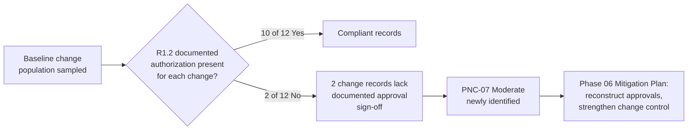

# 05.12 — CIP-010 RSAW & Evidence (Configuration Change Management and Vulnerability Assessments)

| Field | Value |
|---|---|
| Document ID | CIP-05.12 |
| Version | 1.0 |
| Date | 2026-03-02 |
| Classification | BES Cyber System Information (BCSI) // Illustrative Portfolio Sample |
| Owner | Karen Whitfield (NERC Compliance Manager) |
| Author | Advisory Team |
| Status | Approved |

## Purpose

This document records GridPoint Energy, Inc.'s ("GridPoint") internal (mock) assessment of **CIP-010-4 — Configuration Change Management and Vulnerability Assessments**, prepared on the official **Reliability Standard Audit Worksheet (RSAW)** template ahead of the **ReliabilityFirst (RF) Compliance Audit** (2027-Q2). It captures the requirement-by-requirement compliance determination, the evidence sampled across GridPoint's **14 configuration baselines** (one per Medium-impact BES Cyber System), and the single **Potential Noncompliance (PNC)** for this standard — **PNC-07 (Moderate)**, two baseline change records missing authorization approvals (newly identified during sampling).

## Standard Summary

CIP-010-4 requires each applicable Registered Entity to develop configuration baselines, authorize and document changes that deviate from the baseline, monitor for unauthorized changes, conduct periodic vulnerability assessments, and control Transient Cyber Assets (TCAs) and Removable Media. The standard is **applicable to GridPoint's 14 Medium-impact BES Cyber Systems (BCS)** and associated EACMS/PACS/PCA. Implementation is documented across `../04-technical-physical-control-implementation/04.11-configuration-baselines-cip-010-r1.md` through `04.14`.

| Requirement | VRF | Subject |
|---|---|---|
| **R1** | Medium | Configuration change management — baselines, authorization, verification, security-control validation |
| **R2** | Medium | Configuration monitoring — detect unauthorized changes (35-day / event-driven) |
| **R3** | Medium | Vulnerability assessments — paper VA every **15 months** (active VA / 36 months = High only, N/A) |
| **R4** | Medium | Transient Cyber Assets and Removable Media (Attachment 1) |

## Requirement-by-Requirement Compliance Determination

| Part | Requirement (abridged) | Assessment Method | Determination |
|---|---|---|---|
| **R1.1** | Develop a baseline configuration for each applicable BCS (OS/firmware, software, ports, patches) | Baseline sampling (14) | **Compliant** |
| **R1.2** | **Authorize and document** changes that deviate from the existing baseline | Change-record sampling | **PNC-07 (Moderate)** |
| **R1.3** | Update the baseline within **30 calendar days** of completing a change | Change-record sampling | **Compliant** |
| **R1.4** | Verify required security controls are not adversely affected by a change | Change-record sampling | **Compliant** |
| **R1.5** | For High only — test changes in a representative environment | N/A (no High assets) | **Compliant (N/A)** |
| **R2.1** | Monitor for unauthorized changes to the baseline every **35 calendar days** | Doc review; tool config | **Compliant** |
| **R3.1** | Paper vulnerability assessment at least once every **15 calendar months** | Evidence sampling | **Compliant** |
| **R3.2** | Active VA every 36 months (High only) | N/A (no High assets) | **Compliant (N/A)** |
| **R3.3** | VA prior to adding a new applicable Cyber Asset to production | Doc review | **Compliant** |
| **R3.4** | Document results and an action plan to remediate/mitigate findings | Evidence sampling | **Compliant** |
| **R4** | TCA and Removable Media plan (Attachment 1) | Doc review; interview (Ruiz) | **Compliant** |

## Evidence Sampled

| Evidence ID | Requirement Part | Description | Sample Result |
|---|---|---|---|
| EV-010-01 | R1.1 | 14 baseline configuration records (one per Medium BCS) | 14 of 14 present |
| EV-010-02 | R1.2 | Change-authorization records sampled (12 of a change population) | **2 missing approval sign-off — see PNC-07** |
| EV-010-03 | R1.3 | Baseline update timestamps vs. change-completion dates | Within 30 days |
| EV-010-04 | R1.4 | Post-change security-control verification records | Present |
| EV-010-05 | R2.1 | 35-day configuration-monitoring reports (unauthorized-change detection) | Present; no unauthorized changes |
| EV-010-06 | R3.1 | Most recent paper vulnerability assessment (≤15 months) | Present |
| EV-010-07 | R3.4 | VA findings + remediation action plan | Present |
| EV-010-08 | R4 | TCA / Removable Media control records | Present |

## PNC-07 (Moderate) — Two Baseline Change Records Missing Approvals

| Attribute | Detail |
|---|---|
| Finding ID | **PNC-07** |
| Standard / Part | CIP-010-4 **R1 (R1.2)** |
| Risk | **Moderate** |
| Origin | **Newly identified** during evidence sampling |
| Condition | Of the baseline change records sampled, **two** deviating changes were implemented and the baseline was updated, but the records **lacked the documented prior authorization (approval sign-off)** required by R1.2. |
| Cause | Change tickets were processed under time pressure during the modernization window; the approval gate was performed verbally but not captured in the change record. |
| Impact | Moderate — the changes themselves were technically sound and post-change security-control verification (R1.4) passed, and configuration monitoring (R2.1) detected no unauthorized change; the deficiency is the **absence of documented authorization**, an internal-controls failure that could be cited as a change-management control gap. |
| Recommendation | Reconstruct/ratify the approvals where the approving authority can attest; enforce a hard approval gate in the change-management workflow so no baseline change closes without a captured sign-off. Sample a wider change population to confirm the deficiency is isolated. |
| Owner | Marcus Bell (OT/ICS Security Lead) with Elena Ruiz (Substation & Field Engineering Lead) |
| Target | Phase 06 Mitigation Plan |

## RSAW Compliance Narrative (Registered Entity Response Summary)

GridPoint's Registered Entity Response for CIP-010-4 will present the **14 configuration baselines** (R1.1, one per Medium BCS) covering operating system/firmware, commercially and custom software, logical ports, and security patches; the change-authorization records (R1.2), 30-day baseline-update records (R1.3), and post-change security-control verification (R1.4); the 35-day configuration-monitoring reports (R2.1); the paper vulnerability assessment and remediation action plan (R3); and the Transient Cyber Asset / Removable Media controls (R4, Attachment 1). R1.5 and R3.2 are documented as **N/A** because GridPoint has no High-impact assets. The reviewer should note that configuration monitoring detected no unauthorized changes across the sample period — the two flagged changes were authorized in substance but lacked captured approval evidence.

## Areas of Concern & Recommendations

| Item | Requirement | Assessor Recommendation |
|---|---|---|
| Missing captured approvals (2 records) | R1.2 | Enforce a hard approval gate; no baseline change closes without a recorded sign-off |
| Sampling breadth | R1.2 | Expand the change-record sample before the RF audit to confirm the deficiency is isolated to the two records |
| Change-management under schedule pressure | R1 | Provide a lightweight emergency-change path that still captures authorization to avoid recurrence during outage windows |

## Assessor Notes

CIP-010 is strong overall: all **14 baselines** are complete (R1.1), the 35-day configuration-monitoring cycle (R2.1) detected no unauthorized changes, and the paper vulnerability assessment (R3) is current with a documented remediation action plan. The lone finding, **PNC-07 (Moderate)**, is a documentation/authorization gap in **two** sampled change records under R1.2 — a newly identified item (not one of the five Phase-04 in-progress gaps). It carries to the consolidated register (05.15) and the mock-audit report (05.16) for Mitigation-Plan treatment in Phase 06.

## Reliability & Violation Severity Consideration

PNC-07 is an internal-controls documentation deficiency: the two changes were technically validated (R1.4 passed) and configuration monitoring (R2.1) detected no unauthorized change, so the reliability impact is minimal. For an actual audit it would most plausibly map to a **Lower-to-Moderate VSL** — the changes were authorized in substance but the approval was not captured — consistent with the internal **Moderate** rating driven by the change-management control-gap dimension rather than any operational impact.

## Cross-References

- `../04-technical-physical-control-implementation/04.11-configuration-baselines-cip-010-r1.md` — baselines (R1)
- `../04-technical-physical-control-implementation/04.12-configuration-monitoring-cip-010-r2.md` — monitoring (R2)
- `../04-technical-physical-control-implementation/04.13-vulnerability-assessments-cip-010-r3.md` — VA (R3)
- `../04-technical-physical-control-implementation/04.14-transient-cyber-assets-cip-010-r4.md` — TCA / Removable Media (R4)
- `05.15-findings-register-and-risk-exposure.md` — consolidated PNC register (PNC-07)
- `05.16-mock-audit-report-and-readiness-rating.md` — mock-audit report
- `trackers/findings-register-pnc.xlsx` — machine-readable PNC register

---

[⬅ Previous](05.11-cip-009-rsaw-and-evidence.md) · [🏠 Phase README](05.00-README.md) · [Next ➡](05.13-cip-011-rsaw-and-evidence.md)
