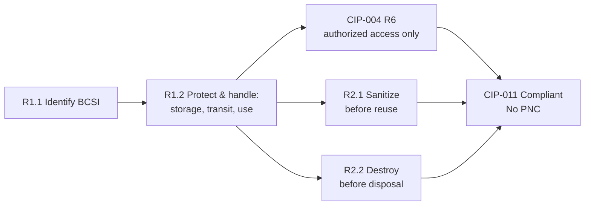

# 05.13 — CIP-011 RSAW & Evidence (Information Protection — BCSI)

| Field | Value |
|---|---|
| Document ID | CIP-05.13 |
| Version | 1.0 |
| Date | 2026-03-02 |
| Classification | BES Cyber System Information (BCSI) // Illustrative Portfolio Sample |
| Owner | Karen Whitfield (NERC Compliance Manager) |
| Author | Advisory Team |
| Status | Approved |

## Purpose

This document records GridPoint Energy, Inc.'s ("GridPoint") internal (mock) assessment of **CIP-011-3 — Information Protection**, prepared on the official **Reliability Standard Audit Worksheet (RSAW)** template ahead of the **ReliabilityFirst (RF) Compliance Audit** (2027-Q2). CIP-011 governs the protection of **BES Cyber System Information (BCSI)**. Following evidence sampling and interviews, GridPoint's implementation was assessed **Compliant** across all requirement parts, with **no Potential Noncompliance (PNC)** identified for this standard. This closes the last of the BCSI-related concerns (the residual **GAP-29** labeling item having been fully addressed in Phase 04).

## Standard Summary

CIP-011-3 requires each applicable Registered Entity to (R1) implement one or more documented information-protection program(s) that identify and protect BCSI, and (R2) prevent unauthorized retrieval of BCSI from Cyber Assets and media prior to reuse or disposal. The standard is **applicable to GridPoint's 14 Medium-impact BES Cyber Systems (BCS)** and associated EACMS/PACS/PCA. Implementation is documented in `../04-technical-physical-control-implementation/04.17-bcsi-information-protection-cip-011.md`, and BCSI access authorization is governed under CIP-004 R6 (`../03-policies-governance-personnel/03.09-bcsi-access-management.md`).

| Requirement | VRF | Subject |
|---|---|---|
| **R1** | Medium | Information Protection Program — identify BCSI; protect and handle BCSI (incl. storage, transit, use) |
| **R2** | Lower | BCSI reuse and disposal — prevent unauthorized retrieval before reuse; prevent retrieval upon disposal |

## Requirement-by-Requirement Compliance Determination

| Part | Requirement (abridged) | Assessment Method | Determination |
|---|---|---|---|
| **R1.1** | Method(s) to **identify** information that meets the definition of BCSI | Doc review; interview (Nair) | **Compliant** |
| **R1.2** | Method(s) to **protect and securely handle** BCSI, including storage, transit, and use | Evidence sampling; walkthrough | **Compliant** |
| **R2.1** | Prior to **reuse**, take action to prevent unauthorized retrieval of BCSI from the Cyber Asset/media | Evidence sampling | **Compliant** |
| **R2.2** | Prior to **disposal**, take action to prevent unauthorized retrieval of BCSI (e.g., destruction) | Evidence sampling | **Compliant** |

## Evidence Sampled

| Evidence ID | Requirement Part | Description | Sample Result |
|---|---|---|---|
| EV-011-01 | R1.1 | BCSI identification method + BCSI examples register | Present; complete |
| EV-011-02 | R1.2 | BCSI handling standard — storage, labeling, transit, and use controls | Present |
| EV-011-03 | R1.2 | Engineering file-share access controls (remediated GAP-06 / GAP-29) | Present; access restricted & logged |
| EV-011-04 | R1.2 | Encryption-in-transit configuration for BCSI exchange | Present |
| EV-011-05 | R2.1 | Media sanitization records prior to reuse (sampled) | Present |
| EV-011-06 | R2.2 | Media/asset destruction certificates prior to disposal (sampled) | Present |
| EV-011-07 | R1.1/R1.2 | BCSI access authorization cross-check to CIP-004 R6 register | Consistent; authorized personnel only |

## Compliance Narrative

GridPoint's information-protection program identifies BCSI through documented criteria (R1.1) and protects it through a handling standard covering storage, labeling, encryption in transit, and controlled use (R1.2). Access to BCSI is limited to authorized personnel under the CIP-004 R6 program, and the previously flagged engineering file-share exposure (GAP-06, High, closed in Phase 04) and labeling item (GAP-29, closed) were verified during sampling. Reuse (R2.1) and disposal (R2.2) controls are evidenced by media-sanitization records and destruction certificates. No deficiencies were identified; **CIP-011 is assessed Compliant with zero PNCs**.

## BCSI Handling Controls Verified

CIP-011-3 modernized BCSI access to a provisioned-access model. GridPoint's controls were sampled across the BCSI lifecycle and each was found operating:

| Lifecycle Stage | Control Verified | Requirement |
|---|---|---|
| Identification | Documented criteria distinguish BCSI from non-BCSI engineering data | R1.1 |
| Storage | BCSI repositories access-restricted; engineering file share remediated (GAP-06) | R1.2 |
| Transit | Encryption-in-transit for BCSI exchange; no plaintext external transfer | R1.2 |
| Use | BCSI labeling standard applied; provisioned access aligned to CIP-004 R6 | R1.2 |
| Reuse | Media sanitization performed and recorded before reuse | R2.1 |
| Disposal | Destruction certificates retained before asset/media disposal | R2.2 |

## Areas of Concern & Recommendations

No Areas of Concern were identified for CIP-011. As a sustaining recommendation, GridPoint should continue periodic access re-verification for BCSI repositories (under CIP-004 R6) and re-confirm the encryption-in-transit configuration whenever a new BCSI exchange path is introduced, so the clean result is maintained through the RF audit window.

## Assessor Notes

CIP-011 is the strongest of the standards assessed in this cycle, with no findings. It is included here to complete the RSAW evidence set and to demonstrate that the BCSI controls implemented in Phases 03–04 hold up under independent evidence sampling. Because BCSI classification touches every document in this portfolio (see the classification banner in each metadata table), a clean CIP-011 result also reinforces the defensibility of the broader evidence repository. This standard contributes **zero PNCs** to the consolidated register (05.15) and the mock-audit report (05.16).

## Reliability & Violation Severity Consideration

With no PNCs, CIP-011 presents no Violation Severity Level exposure for GridPoint in this cycle. The clean result rests on a defensible chain: documented BCSI identification criteria (R1.1), a handling standard enforced across storage/transit/use (R1.2) with access limited under CIP-004 R6, and evidenced sanitization/destruction before reuse and disposal (R2.1/R2.2). The Advisory Team notes that the prior High-risk BCSI exposure (GAP-06, engineering file shares) was independently re-tested during sampling and confirmed closed, which is material to the audit because a recurrence would elevate BCSI risk across the program.

## Sustaining Controls for the RF Audit Window

| Sustaining Action | Purpose |
|---|---|
| Periodic BCSI access re-verification (CIP-004 R6) | Keep provisioned access aligned to need through 2027-Q2 |
| Re-confirm encryption-in-transit on new exchange paths | Preserve R1.2 protection as architecture evolves |
| Retain sanitization/destruction certificates | Maintain a continuous R2 evidence trail |
| Re-run a targeted BCSI access sample pre-audit | Confirm the clean CIP-011 result holds at audit time |
| Refresh BCSI examples register on architecture change | Keep R1.1 identification criteria current |

## Cross-References

- `../04-technical-physical-control-implementation/04.17-bcsi-information-protection-cip-011.md` — implemented BCSI program
- `../03-policies-governance-personnel/03.09-bcsi-access-management.md` — CIP-004 R6 BCSI access authorization
- `../02-bes-cyber-system-categorization/02.12-gap-register-and-risk-ranking.md` — GAP-06, GAP-29 (closed)
- `05.15-findings-register-and-risk-exposure.md` — consolidated PNC register (no CIP-011 finding)
- `05.16-mock-audit-report-and-readiness-rating.md` — mock-audit report
- `05.06-cip-004-rsaw-and-evidence.md` — CIP-004 R6 BCSI access authorization cross-check
- `../02-bes-cyber-system-categorization/02.07-associated-eacms-pacs-pca.md` — associated systems in BCSI scope
- `trackers/findings-register-pnc.xlsx` — machine-readable PNC register

---

[⬅ Previous](05.12-cip-010-rsaw-and-evidence.md) · [🏠 Phase README](05.00-README.md) · [Next ➡](05.14-cip-013-rsaw-and-evidence.md)
