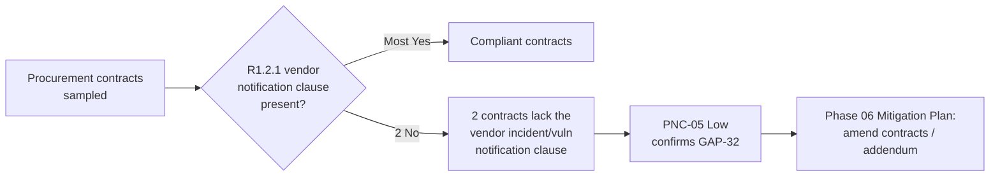

# 05.14 — CIP-013 RSAW & Evidence (Supply Chain Risk Management)

| Field | Value |
|---|---|
| Document ID | CIP-05.14 |
| Version | 1.0 |
| Date | 2026-03-02 |
| Classification | BES Cyber System Information (BCSI) // Illustrative Portfolio Sample |
| Owner | Karen Whitfield (NERC Compliance Manager) |
| Author | Advisory Team |
| Status | Approved |

## Purpose

This document records GridPoint Energy, Inc.'s ("GridPoint") internal (mock) assessment of **CIP-013-2 — Supply Chain Risk Management**, prepared on the official **Reliability Standard Audit Worksheet (RSAW)** template ahead of the **ReliabilityFirst (RF) Compliance Audit** (2027-Q2). It captures the requirement-by-requirement compliance determination, the evidence sampled, and the single **Potential Noncompliance (PNC)** for this standard — **PNC-05 (Low)**, vendor notification clauses missing in **2** procurement contracts (confirms **GAP-32**).

## Standard Summary

CIP-013-2 requires each applicable Registered Entity to develop and implement one or more documented supply-chain cyber security risk-management plan(s) for its high- and medium-impact BES Cyber Systems (and, per CIP-013-2, associated EACMS and PACS), addressing procurement and vendor risk. The standard is **applicable to GridPoint's 14 Medium-impact BES Cyber Systems (BCS)** and associated **26 EACMS / 18 PACS**. Implementation is documented in `../04-technical-physical-control-implementation/04.18-supply-chain-risk-management-cip-013.md`.

| Requirement | VRF | Subject |
|---|---|---|
| **R1** | Medium | Develop supply-chain risk-management plan(s): (R1.1) process for procurement risk; (R1.2) procurement-contract security concepts (vendor notification, coordinated response, disclosure, remote access controls, software integrity) |
| **R2** | Medium | **Implement** the supply-chain risk-management plan(s) |
| **R3** | Lower | Review and obtain **CIP Senior Manager** approval of the plan(s) at least every **15 calendar months** |

## Requirement-by-Requirement Compliance Determination

| Part | Requirement (abridged) | Assessment Method | Determination |
|---|---|---|---|
| **R1.1** | Process to identify and assess cyber security risk from vendor products/services during procurement/planning | Doc review; interview (Whitfield) | **Compliant** |
| **R1.2.1** | Vendor **notification** of vendor-identified incidents / product vulnerabilities | Contract sampling | **PNC-05 (Low)** |
| **R1.2.2** | Coordination of controls for vendor-initiated **remote access** | Contract sampling | **Compliant** |
| **R1.2.3** | Vendor **disclosure** of known vulnerabilities | Contract sampling | **Compliant** |
| **R1.2.4** | Verification of **software integrity and authenticity** | Doc review | **Compliant** |
| **R1.2.5** | Coordination of vendor **remote-access controls** (Interactive & system-to-system) | Doc review; CIP-005 cross-check | **Compliant** |
| **R2** | Implement the supply-chain risk-management plan(s) | Evidence sampling | **Compliant** |
| **R3** | Review and CIP Senior Manager (Reyes) approval every 15 months | Approval-record review | **Compliant** |

## Evidence Sampled

| Evidence ID | Requirement Part | Description | Sample Result |
|---|---|---|---|
| EV-013-01 | R1.1 | Supply-Chain Risk Management (SCRM) plan v1.0 (04.18) | Present; complete |
| EV-013-02 | R1.1 | Vendor risk-assessment records for in-scope procurements | Present |
| EV-013-03 | R1.2 | Procurement contract clause matrix (notification, remote access, disclosure, integrity) | **2 of sampled contracts lack notification clause — see PNC-05** |
| EV-013-04 | R1.2.5 | Vendor remote-access control coordination (cross-ref CIP-005 R2) | Present; consistent |
| EV-013-05 | R1.2.4 | Software integrity/authenticity verification procedure | Present |
| EV-013-06 | R2 | Implementation evidence — SCRM plan applied to recent procurements | Present |
| EV-013-07 | R3 | CIP Senior Manager (Reyes) approval record within 15 months | Present |

## PNC-05 (Low) — Vendor Notification Clauses Missing in 2 Contracts

| Attribute | Detail |
|---|---|
| Finding ID | **PNC-05** |
| Standard / Part | CIP-013-2 **R1 (R1.2.1)** |
| Risk | **Low** |
| Confirms | **GAP-32** (Phase-04 in-progress item) |
| Condition | Two sampled procurement contracts for in-scope vendor products/services **omit the vendor-notification clause** (vendor notification of vendor-identified incidents and product vulnerabilities) required to be addressed under R1.2.1. |
| Cause | Contracts predate or were executed during the SCRM plan rollout; the standard clause set was not retro-applied to those agreements. |
| Impact | Low — CIP-013-2 requires the plan to *address* these concepts, and GridPoint's SCRM process and clause template do so; the deficiency is limited to two legacy agreements. Vendor remote-access controls (R1.2.5) remain enforced through CIP-005 R2 regardless of contract language. |
| Recommendation | Execute contract amendments/addenda adding the notification clause for the two vendors; confirm the clause template is applied to all new and renewing in-scope contracts. |
| Owner | Karen Whitfield (NERC Compliance Manager) with Priya Nair (IT Security Manager) |
| Target | Phase 06 Mitigation Plan |

## RSAW Compliance Narrative (Registered Entity Response Summary)

GridPoint's Registered Entity Response for CIP-013-2 will present the documented Supply-Chain Risk Management (SCRM) plan (R1) covering the procurement risk-assessment process (R1.1) and the six security concepts to be addressed in procurement (R1.2.1–R1.2.6): vendor incident/vulnerability notification, coordinated incident response, vendor disclosure of known vulnerabilities, software integrity and authenticity verification, and coordination of vendor-initiated Interactive and system-to-system remote access. Implementation evidence (R2) demonstrates the plan applied to recent procurements, and the CIP Senior Manager (Daniel Reyes) approval record satisfies the 15-month review obligation (R3). The reviewer should note that GridPoint's clause template addresses all required concepts; the deficiency is confined to two legacy agreements executed before template rollout.

## Areas of Concern & Recommendations

| Item | Requirement | Assessor Recommendation |
|---|---|---|
| Missing notification clause (2 contracts) | R1.2.1 | Execute amendments/addenda; confirm template application on renewal |
| Legacy-contract coverage | R1 | Sweep the full in-scope contract population to confirm no additional legacy gaps |
| Compensating control | R1.2.5 | Document that CIP-005 R2 enforces vendor remote-access controls independent of contract language, limiting exposure |
| Renewal-gate control | R1.2 | Add a procurement checkpoint so no in-scope contract renews without the full clause set |

## Assessor Notes

CIP-013's plan (R1), implementation (R2), and 15-month CIP Senior Manager approval (R3) are all in place and evidenced. The single finding, **PNC-05 (Low)**, is a contract-language gap in **two** legacy agreements under R1.2.1 — a confirmation of Phase-04 in-progress **GAP-32** — and is straightforward to remediate via contract amendment in Phase 06. It carries to the consolidated register (05.15) and the mock-audit report (05.16).

## Reliability & Violation Severity Consideration

PNC-05 is a contract-documentation gap in two legacy agreements. Because CIP-013-2 R1 obligates the entity to *address* the security concepts in its plan (which GridPoint's template does) and the vendor remote-access controls are independently enforced through CIP-005 R2, the reliability exposure is minimal and the finding maps to a **Lower VSL** for an actual audit — consistent with the internal **Low** rating. Remediation is a contract amendment rather than a control build, making this among the fastest of the nine PNCs to close in Phase 06.

## Cross-References

- `../04-technical-physical-control-implementation/04.18-supply-chain-risk-management-cip-013.md` — implemented SCRM plan
- `../04-technical-physical-control-implementation/04.03-interactive-remote-access-cip-005-r2.md` — vendor remote-access controls (R1.2.5 cross-check)
- `../02-bes-cyber-system-categorization/02.12-gap-register-and-risk-ranking.md` — GAP-32 origin
- `05.15-findings-register-and-risk-exposure.md` — consolidated PNC register (PNC-05)
- `05.16-mock-audit-report-and-readiness-rating.md` — mock-audit report
- `05.07-cip-005-rsaw-and-evidence.md` — CIP-005 R2 vendor remote-access enforcement (compensating control)
- `../02-bes-cyber-system-categorization/02.07-associated-eacms-pacs-pca.md` — EACMS/PACS in CIP-013 scope
- `trackers/findings-register-pnc.xlsx` — machine-readable PNC register

---

[⬅ Previous](05.13-cip-011-rsaw-and-evidence.md) · [🏠 Phase README](05.00-README.md) · [Next ➡](05.15-findings-register-and-risk-exposure.md)
