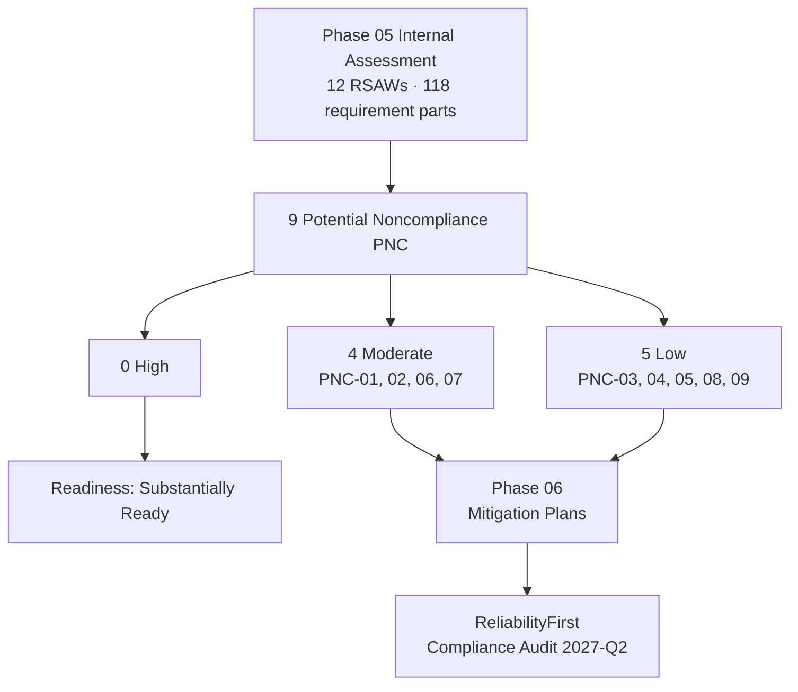

# 05.15 — Findings Register & Risk Exposure (Potential Noncompliance)

| Field | Value |
|---|---|
| Document ID | CIP-05.15 |
| Version | 1.0 |
| Date | 2026-03-02 |
| Classification | BES Cyber System Information (BCSI) // Illustrative Portfolio Sample |
| Owner | Karen Whitfield (NERC Compliance Manager) |
| Author | Advisory Team |
| Status | Approved |

## Purpose

This document is the **keystone consolidated findings register** for GridPoint Energy, Inc.'s ("GridPoint") internal (mock) compliance assessment. It records every **Potential Noncompliance (PNC)** surfaced during the Phase-05 Reliability Standard Audit Worksheet (RSAW) reviews, evidence sampling, interviews, and technical validation across the **118 applicable CIP requirement parts** and **12 RSAWs**. It quantifies GridPoint's residual compliance risk exposure ahead of the **ReliabilityFirst (RF) Compliance Audit** (2027-Q2), assigns an owner and a Phase-06 remediation target to each finding, and provides the authoritative source that feeds the machine-readable register at `trackers/findings-register-pnc.xlsx`.

**Headline result: 9 PNCs — 0 High · 4 Moderate · 5 Low.** No High-risk noncompliance was identified. Five PNCs confirm Phase-04 in-progress gaps; four were newly identified during independent sampling. All nine are remediable via **Mitigation Plans** in Phase 06 before the RF audit, supporting the overall readiness rating of **"Substantially Ready"** (see 05.16).

## How to Read This Register

- **Risk rating** reflects the internal assessor's judgment of reliability and compliance exposure (High / Moderate / Low), analogous to how a Regional Entity weighs the actual/potential impact of a possible violation. **None** of the nine findings rose to **High**.
- **Confirms** indicates a PNC that validates a gap already tracked as *in progress* from the Phase-02 gap register (see `../02-bes-cyber-system-categorization/02.12-gap-register-and-risk-ranking.md`); **New** indicates a finding first surfaced during Phase-05 sampling.
- **Target** for every finding is **Phase 06 — Gap Remediation & Mitigation Plans**; each PNC becomes a tracked Mitigation Plan milestone.

## Consolidated PNC Register (PNC-01 … PNC-09)

| PNC | Standard / Part | Risk | Origin | Short Description |
|---|---|---|---|---|
| **PNC-01** | CIP-009-6 R1 / R2 | **Moderate** | Confirms GAP-12 | Recovery plan not updated for the new EMS |
| **PNC-02** | CIP-005-7 R2 | **Moderate** | Confirms GAP-21 | Interactive Remote Access (IRA) session logging incomplete |
| **PNC-03** | CIP-008-6 R2 | **Low** | Confirms GAP-27 | Incident-response test evidence not retained |
| **PNC-04** | CIP-009-6 R2 | **Low** | Confirms GAP-28 | Backup restoration test overdue |
| **PNC-05** | CIP-013-2 R1 | **Low** | Confirms GAP-32 | Vendor notification clauses missing in 2 contracts |
| **PNC-06** | CIP-007-6 R4 | **Moderate** | New | Audit-log review documentation gaps found in sampling |
| **PNC-07** | CIP-010-4 R1 | **Moderate** | New | Two baseline change records missing approvals |
| **PNC-08** | CIP-006-6 R2 | **Low** | New | One PACS clock drift affecting log timestamps |
| **PNC-09** | CIP-004-7 R4 | **Low** | New | One quarterly access review not signed |

## Detailed Findings

### PNC-01 (Moderate) — CIP-009-6 R1/R2 — Recovery Plan Not Updated for New EMS

| Attribute | Detail |
|---|---|
| Risk | **Moderate** · Origin: Confirms **GAP-12** |
| Description | The CIP-009 recovery plan and its most recent 15-month exercise do not fully reflect the new Energy Management System (EMS) deployed during control-center modernization; backup/restore steps and role references still map to the prior EMS baseline. |
| Recommendation | Update the recovery plan to the new EMS architecture, re-run the R2.1 exercise against the updated plan, and communicate updates per R3.2. |
| Owner | James Okafor (Control Center Operations Manager); support: Priya Nair (IT Security Manager) |
| Target | Phase 06 Mitigation Plan · RSAW: 05.11 |

### PNC-02 (Moderate) — CIP-005-7 R2 — IRA Session Logging Incomplete

| Attribute | Detail |
|---|---|
| Risk | **Moderate** · Origin: Confirms **GAP-21** |
| Description | Interactive Remote Access through the Intermediate System (jump host) is enforced with MFA and encryption, but session-logging records were incomplete for a subset of vendor IRA sessions, weakening the evidentiary trail for R2 remote-access monitoring. |
| Recommendation | Enable and validate complete IRA session logging on the Intermediate System; verify log retention and reconcile against the vendor-access roster; sample to confirm completeness. |
| Owner | Marcus Bell (OT/ICS Security Lead); support: Priya Nair (IT Security Manager) |
| Target | Phase 06 Mitigation Plan · RSAW: 05.07 |

### PNC-03 (Low) — CIP-008-6 R2 — Incident-Response Test Evidence Not Retained

| Attribute | Detail |
|---|---|
| Risk | **Low** · Origin: Confirms **GAP-27** |
| Description | The 15-month IR plan test was performed and lessons learned were documented, but the full retained test record (scenario timeline and E-ISAC/CISA notification dry-run artifacts) was not fully preserved for the sampled exercise. |
| Recommendation | Add a retention checklist to the exercise closeout; reconstruct and file the complete retained test record in the evidence repository. |
| Owner | Marcus Bell (OT/ICS Security Lead); support: Karen Whitfield (NERC Compliance Manager) |
| Target | Phase 06 Mitigation Plan · RSAW: 05.10 |

### PNC-04 (Low) — CIP-009-6 R2 — Backup Restoration Test Overdue

| Attribute | Detail |
|---|---|
| Risk | **Low** · Origin: Confirms **GAP-28** |
| Description | The backup media restoration test (R2.2) verifying that a representative sample of recovery information can be restored was overdue relative to the 15-month cycle for a sampled control-center BCS. Daily backup completion (R1.4) is verified. |
| Recommendation | Perform the restoration test, retain the restore-verification record, and add the test to the CIP-009 compliance calendar with an automated reminder. |
| Owner | Priya Nair (IT Security Manager) |
| Target | Phase 06 Mitigation Plan · RSAW: 05.11 |

### PNC-05 (Low) — CIP-013-2 R1 — Vendor Notification Clauses Missing in 2 Contracts

| Attribute | Detail |
|---|---|
| Risk | **Low** · Origin: Confirms **GAP-32** |
| Description | Two sampled in-scope procurement contracts omit the vendor-notification clause (vendor notification of vendor-identified incidents and product vulnerabilities) addressed under R1.2.1. Vendor remote-access controls remain enforced through CIP-005 R2. |
| Recommendation | Execute contract amendments/addenda adding the notification clause; confirm the standard clause template is applied to all new and renewing in-scope contracts. |
| Owner | Karen Whitfield (NERC Compliance Manager); support: Priya Nair (IT Security Manager) |
| Target | Phase 06 Mitigation Plan · RSAW: 05.14 |

### PNC-06 (Moderate) — CIP-007-6 R4 — Audit-Log Review Documentation Gaps

| Attribute | Detail |
|---|---|
| Risk | **Moderate** · Origin: **New** (surfaced in sampling) |
| Description | SIEM-based security event monitoring is operating, but documentation evidencing the required periodic review of logged events (R4 audit-log review) had gaps for one sampled review interval — the review occurred but the reviewer attestation/record was incomplete. |
| Recommendation | Formalize a signed log-review attestation on the defined cadence; back-fill the missing interval evidence; add a control check so no review interval closes without a captured record. |
| Owner | Priya Nair (IT Security Manager); support: Marcus Bell (OT/ICS Security Lead) |
| Target | Phase 06 Mitigation Plan · RSAW: 05.09 |

### PNC-07 (Moderate) — CIP-010-4 R1 — Two Baseline Change Records Missing Approvals

| Attribute | Detail |
|---|---|
| Risk | **Moderate** · Origin: **New** (surfaced in sampling) |
| Description | Of the baseline change records sampled, two deviating changes were implemented and the baseline updated (R1.3) with passing post-change verification (R1.4), but the records lacked the documented prior authorization (approval sign-off) required by R1.2. |
| Recommendation | Reconstruct/ratify approvals where attestable; enforce a hard approval gate in the change-management workflow; sample a wider change population to confirm the deficiency is isolated. |
| Owner | Marcus Bell (OT/ICS Security Lead); support: Elena Ruiz (Substation & Field Engineering Lead) |
| Target | Phase 06 Mitigation Plan · RSAW: 05.12 |

### PNC-08 (Low) — CIP-006-6 R2 — PACS Clock Drift Affecting Log Timestamps

| Attribute | Detail |
|---|---|
| Risk | **Low** · Origin: **New** (surfaced in sampling) |
| Description | One Physical Access Control System (PACS) exhibited clock drift, causing physical-access log timestamps to diverge from reference time. Access monitoring and ≥90-day log retention are otherwise operating. |
| Recommendation | Synchronize the affected PACS to the authoritative time source, add time-sync monitoring, and verify timestamp accuracy across all PACS at the 10 PSPs. |
| Owner | Frank Delgado (Physical Security Manager) |
| Target | Phase 06 Mitigation Plan · RSAW: 05.08 |

### PNC-09 (Low) — CIP-004-7 R4 — One Quarterly Access Review Not Signed

| Attribute | Detail |
|---|---|
| Risk | **Low** · Origin: **New** (surfaced in sampling) |
| Description | The quarterly access-privilege verification (R4) was performed for the sampled quarter, but one review record lacked the required reviewer sign-off, leaving the attestation incomplete. |
| Recommendation | Obtain the missing sign-off; institute a checklist/workflow control so no quarterly access review is closed without an authorizing signature. |
| Owner | Sandra Lee (HR / PRA Coordinator); support: Karen Whitfield (NERC Compliance Manager) |
| Target | Phase 06 Mitigation Plan · RSAW: 05.06 |

## Risk Exposure & Distribution Summary

| Risk Rating | Count | PNCs |
|---|---|---|
| **High** | **0** | — |
| **Moderate** | **4** | PNC-01, PNC-02, PNC-06, PNC-07 |
| **Low** | **5** | PNC-03, PNC-04, PNC-05, PNC-08, PNC-09 |
| **Total** | **9** | PNC-01 … PNC-09 |

| Origin | Count | PNCs |
|---|---|---|
| Confirms Phase-04 in-progress gap | 5 | PNC-01 (GAP-12), PNC-02 (GAP-21), PNC-03 (GAP-27), PNC-04 (GAP-28), PNC-05 (GAP-32) |
| Newly identified in Phase-05 sampling | 4 | PNC-06, PNC-07, PNC-08, PNC-09 |

| Standard | PNCs | Risk mix |
|---|---|---|
| CIP-002-5.1a | 0 | Clean |
| CIP-003-8 | 0 | Clean |
| CIP-004-7 | PNC-09 | 1 Low |
| CIP-005-7 | PNC-02 | 1 Moderate |
| CIP-006-6 | PNC-08 | 1 Low |
| CIP-007-6 | PNC-06 | 1 Moderate |
| CIP-008-6 | PNC-03 | 1 Low |
| CIP-009-6 | PNC-01, PNC-04 | 1 Moderate + 1 Low |
| CIP-010-4 | PNC-07 | 1 Moderate |
| CIP-011-3 | 0 | Clean |
| CIP-013-2 | PNC-05 | 1 Low |

## Ownership Roll-Up

| Owner | PNCs Owned |
|---|---|
| Marcus Bell (OT/ICS Security Lead) | PNC-02, PNC-03, PNC-07 |
| Priya Nair (IT Security Manager) | PNC-04, PNC-06 |
| James Okafor (Control Center Operations Manager) | PNC-01 |
| Karen Whitfield (NERC Compliance Manager) | PNC-05 |
| Frank Delgado (Physical Security Manager) | PNC-08 |
| Sandra Lee (HR / PRA Coordinator) | PNC-09 |

All owners report finding status to the NERC Compliance Manager (Whitfield), with the **CIP Senior Manager (Daniel Reyes)** as the accountable authority. No finding is left unassigned, and every finding has a defined Phase-06 remediation path.

## Risk Posture Statement

With **zero High-risk findings**, GridPoint's residual exposure is concentrated in **four Moderate** internal-controls/documentation deficiencies and **five Low** administrative or timing gaps. None indicates a systemic control failure, an unaddressed reliability threat, or a missed mandatory reporting obligation. The four Moderate findings (recovery-plan currency, IRA session logging, log-review documentation, and change-authorization documentation) are the priority items for Phase-06 Mitigation Plans; the five Low findings are straightforward administrative corrections. This posture directly supports the mock-audit readiness rating of **"Substantially Ready."**

## Cross-References

- `05.10-cip-008-rsaw-and-evidence.md` … `05.14-cip-013-rsaw-and-evidence.md` — source RSAWs (PNC detail)
- `05.06-cip-004-rsaw-and-evidence.md` · `05.07-cip-005-rsaw-and-evidence.md` · `05.08-cip-006-rsaw-and-evidence.md` · `05.09-cip-007-rsaw-and-evidence.md` — source RSAWs for PNC-09/02/08/06
- `05.16-mock-audit-report-and-readiness-rating.md` — mock-audit report consuming this register
- `../02-bes-cyber-system-categorization/02.12-gap-register-and-risk-ranking.md` — origin gaps (GAP-12/21/27/28/32)
- `../06-gap-remediation-mitigation-plans/06.00-README.md` — Phase 06 remediation target
- `trackers/findings-register-pnc.xlsx` — machine-readable PNC register (authoritative tracking copy)

---

[⬅ Previous](05.14-cip-013-rsaw-and-evidence.md) · [🏠 Phase README](05.00-README.md) · [Next ➡](05.16-mock-audit-report-and-readiness-rating.md)
