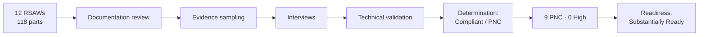

# 05.16 — Mock Audit Report & Readiness Rating

| Field | Value |
|---|---|
| Document ID | CIP-05.16 |
| Version | 1.0 |
| Date | 2026-03-02 |
| Classification | BES Cyber System Information (BCSI) // Illustrative Portfolio Sample |
| Owner | Karen Whitfield (NERC Compliance Manager) |
| Author | Advisory Team |
| Status | Approved |

## Purpose

This is the **keystone internal mock-audit report** for GridPoint Energy, Inc. ("GridPoint", NCR11027). It presents the scope, methodology, and results of the Phase-05 internal (mock) compliance assessment conducted by the Advisory Team and the NERC Compliance Manager, independent of the control implementers, as a rehearsal for the **ReliabilityFirst (RF) Compliance Audit** scheduled for **2027-Q2**. It consolidates the outcome of the **12 Reliability Standard Audit Worksheets (RSAWs)** and the **9 Potential Noncompliance (PNC)** findings, issues an overall **readiness rating**, and recommends the remediation path. It is addressed to the **CIP Senior Manager (Daniel Reyes)** as the accountable authority.

**Overall readiness rating: "Substantially Ready."** No High-risk findings were identified; the nine PNCs (0 High / 4 Moderate / 5 Low) are remediable via Mitigation Plans in Phase 06 before the RF audit.

## 1. Executive Summary

GridPoint's NERC CIP compliance program was independently assessed against the **118 applicable CIP requirement parts** spanning its **14 Medium-impact and 38 Low-impact BES Cyber Systems**, associated **26 EACMS / 18 PACS / 60 PCA**, **3 ESPs**, and **10 PSPs**. The assessment produced **12 RSAWs** and validated evidence through documentation review, evidence sampling, personnel interviews, and technical validation. The program is mature: all six original High-risk gaps and the five subsequent High gaps from the Phase-02 register were confirmed **closed**, and no requirement part was assessed at High risk in this cycle.

Nine PNCs were identified — **0 High, 4 Moderate, 5 Low**. Five confirm Phase-04 in-progress gaps; four are new items surfaced during independent sampling. On this basis, the internal assessment assigns a readiness rating of **"Substantially Ready"** and recommends that GridPoint remediate all nine findings via formal **Mitigation Plans** in Phase 06 ahead of the 2027-Q2 RF Compliance Audit.

## 2. Scope

| Dimension | Scope |
|---|---|
| Registered Entity | GridPoint Energy, Inc. — NCR11027 |
| Functional registrations | GO · GOP · TO · TOP · DP |
| Regional Entity | ReliabilityFirst (RF); oversight FERC → NERC → RF |
| Standards assessed | CIP-002-5.1a, CIP-003-8, CIP-004-7, CIP-005-7, CIP-006-6, CIP-007-6, CIP-008-6, CIP-009-6, CIP-010-4, CIP-011-3, CIP-013-2 (11 standards; CIP-014-3 assessed separately as in progress) |
| RSAWs produced | **12** |
| Requirement parts assessed | **118** |
| Asset scope | 14 Medium BCS + 38 Low BCS; ~420 BCAs; 26 EACMS · 18 PACS · 60 PCA; 3 ESPs; 10 PSPs |
| Assessment period | 2026-Q4 internal (mock) assessment window |

## 3. Methodology

The assessment followed the CMEP-analogous evidence process a Regional Entity would apply during a Compliance Audit, using the official RSAW template for each standard:

| Method | Description |
|---|---|
| RSAW documentation review | Map each requirement part to its implementing document and compliance narrative |
| Evidence sampling | Pull and test a representative sample of records per requirement part |
| Personnel interviews | Interview control owners: Bell (OT), Nair (IT), Delgado (Physical), Lee (HR), Ruiz (Field), Okafor (Ops) |
| Technical validation | Verify configurations, logs, and tool outputs against documented controls |
| Determination | Assign **Compliant** or **Potential Noncompliance (PNC)** per part; risk-rate each PNC |

**Independence:** the assessment was led by the Advisory Team with the NERC Compliance Manager (Karen Whitfield), independent of the implementers (Bell/Nair), to preserve objectivity and rehearse the RF audit dynamic.

## 4. Results Summary

| Standard | RSAW | Requirement Parts | Findings |
|---|---|---|---|
| CIP-002-5.1a | 05.04 | Categorization | Compliant — no PNC |
| CIP-003-8 | 05.05 | Security Management Controls | Compliant — no PNC |
| CIP-004-7 | 05.06 | Personnel & Training | **PNC-09 (Low)** |
| CIP-005-7 | 05.07 | ESP & Remote Access | **PNC-02 (Moderate)** |
| CIP-006-6 | 05.08 | Physical Security | **PNC-08 (Low)** |
| CIP-007-6 | 05.09 | System Security Management | **PNC-06 (Moderate)** |
| CIP-008-6 | 05.10 | Incident Reporting & Response | **PNC-03 (Low)** |
| CIP-009-6 | 05.11 | Recovery Plans | **PNC-01 (Moderate), PNC-04 (Low)** |
| CIP-010-4 | 05.12 | Config Change & Vulnerability | **PNC-07 (Moderate)** |
| CIP-011-3 | 05.13 | Information Protection (BCSI) | Compliant — no PNC |
| CIP-013-2 | 05.14 | Supply Chain Risk Management | **PNC-05 (Low)** |

### 4.1 Findings by Risk

| Risk | Count | PNCs |
|---|---|---|
| **High** | **0** | — |
| **Moderate** | **4** | PNC-01, PNC-02, PNC-06, PNC-07 |
| **Low** | **5** | PNC-03, PNC-04, PNC-05, PNC-08, PNC-09 |
| **Total** | **9** | — |

Full finding detail, ownership, and remediation targets are recorded in the consolidated findings register (`05.15-findings-register-and-risk-exposure.md`) and the tracker `trackers/findings-register-pnc.xlsx`.

## 5. Readiness Rating

| Rating | Definition | Applies? |
|---|---|---|
| Not Ready | One or more High-risk findings; systemic control failures | No |
| **Substantially Ready** | **No High-risk findings; a bounded set of Moderate/Low PNCs remediable via Mitigation Plans before the audit** | **Yes** |
| Audit Ready | No open PNCs; all evidence complete and defensible | Not yet (target for Phase 06 close) |

**Assigned rating: "Substantially Ready."** The determinant is the absence of any High-risk PNC combined with a manageable set of four Moderate and five Low findings, each with a named owner and a Phase-06 remediation path. GridPoint's controls are implemented and operating; the deficiencies are predominantly evidentiary, documentation, or timing in nature rather than absent controls.

## 6. Basis for the Rating

- **No High-risk findings.** All eleven original High-risk gaps (6 in Phase 02 + 5 carried) are confirmed closed; nothing in Phase-05 sampling rose to High.
- **Findings are bounded and remediable.** The four Moderate findings concern recovery-plan currency (PNC-01), IRA session logging (PNC-02), log-review documentation (PNC-06), and change-authorization documentation (PNC-07) — all internal-controls improvements, not missing controls.
- **Low findings are administrative.** PNC-03/04/05/08/09 are retention, scheduling, contract-language, time-sync, and sign-off corrections.
- **Clean standards.** CIP-002, CIP-003, and CIP-011 produced zero PNCs, evidencing a solid categorization, governance, and BCSI foundation.

## 7. Recommendation

The internal assessment recommends that GridPoint:

1. **Open a Mitigation Plan for each of the nine PNCs** in Phase 06, prioritizing the four Moderate findings, with milestone dates preceding the 2027-Q2 RF audit.
2. **Prepare formal Self-Reports** where appropriate for confirmed PNCs, consistent with the CMEP and GridPoint's internal-controls posture, so issues are self-logged rather than audit-discovered.
3. **Re-validate remediated evidence** through a targeted follow-up sample before the RF audit to move the rating from *Substantially Ready* to *Audit Ready*.
4. **Maintain the 15-month review cadences** (policies, IR/recovery testing, VA, SCRM approval) so no new timing gaps arise before the audit.

## 8. Limitations

CIP-014-3 (critical-station physical security for the Northgate 345 kV substation) was assessed separately and remains **in progress** pending the independent third-party verification and is therefore excluded from the nine-PNC count. The assessment reflects the evidence available during the 2026-Q4 window; controls and evidence continue to mature through Phase 06.

## 9. Sign-Off

| Role | Name | Responsibility | Disposition |
|---|---|---|---|
| Prepared / signed by | **Karen Whitfield** — NERC Compliance Manager | Owns and signs the mock-audit report | **Signed** |
| Reviewed by | **Daniel Reyes** — CIP Senior Manager (VP Security & Compliance) | Accountable authority; receives the report | **Reviewed** |
| Assessment lead | Advisory Team | Conducted the independent assessment | Concurred |

_Illustrative portfolio sample — signatures represented by role and disposition, not executed signatures._

## Cross-References

- `05.15-findings-register-and-risk-exposure.md` — consolidated PNC register (source of the 9 findings)
- `05.10` … `05.14` and `05.04` … `05.09` — the 12 source RSAWs
- `05.01-internal-assessment-plan-and-methodology.md` — assessment plan
- `05.02-assessment-team-and-independence.md` — independence basis
- `../02-bes-cyber-system-categorization/02.12-gap-register-and-risk-ranking.md` — origin gaps
- `../06-gap-remediation-mitigation-plans/06.00-README.md` — Phase 06 Mitigation Plans
- `trackers/findings-register-pnc.xlsx` — machine-readable PNC register

---

[⬅ Previous](05.15-findings-register-and-risk-exposure.md) · [🏠 Phase README](05.00-README.md) · [Next ➡](05.17-phase-summary-and-transition.md)
