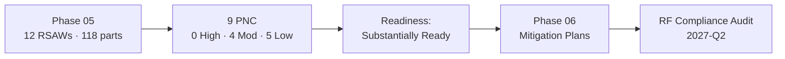

# 05.17 — Phase 05 Summary & Transition

| Field | Value |
|---|---|
| Document ID | CIP-05.17 |
| Version | 1.0 |
| Date | 2026-03-02 |
| Classification | BES Cyber System Information (BCSI) // Illustrative Portfolio Sample |
| Owner | Karen Whitfield (NERC Compliance Manager) |
| Author | Advisory Team |
| Status | Approved |

## Purpose

This document closes **Phase 05 — Internal Compliance Assessment & RSAW Evidence** for GridPoint Energy, Inc. ("GridPoint", NCR11027) and transitions the program to **Phase 06 — Gap Remediation & Mitigation Plans**. It summarizes what the internal (mock) audit produced, restates the readiness rating, and hands off the nine Potential Noncompliance (PNC) findings for formal remediation before the **ReliabilityFirst (RF) Compliance Audit** (2027-Q2).

## What Phase 05 Delivered

| Deliverable | Result |
|---|---|
| Reliability Standard Audit Worksheets (RSAWs) | **12** produced (CIP-002, -003, -004, -005, -006, -007, -008, -009, -010, -011, -013; CIP-014 assessed separately as in progress) |
| Requirement parts assessed | **118** |
| Assessment methods | Documentation review, evidence sampling, interviews, technical validation |
| Independence | Advisory Team + NERC Compliance Manager (Whitfield), independent of implementers (Bell/Nair) |
| Findings | **9 PNCs — 0 High · 4 Moderate · 5 Low** |
| Readiness rating | **"Substantially Ready"** |
| Report | Signed by Compliance Manager Whitfield; reviewed by CIP Senior Manager Reyes |

## Findings Recap

- **0 High-risk findings** — all eleven prior High-risk gaps confirmed closed.
- **4 Moderate:** PNC-01 (CIP-009 recovery plan / new EMS), PNC-02 (CIP-005 R2 IRA session logging), PNC-06 (CIP-007 R4 log-review documentation), PNC-07 (CIP-010 R1 change approvals).
- **5 Low:** PNC-03 (CIP-008 IR test evidence), PNC-04 (CIP-009 backup restore test), PNC-05 (CIP-013 vendor clauses), PNC-08 (CIP-006 R2 PACS clock drift), PNC-09 (CIP-004 R4 access-review sign-off).
- **Origin:** 5 confirm Phase-04 in-progress gaps; 4 newly identified in sampling.

## Readiness Statement

GridPoint is **"Substantially Ready"** for the RF Compliance Audit. Controls are implemented and operating; the residual exposure is a bounded set of Moderate and Low documentation, evidentiary, and timing deficiencies with no High-risk noncompliance. Closing the nine PNCs via Mitigation Plans in Phase 06 is expected to move the program from *Substantially Ready* to *Audit Ready*.

## Standards Coverage at Phase Close

| Standard | RSAW | Outcome |
|---|---|---|
| CIP-002-5.1a | 05.04 | Compliant — no PNC |
| CIP-003-8 | 05.05 | Compliant — no PNC |
| CIP-004-7 | 05.06 | PNC-09 (Low) |
| CIP-005-7 | 05.07 | PNC-02 (Moderate) |
| CIP-006-6 | 05.08 | PNC-08 (Low) |
| CIP-007-6 | 05.09 | PNC-06 (Moderate) |
| CIP-008-6 | 05.10 | PNC-03 (Low) |
| CIP-009-6 | 05.11 | PNC-01 (Moderate), PNC-04 (Low) |
| CIP-010-4 | 05.12 | PNC-07 (Moderate) |
| CIP-011-3 | 05.13 | Compliant — no PNC |
| CIP-013-2 | 05.14 | PNC-05 (Low) |
| CIP-014-3 | (separate track) | In progress — third-party verification |

## Transition to Phase 06

| Handoff Item | Destination |
|---|---|
| 9 PNCs with owners and targets | Phase 06 Mitigation Plans (one per finding) |
| Consolidated findings register | `05.15-findings-register-and-risk-exposure.md` → `trackers/findings-register-pnc.xlsx` |
| Mock-audit report & rating | `05.16-mock-audit-report-and-readiness-rating.md` |
| Self-Report candidates | Phase 06 CMEP self-logging workflow |
| CIP-014 (in progress) | Continue independent third-party verification track |

**Next actions in Phase 06:** open and execute a Mitigation Plan for each PNC (Moderate first), prepare Self-Reports where appropriate, re-validate remediated evidence via a follow-up sample, and confirm the program is Audit Ready ahead of 2027-Q2.

## Priority Sequencing for Phase 06

| Priority | Findings | Rationale |
|---|---|---|
| 1 — Moderate first | PNC-01, PNC-02, PNC-06, PNC-07 | Greatest residual exposure; internal-controls/documentation depth |
| 2 — Low administrative | PNC-03, PNC-04, PNC-05, PNC-08, PNC-09 | Fast closes (retention, scheduling, contract, time-sync, sign-off) |
| Parallel track | CIP-014 (Northgate) | Complete independent third-party verification |

## Phase-Close Attestation

The Phase-05 internal (mock) assessment is complete. The 12 RSAWs, the consolidated findings register, and the signed mock-audit report constitute a defensible evidence set that a Regional Entity would recognize. The **CIP Senior Manager (Daniel Reyes)** has received the mock-audit report and endorses the transition to Phase 06 remediation. No High-risk noncompliance remains open, and the program is on track to reach **Audit Ready** before the ReliabilityFirst Compliance Audit in 2027-Q2.

## Key Figures at a Glance

| Metric | Value |
|---|---|
| RSAWs produced | 12 |
| Requirement parts assessed | 118 |
| PNCs identified | 9 (0 High · 4 Moderate · 5 Low) |
| Standards with zero PNCs | CIP-002, CIP-003, CIP-011 |
| Readiness rating | Substantially Ready |
| Next milestone | RF Compliance Audit, 2027-Q2 |

## Cross-References

- `05.15-findings-register-and-risk-exposure.md` — consolidated PNC register
- `05.16-mock-audit-report-and-readiness-rating.md` — mock-audit report & readiness rating
- `05.00-README.md` — Phase 05 overview
- `../04-technical-physical-control-implementation/04.22-phase-summary-and-transition.md` — prior phase close
- `../06-gap-remediation-mitigation-plans/06.00-README.md` — Phase 06 (Mitigation Plans)
- `trackers/findings-register-pnc.xlsx` — machine-readable PNC register

---

[⬅ Previous](05.16-mock-audit-report-and-readiness-rating.md) · [🏠 Phase README](05.00-README.md) · [Next ➡](../06-gap-remediation-mitigation-plans/06.00-README.md)
