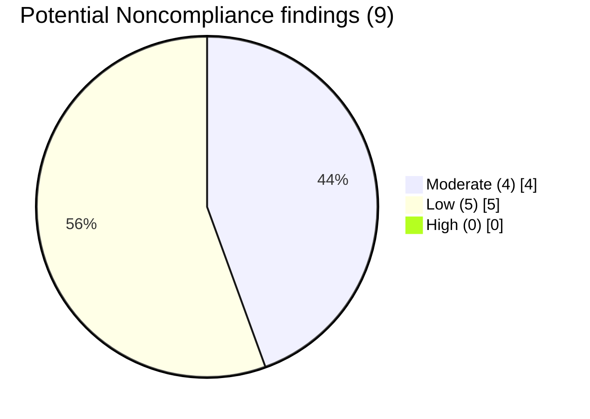

# Diagram — Findings by Risk

| Field | Value |
|---|---|
| Version | 1.0 |
| Date | 2026-03-02 |
| Classification | BES Cyber System Information (BCSI) // Illustrative Portfolio Sample |
| Company | GridPoint Energy, Inc. (NCR11027) |
| Regional Entity | ReliabilityFirst (RF) |
| Phase | 05 — Internal Compliance Assessment & RSAW Evidence |
| Author | Advisory Team |
| Status | Approved |

Readiness: **Substantially Ready** — 0 High findings; 9 PNCs → Mitigation Plans (Phase 06).

## Cross-References
`05.15-findings-register-and-risk-exposure.md`.
