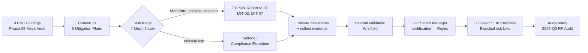

# 06.01 — Remediation Strategy & Prioritization

| Field | Value |
|---|---|
| Document ID | CIP-06.01 |
| Version | 1.0 |
| Date | 2026-03-02 |
| Classification | BES Cyber System Information (BCSI) // Illustrative Portfolio Sample |
| Owner | Nathan Cole (Mitigation Plan Manager) |
| Author | Advisory Team |
| Status | Approved |

## Purpose

This document establishes GridPoint Energy's strategy for remediating the **9 Potential Noncompliance (PNC) findings** produced by the Phase 05 internal (mock) compliance assessment. It defines how each PNC is converted into a formal **NERC Mitigation Plan (MIT-01…MIT-09)**, how remediation is prioritized (Moderate-risk items first), and the timeline for driving residual risk to **Low** and reaching audit-ready status before the **ReliabilityFirst (RF) Compliance Audit in 2027-Q2**.

The strategy is owned by Mitigation Plan Manager **Nathan Cole**, executed by remediation owners **Marcus Bell (OT)**, **Priya Nair (IT)**, **Frank Delgado (Physical)**, and **Sandra Lee (HR)**, internally validated by NERC Compliance Manager **Karen Whitfield**, and certified by CIP Senior Manager **Daniel Reyes**.

## Strategic Objectives

1. Convert all **9 PNCs** into formal Mitigation Plans with milestones, owners, and completion dates.
2. Prioritize the **4 Moderate-risk** items ahead of the **5 Low-risk** items to retire the greatest reliability/compliance exposure first.
3. File **Self-Reports** to ReliabilityFirst for the two Moderate items that constitute possible violations (MIT-02, MIT-07), each with an attached Mitigation Plan.
4. Handle the remaining 7 items as **self-logged minimal-risk issues / Compliance Exceptions**.
5. Close **8 of 9** Mitigation Plans with internally validated completion evidence; carry **1** (MIT-05) as on-schedule In Progress with a risk-accepted completion date.
6. Achieve **0 overdue**, **0 open High**, and **Low** residual risk before the 2027-Q2 audit.

## Risk-Based Prioritization Model

The 9 PNCs carry **0 High · 4 Moderate · 5 Low** risk. Prioritization sequences the Moderate band first because those findings — recovery-plan currency, IRA session logging, audit-log review, and baseline change approvals — most directly affect defensibility of the Medium-impact BES Cyber Systems during the RF audit.

| Priority tier | Risk | Mitigation Plans | Rationale |
|---|---|---|---|
| Tier 1 (first) | Moderate | MIT-01, MIT-02, MIT-06, MIT-07 | Possible/near-violation exposure on Medium BCS; two require Self-Reports |
| Tier 2 (second) | Low | MIT-03, MIT-04, MIT-08, MIT-09 | Evidence-retention / process-hygiene items; minimal reliability risk |
| Tier 3 (dependency-bound) | Low | MIT-05 | Vendor contract amendments dependent on counterparty signature |

## PNC → Mitigation Plan Conversion Summary

| Mitigation Plan | Source PNC | Standard | Risk | Priority tier |
|---|---|---|---|---|
| MIT-01 | PNC-01 | CIP-009 | Moderate | Tier 1 |
| MIT-02 | PNC-02 | CIP-005 R2 | Moderate | Tier 1 |
| MIT-03 | PNC-03 | CIP-008 | Low | Tier 2 |
| MIT-04 | PNC-04 | CIP-009 | Low | Tier 2 |
| MIT-05 | PNC-05 | CIP-013 R2 | Low | Tier 3 |
| MIT-06 | PNC-06 | CIP-007 R4 | Moderate | Tier 1 |
| MIT-07 | PNC-07 | CIP-010 R1 | Moderate | Tier 1 |
| MIT-08 | PNC-08 | CIP-006 R2 | Low | Tier 2 |
| MIT-09 | PNC-09 | CIP-004 R4 | Low | Tier 2 |

## Remediation Lifecycle

## Timeline to Audit Readiness

| Milestone | Target | Status |
|---|---|---|
| PNCs converted to Mitigation Plans | 2027-Q1 baseline | Complete |
| Self-Reports filed to RF (MIT-02, MIT-07) | 2027-Q1 | Complete |
| Tier 1 (Moderate) plans closed | 2027-Q1 | Complete (4 of 4) |
| Tier 2 (Low) plans closed | 2027-Q1 | Complete (4 of 4) |
| MIT-05 vendor amendments executed | On schedule | In Progress |
| Residual risk driven to Low | 2027-Q1 | Achieved |
| Audit-ready package sealed | Before 2027-Q2 | On track |

At the Phase-06 baseline (~2027-Q1) the register stands at **8 Closed / 1 In Progress**, **0 overdue**, **89% closure**, with an estimated remediation effort of **~$180K**.

## Remediation Principles

The strategy is built on five principles that align GridPoint's remediation with NERC CMEP expectations:

1. **Formalize everything.** Every PNC becomes a documented Mitigation Plan, even minimal-risk items, so the corrective record is complete and defensible.
2. **Risk first.** Sequence work by reliability/compliance risk (Moderate before Low) so the greatest exposure is retired earliest.
3. **Report proactively.** Where a finding is a possible violation, Self-Report to ReliabilityFirst rather than wait for detection at audit.
4. **Evidence at each step.** No milestone closes without an attributable artifact; no plan closes without independent validation.
5. **Accountable ownership.** A single named owner drives each plan; the CIP Senior Manager holds program accountability.

## Root-Cause Themes

The 9 PNCs cluster into three root-cause themes that the strategy addresses beyond point fixes:

| Theme | Affected plans | Systemic corrective action |
|---|---|---|
| Evidence retention / documentation hygiene | MIT-03, MIT-06, MIT-09 | Add retention and sign-off gates to procedures |
| Change / approval discipline | MIT-01, MIT-07 | Reinforce pre-deployment approval controls |
| Logging & configuration completeness | MIT-02, MIT-08 | Automate logging health and time-sync monitoring |

The two remaining plans (MIT-04 backup restoration, MIT-05 vendor clauses) are scheduled/procedural and dependency-bound respectively.

## Resource & Effort Model

Estimated total remediation effort is **~$180K**, weighted toward the Moderate Tier 1 items that required engineering and configuration work (IRA logging, audit-log tooling, baseline controls). Low-risk items were largely procedural and low-cost. Effort is drawn from existing OT, IT, Physical, and HR teams under the owners named above, coordinated by the Mitigation Plan Manager.

## Governance & Escalation

- **Nathan Cole** maintains the Mitigation Plan register and reports weekly to the CIP Senior Manager.
- Any milestone slipping toward its completion date is escalated to **Daniel Reyes** for schedule or resource intervention before it becomes overdue.
- **Karen Whitfield** independently validates each closure before it is marked Closed; **Daniel Reyes** provides the final certification.
- Executive visibility (CEO Margaret Chen, VP Grid Operations Robert Tan) is maintained through the monthly program status summary.

## Cross-References

- [../05-internal-compliance-assessment/05.15-findings-register-and-risk-exposure.md](../05-internal-compliance-assessment/05.15-findings-register-and-risk-exposure.md) — source PNC register
- [../05-internal-compliance-assessment/05.16-mock-audit-report-and-readiness-rating.md](../05-internal-compliance-assessment/05.16-mock-audit-report-and-readiness-rating.md) — "Substantially Ready" rating
- [06.02-mitigation-plan-register.md](06.02-mitigation-plan-register.md) — full MIT-01…09 register
- [../02-bes-cyber-system-categorization/02.12-gap-register-and-risk-ranking.md](../02-bes-cyber-system-categorization/02.12-gap-register-and-risk-ranking.md) — originating gap register

---
[⬅ Previous](06.00-README.md) · [🏠 Phase README](06.00-README.md) · [Next ➡](06.02-mitigation-plan-register.md)
