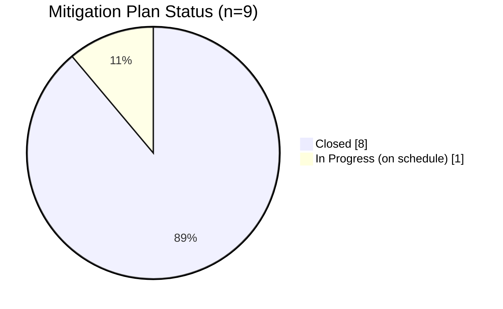

# 06.02 — Mitigation Plan Register

| Field | Value |
|---|---|
| Document ID | CIP-06.02 |
| Version | 1.0 |
| Date | 2026-03-02 |
| Classification | BES Cyber System Information (BCSI) // Illustrative Portfolio Sample |
| Owner | Nathan Cole (Mitigation Plan Manager) |
| Author | Advisory Team |
| Status | Approved |

## Purpose

This is the **keystone Mitigation Plan register** for GridPoint Energy's Phase 06 remediation. It records all **9 NERC Mitigation Plans (MIT-01 … MIT-09)** created from the **9 Potential Noncompliance (PNC) findings** of the Phase 05 internal (mock) compliance assessment. For each Mitigation Plan the register captures the source PNC, the applicable Reliability Standard, the risk rating, the root cause, the remediation action, the accountable owner, the completion date, and the current status.

At the Phase-06 baseline (~2027-Q1) the register stands at **8 Closed / 1 In Progress**, **0 overdue**, **0 open High**, a **closure rate of 89%**, **2 Self-Reports** filed to ReliabilityFirst, **0 TFEs**, and **Low** residual risk. The authoritative machine-readable copy is maintained at [`trackers/mitigation-plan-register.xlsx`](trackers/mitigation-plan-register.xlsx).

## Register Scope & Conventions

- **Register ID scheme:** `MIT-NN`, one Mitigation Plan per PNC finding, mapped 1:1.
- **Risk bands:** Moderate (4) and Low (5); no High-risk findings exist.
- **Status values:** `Closed` = remediation complete + internally validated with evidence + CIP Senior Manager certified; `In Progress` = executing on schedule, not overdue.
- **Enforcement track:** `Self-Report` (filed to RF with Mitigation Plan) or `Self-Log / Compliance Exception` (minimal-risk).
- **Roles:** Mitigation Plan Manager **Nathan Cole**; owners **Marcus Bell (OT)**, **Priya Nair (IT)**, **Frank Delgado (Physical)**, **Sandra Lee (HR)**; internal validation **Karen Whitfield**; certification **Daniel Reyes**.

## Register Summary Dashboard

| Metric | Value |
|---|---|
| Total Mitigation Plans | 9 (MIT-01…09) |
| Risk distribution | 0 High · 4 Moderate · 5 Low |
| Closed | 8 (MIT-01,02,03,04,06,07,08,09) |
| In Progress (on schedule) | 1 (MIT-05) |
| Overdue | 0 |
| Open High | 0 |
| Closure rate | 89% |
| Self-Reports filed to RF | 2 (MIT-02, MIT-07) |
| Self-Logged / Compliance Exceptions | 7 |
| TFEs required | 0 |
| Estimated remediation effort | ~$180K |
| Residual risk | Low |

## Master Register — MIT-01 … MIT-09

| MIT | Source PNC | Standard | Risk | Remediation summary | Owner | Enforcement track | Status |
|---|---|---|---|---|---|---|---|
| MIT-01 | PNC-01 | CIP-009 | Moderate | Update recovery plan for the new EMS | Marcus Bell (OT) | Self-Log / Compliance Exception | Closed |
| MIT-02 | PNC-02 | CIP-005 R2 | Moderate | Complete IRA session logging on Intermediate System | Priya Nair (IT) | Self-Report to RF | Closed |
| MIT-03 | PNC-03 | CIP-008 | Low | Retain IR plan test evidence | Marcus Bell (OT) | Self-Log / Compliance Exception | Closed |
| MIT-04 | PNC-04 | CIP-009 | Low | Perform overdue backup restoration test | Marcus Bell (OT) | Self-Log / Compliance Exception | Closed |
| MIT-05 | PNC-05 | CIP-013 R2 | Low | Add vendor notification clauses to 2 contracts | Priya Nair (IT) | Self-Log / Compliance Exception | In Progress |
| MIT-06 | PNC-06 | CIP-007 R4 | Moderate | Restore audit-log review documentation | Priya Nair (IT) | Self-Log / Compliance Exception | Closed |
| MIT-07 | PNC-07 | CIP-010 R1 | Moderate | Obtain approvals for 2 baseline change records | Marcus Bell (OT) | Self-Report to RF | Closed |
| MIT-08 | PNC-08 | CIP-006 R2 | Low | Correct PACS clock drift / enforce time sync | Frank Delgado (Physical) | Self-Log / Compliance Exception | Closed |
| MIT-09 | PNC-09 | CIP-004 R4 | Low | Obtain signature on 1 quarterly access review | Sandra Lee (HR) | Self-Log / Compliance Exception | Closed |

## Detailed Mitigation Plan Entries

### MIT-01 — CIP-009 Recovery Plan Update (Moderate)
- **Source PNC:** PNC-01 (confirms GAP-12).
- **Root cause:** Recovery plan not updated to reflect the new Energy Management System (EMS) at the Millbrook control center.
- **Remediation:** Revise the CIP-009 recovery plan to include the new EMS restoration procedures; re-baseline backup targets; brief the operations team; schedule the next recovery test.
- **Owner:** Marcus Bell (OT). **Completion date:** 2027-Q1. **Status:** Closed.
- **Evidence:** Revised recovery plan (v-controlled), change record, tabletop briefing sign-in.

### MIT-02 — CIP-005 R2 IRA Session Logging (Moderate) — SELF-REPORTED
- **Source PNC:** PNC-02 (confirms GAP-21).
- **Root cause:** Interactive Remote Access (IRA) session logging via the Intermediate System (jump host) was incomplete for a subset of sessions.
- **Remediation:** Enable and validate full session logging on the Intermediate System; forward logs to the SIEM; verify retention; back-test for the audit period.
- **Owner:** Priya Nair (IT). **Completion date:** 2027-Q1. **Status:** Closed.
- **Enforcement:** **Self-Report filed to ReliabilityFirst** with attached Mitigation Plan (possible violation).
- **Evidence:** SIEM log samples, Intermediate System configuration export, validation memo.

### MIT-03 — CIP-008 IR Test Evidence Retention (Low)
- **Source PNC:** PNC-03 (confirms GAP-27).
- **Root cause:** Incident Response plan test evidence was not retained per the evidence-management plan.
- **Remediation:** Reconstruct and retain the most recent IR test artifacts; add evidence retention to the IR test procedure; store in the evidence repository.
- **Owner:** Marcus Bell (OT). **Completion date:** 2027-Q1. **Status:** Closed.
- **Enforcement:** Self-Logged / Compliance Exception. **Evidence:** IR test report, participant log, retention register entry.

### MIT-04 — CIP-009 Backup Restoration Test (Low)
- **Source PNC:** PNC-04 (confirms GAP-28).
- **Root cause:** Backup restoration test was overdue at the Easton backup site.
- **Remediation:** Execute a restoration test from backup media; document results; reset the recurring test schedule (every 15 months).
- **Owner:** Marcus Bell (OT). **Completion date:** 2027-Q1. **Status:** Closed.
- **Enforcement:** Self-Logged / Compliance Exception. **Evidence:** Restoration test log, media verification record.

### MIT-05 — CIP-013 R2 Vendor Notification Clauses (Low) — IN PROGRESS
- **Source PNC:** PNC-05 (confirms GAP-32).
- **Root cause:** Two vendor contracts lacked required vendor incident-notification and remote-access clauses.
- **Remediation:** Negotiate and execute contract amendments adding the CIP-013 vendor notification / remote-access provisions; update the SCRM vendor register.
- **Owner:** Priya Nair (IT). **Completion date:** on-schedule target (awaiting counterparty signature). **Status:** In Progress.
- **Enforcement:** Self-Logged / Compliance Exception. **Note:** Only remaining open item; risk-accepted with a documented completion date and CIP Senior Manager sign-off (see 06.09).
- **Evidence (interim):** Redlined amendments issued to both vendors, legal tracking log.

### MIT-06 — CIP-007 R4 Audit-Log Review Documentation (Moderate)
- **Source PNC:** PNC-06 (newly identified during sampling).
- **Root cause:** Documentation of periodic security audit-log reviews had gaps for two review cycles.
- **Remediation:** Reconstruct and formalize the audit-log review procedure with sign-off; implement a review checklist and SIEM dashboard; retain review records.
- **Owner:** Priya Nair (IT). **Completion date:** 2027-Q1. **Status:** Closed.
- **Enforcement:** Self-Logged / Compliance Exception. **Evidence:** Signed review records, dashboard export, procedure v2.

### MIT-07 — CIP-010 R1 Baseline Change Approvals (Moderate) — SELF-REPORTED
- **Source PNC:** PNC-07 (newly identified during sampling).
- **Root cause:** Two configuration baseline change records were missing documented approvals prior to implementation.
- **Remediation:** Retroactively review and authorize the two changes; verify no unauthorized deviation; reinforce the change-management gate requiring approval before deployment; retrain the change board.
- **Owner:** Marcus Bell (OT). **Completion date:** 2027-Q1. **Status:** Closed.
- **Enforcement:** **Self-Report filed to ReliabilityFirst** with attached Mitigation Plan (possible violation).
- **Evidence:** Approved change records, change-management procedure v2, retraining roster.

### MIT-08 — CIP-006 R2 PACS Clock Sync (Low)
- **Source PNC:** PNC-08 (newly identified during sampling).
- **Root cause:** One Physical Access Control System (PACS) exhibited clock drift affecting log timestamp accuracy.
- **Remediation:** Correct the PACS clock; configure authoritative time synchronization; verify timestamp accuracy across physical access logs.
- **Owner:** Frank Delgado (Physical). **Completion date:** 2027-Q1. **Status:** Closed.
- **Enforcement:** Self-Logged / Compliance Exception. **Evidence:** Time-sync configuration, before/after log timestamp comparison.

### MIT-09 — CIP-004 R4 Access-Review Signature (Low)
- **Source PNC:** PNC-09 (newly identified during sampling).
- **Root cause:** One quarterly access-privilege review was completed but not signed.
- **Remediation:** Obtain the reviewer's signature; add a completeness check to the quarterly access-review workflow.
- **Owner:** Sandra Lee (HR). **Completion date:** 2027-Q1. **Status:** Closed.
- **Enforcement:** Self-Logged / Compliance Exception. **Evidence:** Signed access-review record, workflow control update.

## Register Status Distribution

## Owner Load Distribution

| Owner | Function | Mitigation Plans | Closed | In Progress |
|---|---|---|---|---|
| Marcus Bell | OT / ICS Security Lead | MIT-01, MIT-03, MIT-04, MIT-07 | 4 | 0 |
| Priya Nair | IT Security Manager | MIT-02, MIT-05, MIT-06 | 2 | 1 |
| Frank Delgado | Physical Security Manager | MIT-08 | 1 | 0 |
| Sandra Lee | HR / PRA Coordinator | MIT-09 | 1 | 0 |

## Enforcement Track Distribution

| Track | Mitigation Plans | Count |
|---|---|---|
| Self-Report to ReliabilityFirst | MIT-02, MIT-07 | 2 |
| Self-Log / Compliance Exception | MIT-01, 03, 04, 05, 06, 08, 09 | 7 |

## Standard Coverage Map

The 9 Mitigation Plans touch eight CIP standards, confirming remediation is spread across the control families rather than concentrated in one area.

| Standard | Mitigation Plans | Count |
|---|---|---|
| CIP-004 R4 | MIT-09 | 1 |
| CIP-005 R2 | MIT-02 | 1 |
| CIP-006 R2 | MIT-08 | 1 |
| CIP-007 R4 | MIT-06 | 1 |
| CIP-008 | MIT-03 | 1 |
| CIP-009 | MIT-01, MIT-04 | 2 |
| CIP-010 R1 | MIT-07 | 1 |
| CIP-013 R2 | MIT-05 | 1 |

## PNC Origin Analysis

Of the 9 findings, **5 confirmed** in-progress gaps carried from Phase 04 and **4 were newly identified** during Phase 05 evidence sampling.

| Origin | Mitigation Plans | Confirms gap |
|---|---|---|
| Confirmed Phase-04 in-progress gap | MIT-01, MIT-02, MIT-03, MIT-04, MIT-05 | GAP-12, GAP-21, GAP-27, GAP-28, GAP-32 |
| Newly identified in Phase-05 sampling | MIT-06, MIT-07, MIT-08, MIT-09 | — |

## Completion-Date Posture

All eight Closed plans reached their completion dates at the Phase-06 baseline (~2027-Q1) with **0 overdue**. MIT-05 carries an on-schedule target awaiting counterparty signature and is risk-accepted (see 06.09). No plan required a completion-date extension request to ReliabilityFirst.

## Prevention-of-Recurrence Controls

Each Mitigation Plan includes a control to prevent recurrence, added to the ongoing internal controls program:

| MIT | Prevention control |
|---|---|
| MIT-01 | Recovery plan update tied to EMS change-management trigger |
| MIT-02 | SIEM alert on IRA logging health; quarterly assurance check |
| MIT-03 | Evidence-retention step embedded in IR test procedure |
| MIT-04 | Recurring 15-month restoration-test schedule |
| MIT-05 | SCRM contract-clause checklist for all new/renewed vendors |
| MIT-06 | Audit-log review checklist + dashboard with sign-off |
| MIT-07 | Mandatory pre-deployment approval gate + monthly sampling |
| MIT-08 | Authoritative time-sync enforced and monitored on PACS |
| MIT-09 | Completeness/signature check in access-review workflow |

## Change Control

The register is version-controlled. Status transitions require an evidence artifact and Compliance Manager (Whitfield) validation before a Mitigation Plan is marked Closed; the CIP Senior Manager (Reyes) certifies each closure. The Excel source of record is [`trackers/mitigation-plan-register.xlsx`](trackers/mitigation-plan-register.xlsx), reconciled weekly against this Markdown register by Nathan Cole. Any reopening of a Closed plan (for example on new evidence) requires CIP Senior Manager approval and a documented rationale.

## Cross-References

- [../05-internal-compliance-assessment/05.15-findings-register-and-risk-exposure.md](../05-internal-compliance-assessment/05.15-findings-register-and-risk-exposure.md) — PNC-01…09 source register
- [06.03-mitigation-plan-template-and-milestones.md](06.03-mitigation-plan-template-and-milestones.md) — milestone breakdowns (MIT-02, MIT-07)
- [06.04-self-report-preparation.md](06.04-self-report-preparation.md) — Self-Report detail
- [06.05-remediation-execution-tracking.md](06.05-remediation-execution-tracking.md) — execution & burndown
- [06.06-completion-evidence-and-internal-validation.md](06.06-completion-evidence-and-internal-validation.md) — evidence-by-MIT
- [../02-bes-cyber-system-categorization/02.12-gap-register-and-risk-ranking.md](../02-bes-cyber-system-categorization/02.12-gap-register-and-risk-ranking.md) — originating gaps

---
[⬅ Previous](06.01-remediation-strategy-and-prioritization.md) · [🏠 Phase README](06.00-README.md) · [Next ➡](06.03-mitigation-plan-template-and-milestones.md)
