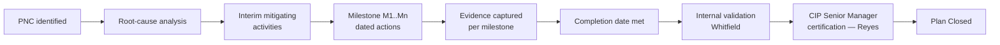

# 06.03 — Mitigation Plan Template & Milestones

| Field | Value |
|---|---|
| Document ID | CIP-06.03 |
| Version | 1.0 |
| Date | 2026-03-02 |
| Classification | BES Cyber System Information (BCSI) // Illustrative Portfolio Sample |
| Owner | Nathan Cole (Mitigation Plan Manager) |
| Author | Advisory Team |
| Status | Approved |

## Purpose

This document defines the standard **NERC Mitigation Plan structure** used for all 9 of GridPoint Energy's Mitigation Plans (MIT-01…MIT-09) and provides fully worked **milestone breakdowns** for the two Self-Reported Moderate items: **MIT-02 (CIP-005 R2 IRA session logging)** and **MIT-07 (CIP-010 R1 baseline change approvals)**. A NERC Mitigation Plan must describe the noncompliance, its cause, the actions to correct it and prevent recurrence, **dated milestones**, a **completion date**, and the **evidence** that will demonstrate completion.

## NERC Mitigation Plan Structure

A ReliabilityFirst-accepted Mitigation Plan contains the following required elements. GridPoint's template captures each in the register and in the per-plan worksheet.

| # | Element | Description |
|---|---|---|
| 1 | Registered Entity & NCR ID | GridPoint Energy, Inc. — NCR11027 |
| 2 | Standard / Requirement | The applicable CIP standard and requirement part |
| 3 | Description of noncompliance | The condition identified (source PNC) |
| 4 | Cause / root cause | Why the condition occurred |
| 5 | Risk assessment | Actual/potential reliability risk (Moderate / Low) |
| 6 | Mitigating activities | Interim risk-reduction actions |
| 7 | Corrective milestones | Dated, verifiable milestone activities |
| 8 | Completion date | Date all milestones are complete |
| 9 | Prevention of recurrence | Controls preventing the condition from recurring |
| 10 | Evidence of completion | Artifacts demonstrating each milestone |
| 11 | Responsible entity / signatory | Owner + CIP Senior Manager (Reyes) |

## Milestone Lifecycle

## Milestone Numbering Convention

- Milestones are numbered `MIT-NN-Mx` (e.g., `MIT-02-M1`).
- Each milestone carries an action, an owner, a target date, an evidence artifact, and a status.
- A plan cannot move to **Closed** until every milestone is evidenced and validated.

## Worked Breakdown — MIT-02 (CIP-005 R2 IRA Session Logging, Moderate, Self-Reported)

**Source:** PNC-02 (confirms GAP-21). **Owner:** Priya Nair (IT). **Standard:** CIP-005-7 R2 (Interactive Remote Access via Intermediate System). **Enforcement:** Self-Report filed to ReliabilityFirst with this Mitigation Plan.

**Description of noncompliance:** IRA session logging on the Intermediate System (jump host) was incomplete for a subset of remote sessions during the audit period, weakening the evidentiary record of vendor and staff remote access to Medium BES Cyber Systems.

**Interim mitigating activities:** Restrict IRA to named accounts; enforce MFA and encryption (already in place per Phase 04); manually review active sessions daily until automated logging is validated.

| Milestone | Action | Owner | Target | Evidence | Status |
|---|---|---|---|---|---|
| MIT-02-M1 | Confirm logging gap scope on Intermediate System | Nair | 2027-Q1 | Gap analysis memo | Complete |
| MIT-02-M2 | Enable full session logging (start/stop, commands, source) | Nair | 2027-Q1 | Config export | Complete |
| MIT-02-M3 | Forward IRA logs to SIEM with retention policy | Nair | 2027-Q1 | SIEM ingest config | Complete |
| MIT-02-M4 | Validate end-to-end log capture with test sessions | Nair / Bell | 2027-Q1 | Test session log samples | Complete |
| MIT-02-M5 | Back-test coverage across the audit period | Nair | 2027-Q1 | Coverage validation report | Complete |
| MIT-02-M6 | Update IRA procedure; brief remote-access users | Nair | 2027-Q1 | Procedure v2, briefing roster | Complete |

**Completion date:** 2027-Q1. **Prevention of recurrence:** SIEM alert on IRA logging health; quarterly IRA logging assurance check added to the internal controls calendar. **Status:** Closed — validated by Whitfield, certified by Reyes.

## Worked Breakdown — MIT-07 (CIP-010 R1 Baseline Change Approvals, Moderate, Self-Reported)

**Source:** PNC-07 (newly identified during sampling). **Owner:** Marcus Bell (OT). **Standard:** CIP-010-4 R1 (configuration change management). **Enforcement:** Self-Report filed to ReliabilityFirst with this Mitigation Plan.

**Description of noncompliance:** Two configuration baseline change records for Medium substation BES Cyber Systems were missing documented approvals prior to implementation, breaking the CIP-010 R1 requirement that changes deviating from the baseline be authorized.

**Interim mitigating activities:** Freeze non-emergency baseline changes pending approval-gate reinforcement; verify the two changes introduced no unauthorized functional deviation.

| Milestone | Action | Owner | Target | Evidence | Status |
|---|---|---|---|---|---|
| MIT-07-M1 | Identify the 2 unapproved change records | Bell | 2027-Q1 | Change record extract | Complete |
| MIT-07-M2 | Verify no unauthorized deviation from baseline | Bell | 2027-Q1 | Configuration diff report | Complete |
| MIT-07-M3 | Retroactively review & authorize the 2 changes | Bell / Reyes | 2027-Q1 | Signed change authorizations | Complete |
| MIT-07-M4 | Reinforce approval gate (no deploy before approval) | Bell | 2027-Q1 | Change-management procedure v2 | Complete |
| MIT-07-M5 | Retrain the change advisory board | Bell | 2027-Q1 | Retraining roster | Complete |
| MIT-07-M6 | Add pre-deployment approval control check | Bell | 2027-Q1 | Control test record | Complete |

**Completion date:** 2027-Q1. **Prevention of recurrence:** Mandatory approval gate enforced in the change workflow; monthly sampling of baseline change records added to internal controls. **Status:** Closed — validated by Whitfield, certified by Reyes.

## Milestone Count Across the Register

The number of milestones scales with the complexity of the corrective action. Self-Reported Moderate plans carry the most milestones; procedural Low plans the fewest.

| MIT | Risk | Milestones | Self-Reported |
|---|---|---|---|
| MIT-01 | Moderate | 4 | No |
| MIT-02 | Moderate | 6 | Yes |
| MIT-03 | Low | 3 | No |
| MIT-04 | Low | 3 | No |
| MIT-05 | Low | 4 | No |
| MIT-06 | Moderate | 4 | No |
| MIT-07 | Moderate | 6 | Yes |
| MIT-08 | Low | 3 | No |
| MIT-09 | Low | 2 | No |

## Completion-Date & Evidence Rules

- **Completion date** is the date the last milestone is evidenced — not the date work began.
- A plan may not be marked Closed before its completion date is supported by artifacts for every milestone.
- Evidence for each milestone is filed to the BCSI-protected evidence repository and cross-referenced to the applicable RSAW requirement part.
- For Self-Reported plans, the milestone set submitted to ReliabilityFirst is the same set tracked internally, ensuring the RF record and the internal record match.

## Template Governance

The Mitigation Plan template is owned by the Mitigation Plan Manager (Nathan Cole) and approved by the CIP Senior Manager (Daniel Reyes). It aligns to ReliabilityFirst's Mitigation Plan submittal expectations so that any plan can be exported into an RF-acceptable format without rework. Revisions to the template are version-controlled alongside the register.

## Template Reuse Across the Register

All 9 Mitigation Plans follow this template; the two worked examples above are the most detailed because they were Self-Reported. The Low-risk plans (MIT-03, 04, 05, 08, 09) and the other Moderate plans (MIT-01, MIT-06) use the same 11-element structure with proportionally fewer milestones.

## Cross-References

- [06.02-mitigation-plan-register.md](06.02-mitigation-plan-register.md) — full register
- [06.04-self-report-preparation.md](06.04-self-report-preparation.md) — Self-Report packaging for MIT-02 & MIT-07
- [06.06-completion-evidence-and-internal-validation.md](06.06-completion-evidence-and-internal-validation.md) — evidence validation
- [../04-technical-physical-control-implementation/04.03-interactive-remote-access-cip-005-r2.md](../04-technical-physical-control-implementation/04.03-interactive-remote-access-cip-005-r2.md) — IRA control baseline
- [../04-technical-physical-control-implementation/04.11-configuration-baselines-cip-010-r1.md](../04-technical-physical-control-implementation/04.11-configuration-baselines-cip-010-r1.md) — baseline control

---
[⬅ Previous](06.02-mitigation-plan-register.md) · [🏠 Phase README](06.00-README.md) · [Next ➡](06.04-self-report-preparation.md)
