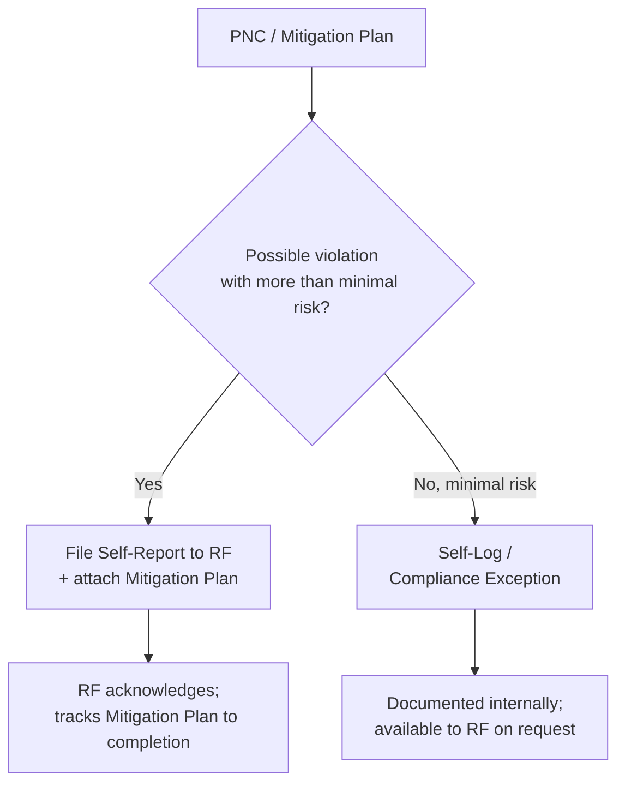
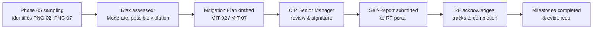

# 06.04 — Self-Report Preparation

| Field | Value |
|---|---|
| Document ID | CIP-06.04 |
| Version | 1.0 |
| Date | 2026-03-02 |
| Classification | BES Cyber System Information (BCSI) // Illustrative Portfolio Sample |
| Owner | Karen Whitfield (NERC Compliance Manager) |
| Author | Advisory Team |
| Status | Approved |

## Purpose

This document describes GridPoint Energy's **Self-Report process** to ReliabilityFirst (RF) under the CMEP and records the disposition of all 9 Mitigation Plans across the two enforcement tracks. **Two Self-Reports** were filed — for **MIT-02 (CIP-005 R2 IRA session logging)** and **MIT-07 (CIP-010 R1 baseline change approvals)** — each accompanied by its Mitigation Plan. The remaining **7 items** were handled as **self-logged minimal-risk issues / Compliance Exceptions**.

## Self-Report in the CMEP

A **Self-Report** is one of the CMEP monitoring methods by which a Registered Entity proactively reports a possible violation to its Regional Entity. Self-reporting is viewed favorably in enforcement, frequently reduces penalty exposure, and is typically paired with a **Mitigation Plan** describing corrective milestones and a completion date. For minimal-risk issues, RF's **Compliance Exception** / self-logging process allows disposition without a full enforcement action.

## Disposition Decision Logic

GridPoint applied this logic: the two Moderate findings that constitute possible violations affecting Medium BES Cyber System evidence (IRA logging and baseline approvals) were Self-Reported; the other seven, being minimal-risk process/evidence-hygiene issues, were self-logged.

## Enforcement Track Disposition Table

| MIT | PNC | Standard | Risk | Disposition | Mitigation Plan attached | Status |
|---|---|---|---|---|---|---|
| MIT-01 | PNC-01 | CIP-009 | Moderate | Self-Log / Compliance Exception | Yes | Closed |
| MIT-02 | PNC-02 | CIP-005 R2 | Moderate | **Self-Report to RF** | Yes | Closed |
| MIT-03 | PNC-03 | CIP-008 | Low | Self-Log / Compliance Exception | Yes | Closed |
| MIT-04 | PNC-04 | CIP-009 | Low | Self-Log / Compliance Exception | Yes | Closed |
| MIT-05 | PNC-05 | CIP-013 R2 | Low | Self-Log / Compliance Exception | Yes | In Progress |
| MIT-06 | PNC-06 | CIP-007 R4 | Moderate | Self-Log / Compliance Exception | Yes | Closed |
| MIT-07 | PNC-07 | CIP-010 R1 | Moderate | **Self-Report to RF** | Yes | Closed |
| MIT-08 | PNC-08 | CIP-006 R2 | Low | Self-Log / Compliance Exception | Yes | Closed |
| MIT-09 | PNC-09 | CIP-004 R4 | Low | Self-Log / Compliance Exception | Yes | Closed |

**Totals:** 2 Self-Reports to RF · 7 Self-Logged / Compliance Exceptions · 9 Mitigation Plans.

## Self-Report Contents

Each Self-Report submitted to ReliabilityFirst contained:

1. Registered Entity identification — GridPoint Energy, Inc., NCR11027, Regional Entity ReliabilityFirst.
2. The applicable Standard and Requirement — CIP-005-7 R2 (MIT-02); CIP-010-4 R1 (MIT-07).
3. A factual description of the possible violation and the discovery method (Phase 05 internal assessment sampling).
4. The duration/scope and an actual/potential risk assessment (Moderate).
5. Interim mitigating activities already in place.
6. The attached **Mitigation Plan** with dated milestones and completion date.
7. The CIP Senior Manager (Daniel Reyes) as the responsible signatory.

## Self-Report Detail — MIT-02

- **Standard:** CIP-005-7 R2 — Interactive Remote Access session logging incomplete on the Intermediate System.
- **Discovery:** Internal (mock) assessment evidence sampling (Phase 05).
- **Risk:** Moderate — remote access to Medium BCS was controlled (MFA/encryption) but the log evidence record was incomplete.
- **Attached Mitigation Plan:** MIT-02 (6 milestones, completion 2027-Q1). **Status:** Closed / internally validated.

## Self-Report Detail — MIT-07

- **Standard:** CIP-010-4 R1 — two baseline change records missing pre-implementation approvals.
- **Discovery:** Internal (mock) assessment evidence sampling (Phase 05).
- **Risk:** Moderate — changes verified to introduce no unauthorized deviation; the gap was in the approval record.
- **Attached Mitigation Plan:** MIT-07 (6 milestones, completion 2027-Q1). **Status:** Closed / internally validated.

## Self-Logging / Compliance Exception Handling

The seven self-logged items (MIT-01, 03, 04, 05, 06, 08, 09) were documented in GridPoint's internal compliance log with cause, corrective action, evidence, and completion date, and are available to RF on request. Each still carries a full Mitigation Plan for internal rigor, but none rose to the risk threshold warranting a formal Self-Report.

## Why Self-Report These Two

Self-reporting is a deliberate enforcement strategy. For MIT-02 and MIT-07, GridPoint judged that the findings represented **possible violations** of Medium-impact BES Cyber System requirements with more than minimal risk, and that proactive disclosure would:

- Demonstrate a mature, self-policing internal controls program to ReliabilityFirst.
- Position the findings for favorable enforcement treatment (potential Compliance Exception or reduced penalty).
- Attach a credible Mitigation Plan showing the issue was already being corrected before any RF monitoring activity.

## Self-Report Timeline

## Self-Report Status Tracking

| Self-Report | Submitted | Mitigation Plan | Milestones complete | RF status |
|---|---|---|---|---|
| MIT-02 (CIP-005 R2) | Filed to RF | 6 milestones | 6 of 6 | Tracking to completion |
| MIT-07 (CIP-010 R1) | Filed to RF | 6 milestones | 6 of 6 | Tracking to completion |

## Roles

- **Karen Whitfield** prepares and submits the Self-Reports through the RF portal.
- **Nathan Cole** supplies the Mitigation Plan packages.
- **Daniel Reyes** (CIP Senior Manager) reviews and signs each Self-Report before submission.
- **Marcus Bell** and **Priya Nair** provide the technical evidence underpinning MIT-07 and MIT-02 respectively.

## Cross-References

- [06.02-mitigation-plan-register.md](06.02-mitigation-plan-register.md) — register with enforcement tracks
- [06.03-mitigation-plan-template-and-milestones.md](06.03-mitigation-plan-template-and-milestones.md) — MIT-02 & MIT-07 milestones
- [06.07-technical-feasibility-exceptions.md](06.07-technical-feasibility-exceptions.md) — TFE determination (0 required)
- [../01-program-foundation/01.03-regulatory-context-nerc-ferc-rf-cmep.md](../01-program-foundation/01.03-regulatory-context-nerc-ferc-rf-cmep.md) — CMEP context
- [../05-internal-compliance-assessment/05.15-findings-register-and-risk-exposure.md](../05-internal-compliance-assessment/05.15-findings-register-and-risk-exposure.md) — PNC source

---
[⬅ Previous](06.03-mitigation-plan-template-and-milestones.md) · [🏠 Phase README](06.00-README.md) · [Next ➡](06.05-remediation-execution-tracking.md)
