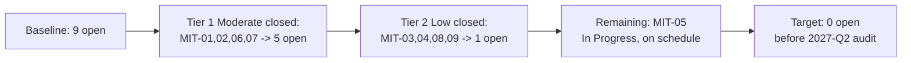

# 06.05 — Remediation Execution Tracking

| Field | Value |
|---|---|
| Document ID | CIP-06.05 |
| Version | 1.0 |
| Date | 2026-03-02 |
| Classification | BES Cyber System Information (BCSI) // Illustrative Portfolio Sample |
| Owner | Nathan Cole (Mitigation Plan Manager) |
| Author | Advisory Team |
| Status | Approved |

## Purpose

This document describes how GridPoint Energy **tracks execution** of the 9 Mitigation Plans — how milestones and completion evidence are monitored, how status transitions are controlled, and how the register reached **8 Closed / 1 In Progress with 0 overdue**. It provides the milestone-level tracking view and a remediation burndown.

## Tracking Model

Execution tracking runs off the Mitigation Plan register ([`trackers/mitigation-plan-register.xlsx`](trackers/mitigation-plan-register.xlsx)) and a milestone log. Each Mitigation Plan advances through a controlled status lifecycle, and every status change requires a supporting evidence artifact.

| Status | Definition | Gate to advance |
|---|---|---|
| Open | Plan created, milestones defined | Owner assigned, dates set |
| In Progress | Milestones executing on schedule | Milestone evidence captured |
| Evidenced | All milestones complete with artifacts | Compliance Manager review |
| Closed | Validated + CIP Senior Manager certified | Whitfield validation + Reyes certification |

## Execution Governance Cadence

- **Weekly:** Nathan Cole reviews milestone progress with each owner (Bell, Nair, Delgado, Lee) and updates the register.
- **Bi-weekly:** Status roll-up to CIP Senior Manager Daniel Reyes; any milestone trending toward its completion date is flagged.
- **Per closure:** Karen Whitfield performs independent validation; Daniel Reyes certifies.

## Milestone Execution Tracker

| MIT | Owner | Milestones | Completed | Completion date | Overdue | Status |
|---|---|---|---|---|---|---|
| MIT-01 | Bell | 4 | 4 | 2027-Q1 | No | Closed |
| MIT-02 | Nair | 6 | 6 | 2027-Q1 | No | Closed |
| MIT-03 | Bell | 3 | 3 | 2027-Q1 | No | Closed |
| MIT-04 | Bell | 3 | 3 | 2027-Q1 | No | Closed |
| MIT-05 | Nair | 4 | 3 | On schedule | No | In Progress |
| MIT-06 | Nair | 4 | 4 | 2027-Q1 | No | Closed |
| MIT-07 | Bell | 6 | 6 | 2027-Q1 | No | Closed |
| MIT-08 | Delgado | 3 | 3 | 2027-Q1 | No | Closed |
| MIT-09 | Lee | 2 | 2 | 2027-Q1 | No | Closed |

**Roll-up:** 8 Closed · 1 In Progress · **0 overdue** · 89% closure.

## Closed vs In Progress

- **Closed (8):** MIT-01, MIT-02, MIT-03, MIT-04, MIT-06, MIT-07, MIT-08, MIT-09 — all milestones complete, evidenced, validated, and certified.
- **In Progress (1):** MIT-05 — vendor contract amendments issued; awaiting counterparty signature on the final milestone. On schedule, not overdue.

## Remediation Burndown

### Burndown by tranche

| Tranche | Plans closed | Cumulative closed | Remaining open |
|---|---|---|---|
| Start (baseline) | 0 | 0 | 9 |
| Moderate (Tier 1) | MIT-01, 02, 06, 07 | 4 | 5 |
| Low (Tier 2) | MIT-03, 04, 08, 09 | 8 | 1 |
| Dependency (Tier 3) | MIT-05 (in progress) | 8 | 1 |

## Overdue & Exception Handling

There are **0 overdue** milestones. Should any milestone approach its completion date without evidence, the tracking process escalates to the CIP Senior Manager for schedule or resource action before the date is missed. The single open item (MIT-05) is externally dependent on counterparty signature and is managed under a documented risk acceptance (see 06.09) rather than treated as a slip.

## Tracker Data Fields

The Excel tracker ([`trackers/mitigation-plan-register.xlsx`](trackers/mitigation-plan-register.xlsx)) carries the following fields per Mitigation Plan and per milestone, enabling both roll-up reporting and audit retrieval:

| Field | Purpose |
|---|---|
| MIT ID / Milestone ID | Unique identifier (e.g., MIT-02-M3) |
| Source PNC | Traceability to Phase 05 finding |
| Standard / Requirement | Applicable CIP requirement part |
| Risk | Moderate / Low |
| Owner | Accountable individual |
| Target date | Milestone completion target |
| Actual date | Date evidenced |
| Evidence artifact | Repository reference |
| Status | Open / In Progress / Evidenced / Closed |
| Enforcement track | Self-Report / Self-Log |
| Validation | Whitfield sign-off |
| Certification | Reyes sign-off |

## Weekly Status Snapshot (Baseline ~2027-Q1)

| Week marker | Closed | In Progress | Overdue | Notes |
|---|---|---|---|---|
| Tier 1 close | 4 | 5 | 0 | Moderate items retired |
| Tier 2 close | 8 | 1 | 0 | Low items retired |
| Current | 8 | 1 | 0 | MIT-05 awaiting signature |

## Dependency Management

MIT-05 is the only plan with an **external dependency** (vendor counterparty signature). The tracker flags it as dependency-bound so it is not mis-reported as a slip. All other plans were internally executable and were completed on schedule. Dependency-bound items are reviewed at each bi-weekly roll-up and reaffirmed under risk acceptance.

## Evidence Capture in Execution

Each milestone closes only when its artifact is filed to the evidence repository and referenced in the register. Evidence types include configuration exports, SIEM samples, signed procedures, test logs, and change authorizations. The evidence-by-MIT catalogue is maintained in 06.06.

## Cross-References

- [06.02-mitigation-plan-register.md](06.02-mitigation-plan-register.md) — register
- [06.03-mitigation-plan-template-and-milestones.md](06.03-mitigation-plan-template-and-milestones.md) — milestone structure
- [06.06-completion-evidence-and-internal-validation.md](06.06-completion-evidence-and-internal-validation.md) — evidence & validation
- [06.08-remediation-status-reporting.md](06.08-remediation-status-reporting.md) — KPIs & reporting
- [../01-program-foundation/01.13-document-and-evidence-management-plan.md](../01-program-foundation/01.13-document-and-evidence-management-plan.md) — evidence management

---
[⬅ Previous](06.04-self-report-preparation.md) · [🏠 Phase README](06.00-README.md) · [Next ➡](06.06-completion-evidence-and-internal-validation.md)
