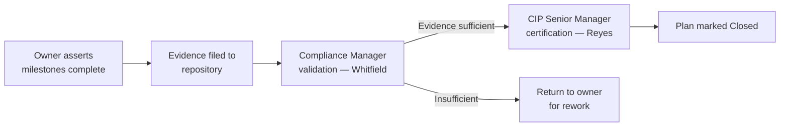
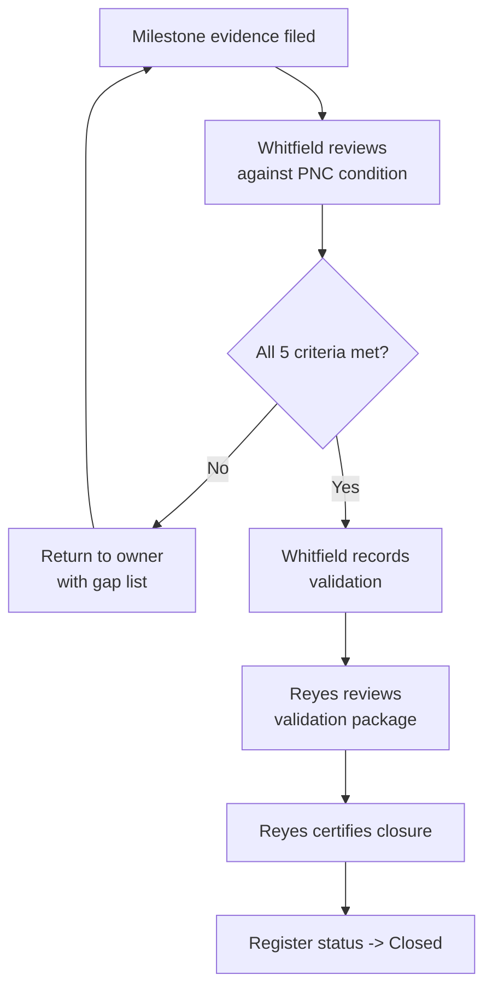

# 06.06 — Completion Evidence & Internal Validation

| Field | Value |
|---|---|
| Document ID | CIP-06.06 |
| Version | 1.0 |
| Date | 2026-03-02 |
| Classification | BES Cyber System Information (BCSI) // Illustrative Portfolio Sample |
| Owner | Karen Whitfield (NERC Compliance Manager) |
| Author | Advisory Team |
| Status | Approved |

## Purpose

This document describes how GridPoint Energy captures **completion evidence** for each Mitigation Plan and how that evidence is **internally validated** before a plan is marked Closed. NERC Compliance Manager **Karen Whitfield** independently validates each closure against its evidence; CIP Senior Manager **Daniel Reyes** provides the final **certification**. It records the evidence artifact set for all 9 Mitigation Plans (MIT-01…MIT-09).

## Validation Model

Completion of a Mitigation Plan is a two-signature control: the plan owner asserts completion with evidence, the Compliance Manager independently validates, and the CIP Senior Manager certifies. This separation of duties mirrors the independence maintained during the Phase 05 mock audit and ensures no plan is self-certified by its implementer.

## Internal Validation Criteria

For each Mitigation Plan, Whitfield confirms:

1. Every milestone has a dated, attributable evidence artifact.
2. The evidence demonstrably corrects the source PNC condition.
3. The prevention-of-recurrence control is in place and operating.
4. The evidence is stored in the BCSI-protected evidence repository per the evidence-management plan.
5. For Self-Reported items (MIT-02, MIT-07), the evidence matches what was represented to ReliabilityFirst.

## Evidence-by-Mitigation-Plan

| MIT | Standard | Completion evidence | Validated (Whitfield) | Certified (Reyes) | Status |
|---|---|---|---|---|---|
| MIT-01 | CIP-009 | Revised recovery plan v2, change record, tabletop briefing roster | Yes | Yes | Closed |
| MIT-02 | CIP-005 R2 | Intermediate System config export, SIEM IRA log samples, coverage validation report, IRA procedure v2 | Yes | Yes | Closed |
| MIT-03 | CIP-008 | IR test report, participant log, evidence-retention register entry | Yes | Yes | Closed |
| MIT-04 | CIP-009 | Backup restoration test log, media verification record | Yes | Yes | Closed |
| MIT-05 | CIP-013 R2 | Redlined vendor amendments (interim), legal tracking log — final signatures pending | Interim only | Pending | In Progress |
| MIT-06 | CIP-007 R4 | Signed audit-log review records, SIEM dashboard export, review procedure v2 | Yes | Yes | Closed |
| MIT-07 | CIP-010 R1 | Signed change authorizations, configuration diff report, change-management procedure v2, retraining roster | Yes | Yes | Closed |
| MIT-08 | CIP-006 R2 | PACS time-sync config, before/after timestamp comparison | Yes | Yes | Closed |
| MIT-09 | CIP-004 R4 | Signed quarterly access-review record, workflow completeness control | Yes | Yes | Closed |

**Validation roll-up:** 8 of 9 fully validated and certified; MIT-05 carries interim evidence pending final counterparty signature.

## Evidence Standards

- **Attributable:** every artifact identifies who performed the action and when.
- **Complete:** artifacts cover each milestone, not just the end state.
- **Retained:** stored in the evidence repository, classified BCSI, retained per the evidence-management plan.
- **Audit-mapped:** each artifact is cross-referenced to the applicable RSAW requirement part so it is retrievable during the 2027-Q2 RF audit.

## Certification Register

| Certification event | Signatory | Scope |
|---|---|---|
| Per-plan closure certification | Daniel Reyes (CIP Senior Manager) | 8 closed Mitigation Plans |
| Program-level remediation attestation | Daniel Reyes | Phase 06 remediation completeness |
| Risk acceptance for MIT-05 | Daniel Reyes | Single in-progress item |

## Validation Sequence per Plan

## Evidence Artifact Counts

| MIT | Artifact count | Primary artifact type |
|---|---|---|
| MIT-01 | 3 | Revised plan / change record |
| MIT-02 | 4 | Configuration + log evidence |
| MIT-03 | 3 | Test report / retention record |
| MIT-04 | 2 | Test log / verification |
| MIT-05 | 2 (interim) | Redlined amendments |
| MIT-06 | 3 | Signed review records |
| MIT-07 | 4 | Approvals + procedure |
| MIT-08 | 2 | Config + timestamp comparison |
| MIT-09 | 2 | Signed record + control update |

Every artifact is cross-referenced to the applicable RSAW requirement part so evidence is directly retrievable during the 2027-Q2 RF audit.

## Independence & Separation of Duties

Validation independence is preserved: implementers (Bell, Nair, Delgado, Lee) do not validate their own closures. The Compliance Manager (Whitfield), who is organizationally independent of control implementation, performs validation; the CIP Senior Manager (Reyes) certifies. This is the same independence discipline applied during the Phase 05 mock audit and is itself audit evidence of a mature internal controls program.

## Handling of the In-Progress Item

MIT-05 evidence is complete except for the executed vendor signatures on two contract amendments. Interim evidence (issued redlines, legal tracking) is validated; final certification will follow signature receipt. The residual exposure is risk-accepted by the CIP Senior Manager with a documented completion date (see 06.09).

## Cross-References

- [06.02-mitigation-plan-register.md](06.02-mitigation-plan-register.md) — register
- [06.05-remediation-execution-tracking.md](06.05-remediation-execution-tracking.md) — execution tracking
- [06.09-residual-risk-and-risk-acceptance.md](06.09-residual-risk-and-risk-acceptance.md) — MIT-05 risk acceptance
- [../01-program-foundation/01.13-document-and-evidence-management-plan.md](../01-program-foundation/01.13-document-and-evidence-management-plan.md) — evidence management
- [../05-internal-compliance-assessment/05.16-mock-audit-report-and-readiness-rating.md](../05-internal-compliance-assessment/05.16-mock-audit-report-and-readiness-rating.md) — readiness rating

---
[⬅ Previous](06.05-remediation-execution-tracking.md) · [🏠 Phase README](06.00-README.md) · [Next ➡](06.07-technical-feasibility-exceptions.md)
