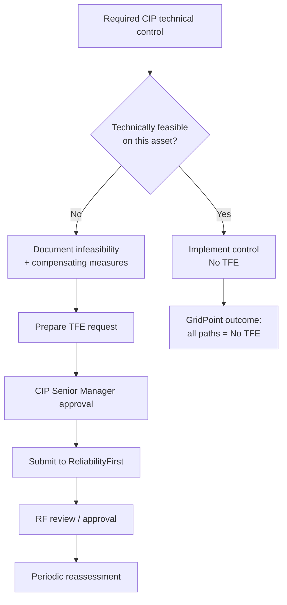

# 06.07 — Technical Feasibility Exceptions

| Field | Value |
|---|---|
| Document ID | CIP-06.07 |
| Version | 1.0 |
| Date | 2026-03-02 |
| Classification | BES Cyber System Information (BCSI) // Illustrative Portfolio Sample |
| Owner | Daniel Reyes (CIP Senior Manager) |
| Author | Advisory Team |
| Status | Approved |

## Purpose

This document explains the NERC **Technical Feasibility Exception (TFE)** process and records GridPoint Energy's determination that **0 TFEs are required** — all controls associated with the 9 Mitigation Plans and the wider CIP program are **technically feasible**. It also documents how a TFE would be prepared and managed if one ever became necessary.

## What a TFE Is

A **Technical Feasibility Exception** is a formal, Regional-Entity-approved exception to a strict CIP requirement where compliance is **not technically feasible** for a specific BES Cyber Asset or System (for example, legacy devices that cannot support required encryption, authentication, or logging). A TFE is not a waiver of the requirement's intent: it requires **compensating measures**, a mitigation of the associated risk, and periodic reassessment. TFEs are requested for specific CIP requirement parts that expressly permit them (e.g., certain CIP-005 and CIP-007 technical controls).

## TFE Determination for GridPoint

Every corrective action across MIT-01…MIT-09 was implementable with existing or readily configurable technology on GridPoint's Medium-impact BES Cyber Systems and associated EACMS/PACS/PCA. No control required an exception.

| Consideration | Determination |
|---|---|
| Did any Mitigation Plan control lack a technically feasible implementation? | No |
| Legacy devices unable to support required logging/MFA/encryption? | None in scope for the 9 plans |
| Compensating measures needed in lieu of a required control? | None |
| **TFEs required** | **0** |

## Feasibility Review by Relevant Standard

The TFE-eligible technical requirements were re-examined during remediation and confirmed feasible:

| Standard / Requirement | TFE-eligible area | Feasibility outcome |
|---|---|---|
| CIP-005-7 R2 (MIT-02) | IRA logging on Intermediate System | Feasible — logging enabled, no TFE |
| CIP-007-6 R4 (MIT-06) | Security event / audit-log review | Feasible — SIEM supports, no TFE |
| CIP-007-6 R5 | Authentication controls | Feasible — MFA in place, no TFE |
| CIP-010-4 R1 (MIT-07) | Baseline change management | Feasible — process control, no TFE |
| CIP-006-6 R2 (MIT-08) | PACS time synchronization | Feasible — time-sync configured, no TFE |

## TFE Decision Flow (Reference)

## Hypothetical TFE Handling (If Ever Required)

Were a future asset (e.g., a legacy relay incapable of supporting required encryption) to warrant a TFE, GridPoint would:

1. Document the specific requirement part and the technical infeasibility with engineering justification.
2. Define **compensating measures** (e.g., network segmentation, enhanced monitoring, physical controls) to mitigate residual risk.
3. Perform a risk assessment of the exception.
4. Obtain **CIP Senior Manager (Daniel Reyes)** approval.
5. Submit the TFE to **ReliabilityFirst** for review and approval, maintaining evidence.
6. Reassess the TFE periodically and retire it when technology permits full compliance.

## TFE vs Self-Report vs Mitigation Plan

These three CMEP instruments are frequently confused; GridPoint applies them distinctly:

| Instrument | When used | GridPoint use in Phase 06 |
|---|---|---|
| Mitigation Plan | To correct a possible/confirmed noncompliance with milestones | 9 (all findings) |
| Self-Report | To proactively disclose a possible violation to RF | 2 (MIT-02, MIT-07) |
| TFE | When strict compliance is not technically feasible | 0 (none required) |

A TFE is not a substitute for remediation — it is a formally approved, risk-mitigated deviation for a specific technical control that a device genuinely cannot meet. None of GridPoint's findings met that condition; all were corrected through Mitigation Plans.

## Portfolio-Wide TFE Scan

Beyond the 9 Mitigation Plans, the Advisory Team scanned the full Medium-impact control set for TFE-eligible conditions during the internal assessment:

| Asset class | TFE-eligible control checked | Result |
|---|---|---|
| Control-center BCS (Millbrook, Easton) | CIP-005 IRA, CIP-007 authentication/logging | Feasible |
| 8 Medium substation BCS | CIP-007 malicious-code prevention, event logging | Feasible |
| EACMS (26) | CIP-005 EAP controls | Feasible |
| PACS (18) | CIP-006 monitoring / time sync | Feasible |
| PCA (60) | CIP-010 baseline management | Feasible |

No asset presented a control that could not be implemented, confirming the **0 TFE** determination at the portfolio level.

## Governance

The TFE determination is owned and signed by the CIP Senior Manager. Because 0 TFEs are required, no TFE evidence package is carried into the 2027-Q2 audit; the audit package instead notes the affirmative determination that all in-scope controls are technically feasible. Should the asset baseline change (for example, acquisition of legacy equipment), the TFE eligibility scan is repeated as part of the ongoing internal controls program.

## Audit Position on TFEs

For the 2027-Q2 RF Compliance Audit, GridPoint's position is stated affirmatively: the Registered Entity holds **no active TFEs** and requires none, because every applicable CIP technical control is implemented in full on all Medium-impact BES Cyber Systems and associated EACMS, PACS, and PCA. This is a favorable posture — a large active-TFE inventory can itself draw audit scrutiny — and is documented in the audit-readiness package as a signed determination by the CIP Senior Manager.

## Cross-References

- [06.02-mitigation-plan-register.md](06.02-mitigation-plan-register.md) — Mitigation Plans (all controls feasible)
- [06.04-self-report-preparation.md](06.04-self-report-preparation.md) — Self-Report vs TFE distinction
- [06.09-residual-risk-and-risk-acceptance.md](06.09-residual-risk-and-risk-acceptance.md) — residual risk
- [../04-technical-physical-control-implementation/04.07-patch-management-cip-007-r2.md](../04-technical-physical-control-implementation/04.07-patch-management-cip-007-r2.md) — CIP-007 controls
- [../01-program-foundation/01.03-regulatory-context-nerc-ferc-rf-cmep.md](../01-program-foundation/01.03-regulatory-context-nerc-ferc-rf-cmep.md) — CMEP artifacts

---
[⬅ Previous](06.06-completion-evidence-and-internal-validation.md) · [🏠 Phase README](06.00-README.md) · [Next ➡](06.08-remediation-status-reporting.md)
