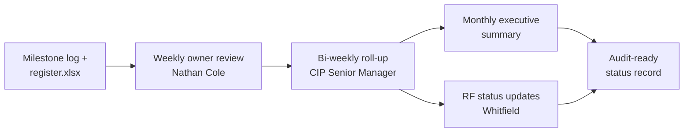

# 06.08 — Remediation Status Reporting

| Field | Value |
|---|---|
| Document ID | CIP-06.08 |
| Version | 1.0 |
| Date | 2026-03-02 |
| Classification | BES Cyber System Information (BCSI) // Illustrative Portfolio Sample |
| Owner | Nathan Cole (Mitigation Plan Manager) |
| Author | Advisory Team |
| Status | Approved |

## Purpose

This document defines how GridPoint Energy **reports remediation status** to internal management and to ReliabilityFirst (RF), and records the Phase-06 key performance indicators (KPIs): **89% closure**, **0 overdue**, **0 open High**. It establishes the reporting cadence, audiences, and content so remediation progress is visible and defensible ahead of the 2027-Q2 RF Compliance Audit.

## Reporting Audiences & Cadence

| Audience | Report | Cadence | Owner |
|---|---|---|---|
| Remediation owners (Bell, Nair, Delgado, Lee) | Milestone working status | Weekly | Nathan Cole |
| CIP Senior Manager (Daniel Reyes) | Remediation roll-up + exceptions | Bi-weekly | Nathan Cole |
| Executive (Chen CEO, Tan VP Ops) | Program status summary | Monthly | Daniel Reyes |
| ReliabilityFirst | Self-Report / Mitigation Plan status updates | Per RF schedule / on milestone completion | Karen Whitfield |

## KPI Dashboard

| KPI | Value | Target | Status |
|---|---|---|---|
| Mitigation Plans total | 9 | — | — |
| Closure rate | 89% (8 of 9) | ≥ 85% pre-audit | Met |
| Closed | 8 | — | On track |
| In Progress (on schedule) | 1 (MIT-05) | — | On schedule |
| Overdue | 0 | 0 | Met |
| Open High-risk | 0 | 0 | Met |
| Self-Reports filed to RF | 2 | As warranted | Filed |
| TFEs required | 0 | — | Confirmed |
| Estimated remediation effort | ~$180K | Within budget | On budget |
| Residual risk | Low | Low | Met |

## Status Roll-Up by Risk Band

| Risk band | Plans | Closed | In Progress | Overdue |
|---|---|---|---|---|
| High | 0 | 0 | 0 | 0 |
| Moderate | 4 (MIT-01,02,06,07) | 4 | 0 | 0 |
| Low | 5 (MIT-03,04,05,08,09) | 4 | 1 | 0 |
| **Total** | **9** | **8** | **1** | **0** |

## Reporting Flow

## Report Content Standards

Each management report contains: total plans and closure rate; the closed vs in-progress list; any overdue or at-risk milestones (currently none); Self-Report status with RF; residual risk statement; and upcoming milestone dates. RF-facing updates report Mitigation Plan completion against the milestones submitted for MIT-02 and MIT-07.

## Trend Narrative

At the Phase-06 baseline (~2027-Q1), remediation moved from 9 open Mitigation Plans to 8 Closed with the single remaining item (MIT-05) on schedule. No milestone became overdue, no High-risk item existed at any point, and both Self-Reports were filed and are tracking to completion. The KPI posture supports the Phase 05 "Substantially Ready" rating advancing to audit-ready.

## Escalation Triggers

| Trigger | Action |
|---|---|
| Any milestone within 2 weeks of completion date without evidence | Escalate to CIP Senior Manager |
| Any plan becomes overdue | Immediate CIP Senior Manager + executive notification |
| New High-risk finding | Reopen risk assessment; consider Self-Report |
| MIT-05 signature delay beyond target | Reaffirm risk acceptance; notify RF if material |

## Owner-Level Status Report

| Owner | Function | Plans | Closed | In Progress | Overdue |
|---|---|---|---|---|---|
| Marcus Bell | OT / ICS Security | 4 | 4 | 0 | 0 |
| Priya Nair | IT Security | 3 | 2 | 1 | 0 |
| Frank Delgado | Physical Security | 1 | 1 | 0 | 0 |
| Sandra Lee | HR / PRA | 1 | 1 | 0 | 0 |

## Reporting Artifacts

| Artifact | Audience | Frequency |
|---|---|---|
| Mitigation Plan register extract | CIP Senior Manager | Bi-weekly |
| KPI dashboard | Executive | Monthly |
| Self-Report status memo | ReliabilityFirst | On milestone completion |
| Milestone log | Owners | Weekly |
| Residual-risk attestation | Executive / audit file | At phase close |

## Data Integrity of Reporting

All reported figures trace to the version-controlled register and milestone log; there is no separately maintained status source that could drift. The Compliance Manager reconciles the reported KPIs against the register before each executive and RF-facing report, ensuring that the 89% closure / 0 overdue / 0 High figures are evidence-backed rather than asserted.

## Cross-References

- [06.02-mitigation-plan-register.md](06.02-mitigation-plan-register.md) — register
- [06.05-remediation-execution-tracking.md](06.05-remediation-execution-tracking.md) — execution tracking
- [06.09-residual-risk-and-risk-acceptance.md](06.09-residual-risk-and-risk-acceptance.md) — residual risk
- [../01-program-foundation/01.11-communications-and-escalation-plan.md](../01-program-foundation/01.11-communications-and-escalation-plan.md) — escalation plan
- [../01-program-foundation/01.07-governance-structure-and-raci.md](../01-program-foundation/01.07-governance-structure-and-raci.md) — governance

---
[⬅ Previous](06.07-technical-feasibility-exceptions.md) · [🏠 Phase README](06.00-README.md) · [Next ➡](06.09-residual-risk-and-risk-acceptance.md)
