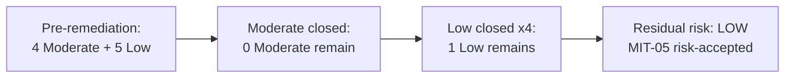

# 06.09 — Residual Risk & Risk Acceptance

| Field | Value |
|---|---|
| Document ID | CIP-06.09 |
| Version | 1.0 |
| Date | 2026-03-02 |
| Classification | BES Cyber System Information (BCSI) // Illustrative Portfolio Sample |
| Owner | Daniel Reyes (CIP Senior Manager) |
| Author | Advisory Team |
| Status | Approved |

## Purpose

This document records GridPoint Energy's **residual risk** after remediation of the 9 Mitigation Plans and the formal **risk acceptance** for the single in-progress item, **MIT-05 (CIP-013 R2 vendor notification clauses)**. With 8 of 9 Mitigation Plans Closed, 0 overdue, and 0 open High-risk items, the assessed residual risk is **Low**. The one remaining item is risk-accepted with a documented completion date and CIP Senior Manager sign-off.

## Residual Risk Determination

Remediation retired all Moderate-risk findings (MIT-01, 02, 06, 07 — Closed) and four of five Low-risk findings (MIT-03, 04, 08, 09 — Closed). The only open item (MIT-05) is a Low-risk contractual documentation gap with strong compensating context: the CIP-013 SCRM program, vendor remote-access controls, and vendor risk register are already operating; only the added contractual notification clauses await counterparty signature.

| Factor | Assessment |
|---|---|
| Open High-risk findings | 0 |
| Open Moderate-risk findings | 0 |
| Open Low-risk findings | 1 (MIT-05) |
| Overdue milestones | 0 |
| Compensating controls for the open item | CIP-013 SCRM program active; vendor access controlled/logged |
| **Assessed residual risk** | **Low** |

## Residual Risk Heat View

## Risk Acceptance — MIT-05

**Item:** MIT-05 — CIP-013 R2 vendor incident-notification / remote-access clauses missing in 2 vendor contracts (source PNC-05, confirms GAP-32). **Owner:** Priya Nair (IT).

**Basis for acceptance:**
- Risk rating is **Low**; the underlying SCRM controls are implemented and operating.
- Redlined amendments have been issued to both vendors; completion depends on an external party's signature, which is outside GridPoint's unilateral control.
- Interim compensating measures — controlled and logged vendor remote access, active vendor risk monitoring — mitigate exposure pending signature.

**Acceptance terms:**

| Attribute | Value |
|---|---|
| Accepted risk | Residual Low — pending vendor signatures on 2 CIP-013 amendments |
| Documented completion date | On-schedule target (final counterparty signature) |
| Compensating controls | CIP-013 SCRM plan, logged vendor IRA, vendor risk register |
| Review checkpoint | Bi-weekly status; reaffirm before 2027-Q2 audit |
| Accepting authority | Daniel Reyes (CIP Senior Manager) |

## CIP Senior Manager Sign-Off

The CIP Senior Manager, **Daniel Reyes**, as the single accountable authority under CIP-003 R1, has:

1. Reviewed the completion evidence for the 8 Closed Mitigation Plans (validated by Compliance Manager Whitfield).
2. Accepted the residual **Low** risk associated with the open item MIT-05, subject to its documented completion date and compensating controls.
3. Attested that GridPoint's post-remediation residual risk posture is **Low** and audit-ready for the 2027-Q2 ReliabilityFirst Compliance Audit.

## Residual Risk by Standard

| Standard | Pre-remediation finding | Post-remediation residual |
|---|---|---|
| CIP-009 (MIT-01, MIT-04) | Recovery/backup gaps | None — Closed |
| CIP-005 R2 (MIT-02) | IRA logging gap | None — Closed |
| CIP-008 (MIT-03) | IR evidence retention | None — Closed |
| CIP-007 R4 (MIT-06) | Audit-log documentation | None — Closed |
| CIP-010 R1 (MIT-07) | Baseline approvals | None — Closed |
| CIP-006 R2 (MIT-08) | PACS clock drift | None — Closed |
| CIP-004 R4 (MIT-09) | Access-review signature | None — Closed |
| CIP-013 R2 (MIT-05) | Vendor notification clauses | Low — risk-accepted, in progress |

## Risk-Acceptance Register

| Item | Risk | Owner | Accepting authority | Review |
|---|---|---|---|---|
| MIT-05 vendor clauses | Low | Priya Nair | Daniel Reyes | Bi-weekly; reaffirm pre-audit |

No other items carry accepted residual risk; the remaining eight are fully remediated and require no acceptance.

## Monitoring of Accepted Risk

The single accepted risk (MIT-05) is monitored at each bi-weekly roll-up. If the vendor signatures are not obtained by the documented completion date, the item is re-escalated to the CIP Senior Manager, the risk acceptance is re-evaluated, and — if the exposure changes materially — a status update is provided to ReliabilityFirst. Until then, the compensating CIP-013 controls hold the exposure at Low.

## Program-Level Residual Risk Statement

After Phase 06 remediation, GridPoint has no open High- or Moderate-risk compliance findings, no overdue milestones, and a single risk-accepted Low-risk item on a defined path to closure. The residual risk to reliable operation of the Medium-impact BES Cyber Systems is **Low**, consistent with the Phase 05 "Substantially Ready" rating maturing to audit-ready.

## Risk Posture Trend

| Phase milestone | Risk posture |
|---|---|
| Phase 02 baseline gap assessment | 6 High-risk gaps open |
| Phase 04 control implementation | All High gaps closed; 6 items in progress |
| Phase 05 mock audit | 0 High · 4 Moderate · 5 Low PNCs; "Substantially Ready" |
| Phase 06 remediation | 0 High · 0 Moderate open · 1 Low risk-accepted; **Low residual** |

The trend shows monotonic risk reduction across phases, culminating in a Low residual-risk posture with a single, well-controlled open item. This trajectory is the core narrative GridPoint carries into the audit-readiness package.

## Cross-References

- [06.02-mitigation-plan-register.md](06.02-mitigation-plan-register.md) — MIT-05 detail
- [06.06-completion-evidence-and-internal-validation.md](06.06-completion-evidence-and-internal-validation.md) — evidence & validation
- [06.08-remediation-status-reporting.md](06.08-remediation-status-reporting.md) — KPIs
- [../04-technical-physical-control-implementation/04.18-supply-chain-risk-management-cip-013.md](../04-technical-physical-control-implementation/04.18-supply-chain-risk-management-cip-013.md) — CIP-013 SCRM
- [../01-program-foundation/01.06-cip-senior-manager-designation-and-delegations.md](../01-program-foundation/01.06-cip-senior-manager-designation-and-delegations.md) — CIP Senior Manager authority

---
[⬅ Previous](06.08-remediation-status-reporting.md) · [🏠 Phase README](06.00-README.md) · [Next ➡](06.10-phase-summary-and-transition.md)
