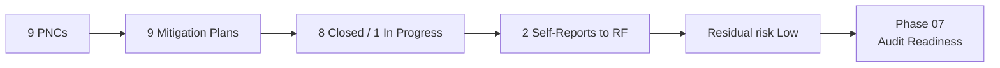

# 06.10 — Phase Summary & Transition

| Field | Value |
|---|---|
| Document ID | CIP-06.10 |
| Version | 1.0 |
| Date | 2026-03-02 |
| Classification | BES Cyber System Information (BCSI) // Illustrative Portfolio Sample |
| Owner | Nathan Cole (Mitigation Plan Manager) |
| Author | Advisory Team |
| Status | Approved |

## Purpose

This document closes **Phase 06 — Gap Remediation & Mitigation Plans** and transitions GridPoint Energy to **Phase 07 — Audit Readiness & Compliance Package**. It summarizes remediation outcomes and confirms the program is audit-ready for the 2027-Q2 ReliabilityFirst (RF) Compliance Audit.

## Phase 06 Outcomes

| Outcome | Result |
|---|---|
| PNCs converted to Mitigation Plans | 9 → 9 (MIT-01…MIT-09) |
| Risk distribution | 0 High · 4 Moderate · 5 Low |
| Closed (validated + certified) | 8 (MIT-01,02,03,04,06,07,08,09) |
| In Progress (on schedule) | 1 (MIT-05) |
| Overdue | 0 |
| Open High-risk | 0 |
| Closure rate | 89% |
| Self-Reports filed to RF | 2 (MIT-02, MIT-07) |
| Self-Logged / Compliance Exceptions | 7 |
| TFEs required | 0 |
| Estimated remediation effort | ~$180K |
| Residual risk | Low |

## What Was Accomplished

- All **9 Potential Noncompliance findings** from the Phase 05 mock audit were formalized into NERC **Mitigation Plans** with milestones, owners, completion dates, and evidence.
- The **4 Moderate** items were prioritized and closed; **4 of 5 Low** items were closed; the remaining Low item (**MIT-05**) is on schedule and risk-accepted.
- **2 Self-Reports** were filed to ReliabilityFirst (MIT-02 IRA logging, MIT-07 baseline approvals), each with an attached Mitigation Plan; the other 7 were self-logged as minimal-risk / Compliance Exceptions.
- Each closure was independently validated by Compliance Manager **Karen Whitfield** and certified by CIP Senior Manager **Daniel Reyes**.
- The TFE analysis confirmed **0 TFEs** required — all controls technically feasible.
- Post-remediation **residual risk is Low** and the program is **audit-ready**.

## Remediation Close Flow

## Transition to Phase 07

Phase 07 assembles the **audit-readiness compliance package**: consolidating RSAW evidence, Mitigation Plan closure records, Self-Report documentation, and the residual-risk attestation into a single defensible package for the RF Compliance Audit, and confirming logistics and interview readiness.

| Handoff item | To Phase 07 |
|---|---|
| Mitigation Plan register (8 Closed / 1 In Progress) | Evidence consolidation |
| Self-Report packages (MIT-02, MIT-07) | Audit narrative |
| Completion evidence-by-MIT | RSAW cross-mapping |
| Residual-risk & risk-acceptance record | Audit attestation |
| MIT-05 open-item tracking | Pre-audit closure watch |

## Deliverables Produced in Phase 06

| Deliverable | Reference |
|---|---|
| Remediation strategy & prioritization | 06.01 |
| Mitigation Plan register (MIT-01…09) | 06.02 |
| Mitigation Plan template & milestones | 06.03 |
| Self-Report packages (2) | 06.04 |
| Execution tracking & burndown | 06.05 |
| Completion evidence & validation | 06.06 |
| TFE determination (0 required) | 06.07 |
| Status reporting & KPIs | 06.08 |
| Residual risk & risk acceptance | 06.09 |

## Readiness Confirmation

| Audit-readiness criterion | Status |
|---|---|
| No open High-risk findings | Met (0) |
| No open Moderate-risk findings | Met (0 open; 4 closed) |
| No overdue milestones | Met (0) |
| Self-Reports filed and tracking | Met (2) |
| Residual risk Low | Met |
| Completion evidence validated & certified | Met (8 of 9; MIT-05 interim) |

## Open Item Carried Forward

The single open item, **MIT-05** (CIP-013 R2 vendor notification clauses), transfers to Phase 07 under active tracking and CIP Senior Manager risk acceptance, with completion expected before the 2027-Q2 RF Compliance Audit. It is the only remediation item not fully closed and presents Low residual risk.

## Sign-Off

Phase 06 is complete and approved. Remediation is substantially closed (8 of 9 Mitigation Plans), the two Self-Reports are filed and tracking, residual risk is Low, 0 TFEs are required, and GridPoint is positioned to enter the audit-readiness phase. CIP Senior Manager **Daniel Reyes** certifies the Phase-06 remediation outcome.

## Key Figures at a Glance

| Figure | Value |
|---|---|
| PNCs → Mitigation Plans | 9 → 9 |
| Closed / In Progress | 8 / 1 |
| Overdue / Open High | 0 / 0 |
| Closure rate | 89% |
| Self-Reports to RF | 2 |
| TFEs required | 0 |
| Estimated effort | ~$180K |
| Residual risk | Low |

## Cross-References

- [06.02-mitigation-plan-register.md](06.02-mitigation-plan-register.md) — Mitigation Plan register
- [06.09-residual-risk-and-risk-acceptance.md](06.09-residual-risk-and-risk-acceptance.md) — residual risk
- [../05-internal-compliance-assessment/05.17-phase-summary-and-transition.md](../05-internal-compliance-assessment/05.17-phase-summary-and-transition.md) — prior phase close
- [../07-audit-readiness-compliance-package/07.00-README.md](../07-audit-readiness-compliance-package/07.00-README.md) — next phase

---
[⬅ Previous](06.09-residual-risk-and-risk-acceptance.md) · [🏠 Phase README](06.00-README.md) · [Next ➡](../07-audit-readiness-compliance-package/07.00-README.md)
