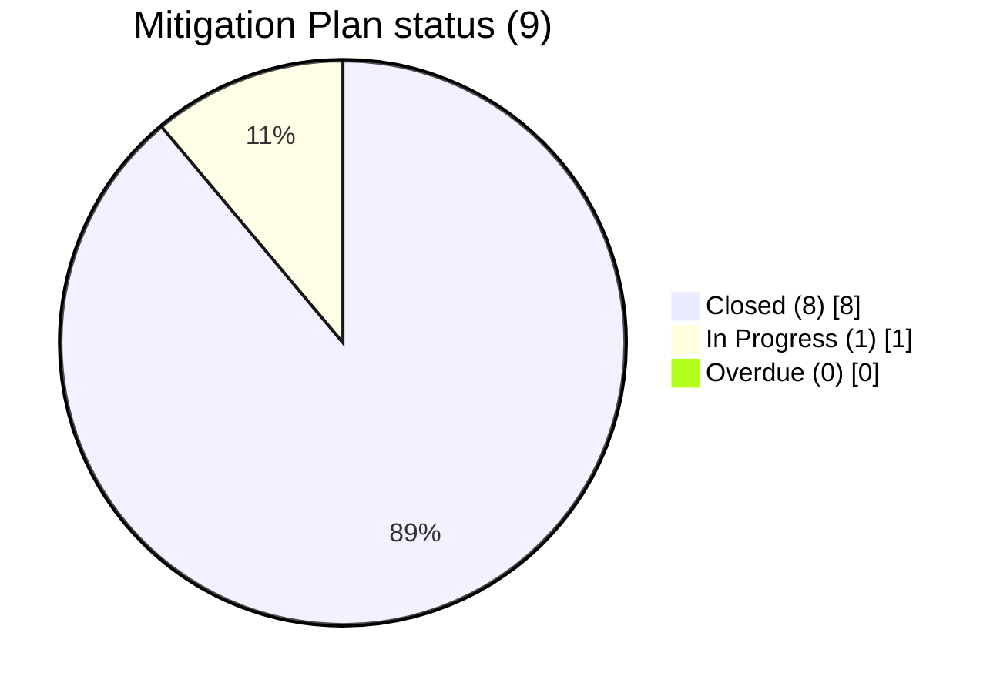

# Diagram — Remediation Burndown

| Field | Value |
|---|---|
| Version | 1.0 |
| Date | 2026-03-02 |
| Classification | BES Cyber System Information (BCSI) // Illustrative Portfolio Sample |
| Company | GridPoint Energy, Inc. (NCR11027) |
| Regional Entity | ReliabilityFirst (RF) |
| Phase | 06 — Gap Remediation & Mitigation Plans |
| Author | Advisory Team |
| Status | Approved |

89% closed · 0 overdue · 0 High · residual risk **Low**. MIT-05 on schedule (2027-03-31).

## Cross-References
`06.05-remediation-execution-tracking.md`, `trackers/mitigation-plan-register.xlsx`.
