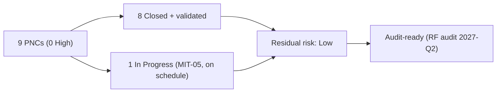

# Diagram — Residual Risk

| Field | Value |
|---|---|
| Version | 1.0 |
| Date | 2026-03-02 |
| Classification | BES Cyber System Information (BCSI) // Illustrative Portfolio Sample |
| Company | GridPoint Energy, Inc. (NCR11027) |
| Regional Entity | ReliabilityFirst (RF) |
| Phase | 06 — Gap Remediation & Mitigation Plans |
| Author | Advisory Team |
| Status | Approved |

## Cross-References
`06.09-residual-risk-and-risk-acceptance.md`.
