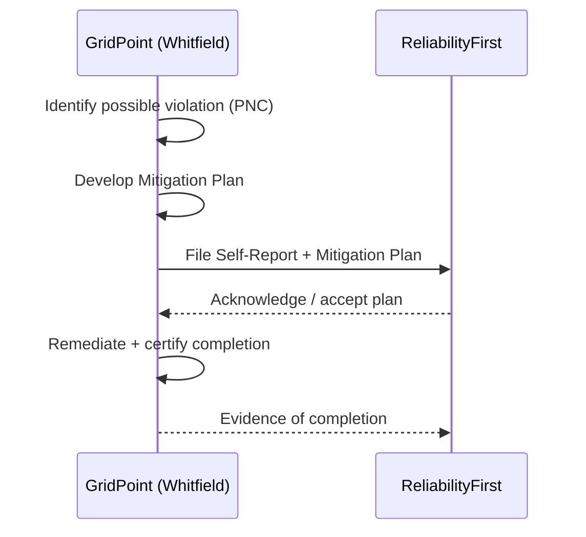

# Diagram — Self-Report Flow

| Field | Value |
|---|---|
| Version | 1.0 |
| Date | 2026-03-02 |
| Classification | BES Cyber System Information (BCSI) // Illustrative Portfolio Sample |
| Company | GridPoint Energy, Inc. (NCR11027) |
| Regional Entity | ReliabilityFirst (RF) |
| Phase | 06 — Gap Remediation & Mitigation Plans |
| Author | Advisory Team |
| Status | Approved |

## Cross-References
`06.04-self-report-preparation.md`, `trackers/self-report-log.xlsx`.
