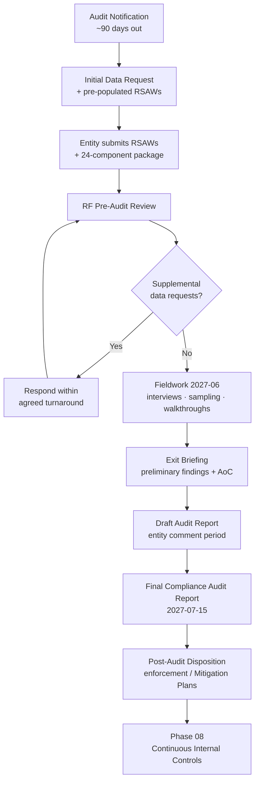

# 07.01 — Audit Process Overview (CMEP Compliance Audit)

| Field | Value |
|---|---|
| Document ID | CIP-07.01 |
| Version | 1.0 |
| Date | 2026-03-02 |
| Classification | BES Cyber System Information (BCSI) // Illustrative Portfolio Sample |
| Owner | Karen Whitfield (NERC Compliance Manager) |
| Author | Advisory Team |
| Status | Approved |

## Purpose

This document explains, for GridPoint Energy's internal stakeholders and Subject Matter Experts (SMEs), how a **ReliabilityFirst (RF) Compliance Audit** is conducted under the NERC **Compliance Monitoring and Enforcement Program (CMEP)**. It defines the audit lifecycle stages, the audit period, the evidence auditors examine, the roles of the Registered Entity and the Regional Entity, and the terminology the GridPoint team must use fluently during the **2027-Q2 RF Compliance Audit** (fieldwork **2027-06**; Compliance Audit Report issued **2027-07-15**).

Understanding this process is the foundation of the entire Phase 07 audit-readiness effort — every subsequent document (package assembly, completeness checks, data-request handling, dry-run, logistics, and walkthrough narratives) exists to satisfy one or more stages described here.

## 1. Regulatory Context — Where the Compliance Audit Fits

The Compliance Audit is one of **seven CMEP monitoring methods** available to the Regional Entity. GridPoint must be prepared for any of them, but the scheduled **Compliance Audit** is the most comprehensive and the primary focus of this phase.

| CMEP Monitoring Method | Description | GridPoint Relevance |
|---|---|---|
| **Compliance Audit** | Scheduled, comprehensive review of one or more standards over an audit period | **Primary — 2027-Q2 RF audit** |
| Self-Certification | Entity attests to its own compliance on RF-defined schedule | Periodic obligation |
| Spot Check | Targeted RF review of a subset of requirements | Possible at any time |
| Compliance Investigation | Triggered by an event or suspected violation | Not active |
| **Self-Report** | Entity reports a possible violation to RF | 2 filed (MIT-02, MIT-07) |
| Periodic Data Submittal | Scheduled data delivery (e.g., events, misoperations) | Ongoing |
| Complaint | Third-party allegation reviewed by RF | Not active |

Oversight chain: **FERC → NERC → ReliabilityFirst → GridPoint Energy (NCR11027)**. Medium-impact entities such as GridPoint are audited by RF on a **~3-year cycle**.

## 2. Audit Scope and Audit Period

- **Standards in scope:** all applicable CIP standards, **CIP-002-5.1a through CIP-013-2**. CIP-014-3 (Northgate) is noted as **in-progress with a completion commitment**.
- **Registered functions in scope:** **GO / GOP / TO / TOP / DP**.
- **Applicable requirement parts:** **118** (Medium + Low), the same population assessed in the Phase 05 internal mock audit.
- **Audit period:** the window of time for which compliance is examined — from the effective date of each applicable standard (or the prior audit's end date) through the audit's start. Evidence must demonstrate **continuous** compliance across the entire audit period, not merely at a point in time.
- **Delivery mode:** on-site at the Millbrook control center and headquarters, plus remote review of BCSI evidence through a controlled repository.

## 3. RF Compliance Audit Stages

The RF audit follows a structured lifecycle defined by the CMEP and the RF audit team's engagement letter.

| Stage | Timing (relative) | Regional Entity Action | GridPoint Action |
|---|---|---|---|
| **1. Audit Notification** | ~90 days before fieldwork | RF issues notification letter, audit scope, audit period, and audit team roster | Acknowledge; designate audit coordinator (Whitfield) and SMEs |
| **2. Pre-Audit Data Request (initial RSAW request)** | ~60–90 days out | RF sends the initial data request and pre-populated **RSAWs** per standard | Complete RSAWs, assemble the 24-component package, submit through secure portal |
| **3. Pre-Audit Review** | ~30–60 days out | RF reviews submitted RSAWs and evidence; issues clarifying/supplemental data requests | Respond within agreed turnaround; log every request |
| **4. Fieldwork (on-site + remote)** | **2027-06** | RF conducts interviews, evidence sampling, control walkthroughs, and technical validation | SMEs present controls; retrieve sampled evidence on demand |
| **5. Findings & Exit Briefing** | End of fieldwork | RF communicates preliminary findings / potential noncompliance and Areas of Concern | Clarify, provide additional evidence, note responses |
| **6. Draft & Final Audit Report** | Through **2027-07-15** | RF issues draft report for entity comment, then the final **Compliance Audit Report** | Review draft, submit written comments, receive final report |
| **7. Post-Audit Disposition** | After report | RF processes any Possible Violations into enforcement; accepts Mitigation Plans | Execute any remaining Mitigation Plans; Phase 08 continuous controls |

### Audit Process Flow

## 4. What the Auditors Examine

RF auditors test whether GridPoint can **demonstrate** compliance with each requirement part across the full audit period. They examine four evidence classes:

| Evidence Class | Examples GridPoint Provides |
|---|---|
| **Documentation** | Policies, plans, procedures, the CIP-002 categorization, RSAW narratives |
| **Records / Artifacts** | Access authorization records, patch-evaluation logs, baseline change records, log-review sign-offs, training records, PRA records |
| **System / Technical** | ESP firewall rulesets, Intermediate System / MFA configs, EACMS logs, PACS logs, monitoring dashboards |
| **Personnel** | SME interviews and control walkthroughs demonstrating the process is real and operating |

Auditors reconcile the **RSAW narrative** against the **cited evidence** and the **sampled populations**. A control is only "compliant" if the narrative, the evidence, and the interview testimony are **mutually consistent**. Gaps between what a document claims and what evidence proves are the most common source of findings.

## 5. Audit Outcomes and Terminology

| Outcome Term | Meaning |
|---|---|
| **No Finding / Compliant** | Requirement demonstrated; no issue |
| **Possible Violation (PV)** | Auditor identifies potential noncompliance; routed to enforcement |
| **Area of Concern (AoC)** | Non-violation recommendation to improve a practice |
| **Mitigation Plan** | Entity's remediation plan for a possible/confirmed violation, accepted by RF |
| **Self-Report** | Entity's prior disclosure of a possible violation — viewed favorably |

GridPoint's target outcome, supported by the Phase 05 "Substantially Ready" rating and the Phase 06 remediation (8 of 9 Mitigation Plans closed, 2 Self-Reports filed), is **0 new Possible Violations** with the two self-reported items (MIT-02 IRA logging, MIT-07 baseline approvals) acknowledged under **accepted Mitigation Plans**.

## 6. Roles During the Audit

| Role | Person | Audit Responsibility |
|---|---|---|
| Program Lead | Nathan Cole | Overall audit-readiness coordination |
| Audit Coordinator / Single Point of Contact | Karen Whitfield | Manages RF communications and data requests |
| CIP Senior Manager | Daniel Reyes | Accountable authority; signs the compliance package |
| OT / ICS SME | Marcus Bell | CIP-005/-007/-010 technical demonstrations |
| IT Security SME | Priya Nair | CIP-004/-007/-011 evidence |
| Physical Security SME | Frank Delgado | CIP-006/-014 |
| HR / PRA SME | Sandra Lee | CIP-004 personnel evidence |
| Field Engineering SME | Elena Ruiz | Substation controls |
| Control Center Ops SME | James Okafor | CIP-008/-009 operations |

## Cross-References

- [../01-program-foundation/01.03-regulatory-context-nerc-ferc-rf-cmep.md](../01-program-foundation/01.03-regulatory-context-nerc-ferc-rf-cmep.md) — CMEP and RF oversight chain
- [../05-internal-compliance-assessment/05.16-mock-audit-report-and-readiness-rating.md](../05-internal-compliance-assessment/05.16-mock-audit-report-and-readiness-rating.md) — "Substantially Ready" rating
- [07.02-compliance-evidence-package-assembly.md](07.02-compliance-evidence-package-assembly.md) — the 24-component package built for Stage 2
- [07.04-data-request-response-process.md](07.04-data-request-response-process.md) — supplemental data-request handling (Stage 3)

---
[⬅ Previous](07.00-README.md) · [🏠 Phase README](07.00-README.md) · [Next ➡](07.02-compliance-evidence-package-assembly.md)
