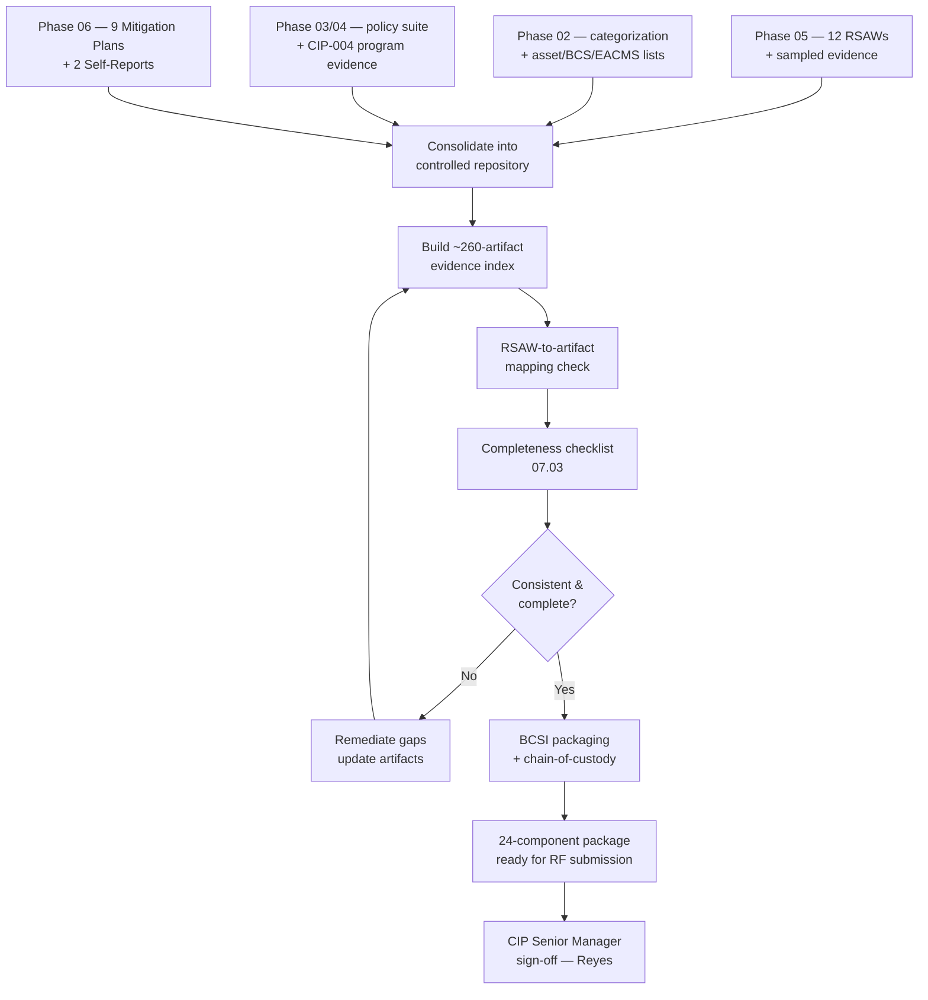

# 07.02 — Compliance Evidence Package Assembly

| Field | Value |
|---|---|
| Document ID | CIP-07.02 |
| Version | 1.0 |
| Date | 2026-03-02 |
| Classification | BES Cyber System Information (BCSI) // Illustrative Portfolio Sample |
| Owner | Nathan Cole (Program Lead) |
| Author | Advisory Team |
| Status | Approved |

## Purpose

This is the **keystone** document of Phase 07. It defines and inventories the **24-component compliance evidence package** that GridPoint Energy (NCR11027) submits to **ReliabilityFirst (RF)** in response to the initial data request of the **2027-Q2 Compliance Audit**. The package binds together the **12 Reliability Standard Audit Worksheets (RSAWs)**, the CIP-002 categorization, the integrated asset & BES Cyber System (BCS) lists, the policy suite, the CIP-004 personnel program evidence, the **~260-artifact evidence index**, the **9 Mitigation Plans**, the **2 Self-Reports**, and the supporting registers.

The package is the single, authoritative, version-controlled body of proof that GridPoint presents to demonstrate continuous compliance across the audit period. It is classified **BES Cyber System Information (BCSI)** and is managed in a controlled repository with access controls, transmission encryption, and a full chain-of-custody log.

## 1. Package Design Principles

| Principle | Application at GridPoint |
|---|---|
| **RSAW-anchored** | Every artifact traces to a specific RSAW requirement part; nothing is orphaned |
| **Single source of truth** | One controlled repository; no divergent local copies |
| **Version-controlled** | Every component carries Version, Date, Owner, and Status |
| **BCSI-protected** | Access controls, need-to-know, encrypted transmission per CIP-011-3 |
| **Chain-of-custody** | Repository logs who accessed, exported, or delivered each artifact |
| **Consistency-tested** | Figures reconcile across all components (see [07.03](07.03-evidence-completeness-checklist.md)) |
| **Audit-navigable** | An index maps RSAW → requirement part → artifact ID → repository location |

## 2. The 24-Component Package Inventory

The package comprises exactly **24 line items**. Components 1–12 are the RSAWs; components 13–24 are the categorization, asset/BCS lists, policy suite, CIP-004 program evidence, the ~260-artifact evidence index, the Mitigation Plans, the Self-Reports, and supporting registers.

| # | Component | Source Phase / Reference | Classification | Owner |
|---|---|---|---|---|
| 1 | **RSAW — CIP-002-5.1a** Categorization | [05.04](../05-internal-compliance-assessment/05.04-cip-002-rsaw-and-evidence.md) | BCSI | Whitfield |
| 2 | **RSAW — CIP-003-8** Security Mgmt Controls | [05.05](../05-internal-compliance-assessment/05.05-cip-003-rsaw-and-evidence.md) | BCSI | Whitfield |
| 3 | **RSAW — CIP-004-7** Personnel & Training | [05.06](../05-internal-compliance-assessment/05.06-cip-004-rsaw-and-evidence.md) | BCSI | Lee |
| 4 | **RSAW — CIP-005-7** ESP & Remote Access | [05.07](../05-internal-compliance-assessment/05.07-cip-005-rsaw-and-evidence.md) | BCSI | Bell |
| 5 | **RSAW — CIP-006-6** Physical Security | [05.08](../05-internal-compliance-assessment/05.08-cip-006-rsaw-and-evidence.md) | BCSI | Delgado |
| 6 | **RSAW — CIP-007-6** System Security Mgmt | [05.09](../05-internal-compliance-assessment/05.09-cip-007-rsaw-and-evidence.md) | BCSI | Bell |
| 7 | **RSAW — CIP-008-6** Incident Reporting & Response | [05.10](../05-internal-compliance-assessment/05.10-cip-008-rsaw-and-evidence.md) | BCSI | Okafor |
| 8 | **RSAW — CIP-009-6** Recovery Plans | [05.11](../05-internal-compliance-assessment/05.11-cip-009-rsaw-and-evidence.md) | BCSI | Okafor |
| 9 | **RSAW — CIP-010-4** Config Change & Vuln Assessment | [05.12](../05-internal-compliance-assessment/05.12-cip-010-rsaw-and-evidence.md) | BCSI | Bell |
| 10 | **RSAW — CIP-011-3** Information Protection (BCSI) | [05.13](../05-internal-compliance-assessment/05.13-cip-011-rsaw-and-evidence.md) | BCSI | Nair |
| 11 | **RSAW — CIP-013-2** Supply Chain Risk Mgmt | [05.14](../05-internal-compliance-assessment/05.14-cip-013-rsaw-and-evidence.md) | BCSI | Nair |
| 12 | **RSAW — CIP-014-3** Physical Security (in-progress) | Phase 05 (assessed separately) | BCSI | Delgado |
| 13 | **CIP-002 Categorization Document** (High/Med/Low list) | [02.09](../02-bes-cyber-system-categorization/02.09-cip-002-categorization-document.md) | BCSI | Whitfield |
| 14 | **Integrated BES Asset Inventory** (44 substations, 4 plants, 2 CCs) | [02.02](../02-bes-cyber-system-categorization/02.02-bes-asset-inventory.md) | BCSI | Ruiz |
| 15 | **BES Cyber System & BCA List** (52 BCS / ~420 BCAs) | [02.04](../02-bes-cyber-system-categorization/02.04-bes-cyber-system-identification.md) | BCSI | Bell |
| 16 | **Associated EACMS / PACS / PCA List** (26 / 18 / 60) | [02.07](../02-bes-cyber-system-categorization/02.07-associated-eacms-pacs-pca.md) | BCSI | Bell |
| 17 | **CIP Policy Suite** (CIP-003 policies + procedures) | Phase 03 | BCSI | Reyes |
| 18 | **CIP-004 Program Evidence** (training, PRA, access mgmt) | Phase 04 / [05.06](../05-internal-compliance-assessment/05.06-cip-004-rsaw-and-evidence.md) | BCSI | Lee |
| 19 | **~260-Artifact Evidence Index** (RSAW-mapped) | [07.03](07.03-evidence-completeness-checklist.md) | BCSI | Cole |
| 20 | **9 Mitigation Plans** (MIT-01…09) | [06.02](../06-gap-remediation-mitigation-plans/06.02-mitigation-plan-register.md) | BCSI | Cole |
| 21 | **2 Self-Reports** (MIT-02 IRA logging, MIT-07 baseline approvals) | [06.04](../06-gap-remediation-mitigation-plans/06.04-self-report-preparation.md) | BCSI | Whitfield |
| 22 | **Applicability Matrix** (118 requirement parts) | [02.10](../02-bes-cyber-system-categorization/02.10-applicability-matrix.md) | BCSI | Whitfield |
| 23 | **Gap & Findings Registers** (gap register + 9 PNC register) | [05.15](../05-internal-compliance-assessment/05.15-findings-register-and-risk-exposure.md) | BCSI | Whitfield |
| 24 | **CIP Senior Manager Designation & Delegations** | [01.06](../01-program-foundation/01.06-cip-senior-manager-designation-and-delegations.md) | BCSI | Reyes |

**Total: 24 components.** RSAWs = **12** (components 1–12). Supporting components = **12** (components 13–24).

## 3. The ~260-Artifact Evidence Index (Component 19)

The evidence index is the connective tissue of the package: it maps each RSAW requirement part to the specific artifacts that prove compliance, and to their repository location. Approximately **260 evidence artifacts** are indexed and mapped across the **118** applicable requirement parts.

| Standard | Illustrative Artifact Count | Representative Artifacts |
|---|---|---|
| CIP-002 | ~18 | Categorization document, asset reconciliation, 15-month review record |
| CIP-003 | ~20 | Policy suite, CIP Senior Manager approval, Low-impact Attachment 1 evidence |
| CIP-004 | ~34 | Training completion records, PRA records, access authorization/revocation logs, quarterly access reviews |
| CIP-005 | ~24 | ESP diagrams, firewall rulesets, Intermediate System / MFA configs, IRA session logs |
| CIP-006 | ~22 | PSP access logs, visitor logs, PACS configs, monitoring records |
| CIP-007 | ~30 | Patch-evaluation logs (35-day cycle), ports/services baselines, malware protection, audit-log reviews |
| CIP-008 | ~14 | Incident response plan, IR test evidence, notification records |
| CIP-009 | ~16 | Recovery plans, backup restoration test records, EMS update record |
| CIP-010 | ~26 | Configuration baselines, change records with approvals, vulnerability assessments |
| CIP-011 | ~16 | BCSI handling procedure, information protection program, storage/reuse-and-disposal records |
| CIP-013 | ~14 | Supply chain risk plan, vendor risk assessments, procurement/contract language |
| CIP-014 | ~10 | Threat & vulnerability evaluation (Northgate, in-progress), third-party review commitment |
| **Total** | **~260** | Mapped 1:1 to RSAW requirement parts |

Each index row carries: `Artifact ID · RSAW · Requirement Part · Artifact Title · Evidence Class · Date/Period Covered · Repository Path · Owner`. The authoritative machine-readable index is maintained at [`trackers/evidence-index.xlsx`](trackers/evidence-index.xlsx).

## 4. Assembly Workflow

## 5. Assembly Roles

| Role | Person | Assembly Responsibility |
|---|---|---|
| Program Lead | Nathan Cole | Owns package integrity and the evidence index |
| Compliance Manager | Karen Whitfield | RSAW finalization, registers, RF submission |
| CIP Senior Manager | Daniel Reyes | Final sign-off (see [07.12](07.02-compliance-evidence-package-assembly.md)) |
| OT SME | Marcus Bell | CIP-005/-007/-010 evidence and BCS lists |
| IT SME | Priya Nair | CIP-011/-013 evidence |
| Physical SME | Frank Delgado | CIP-006/-014 evidence |
| HR SME | Sandra Lee | CIP-004 personnel evidence |
| Field SME | Elena Ruiz | Asset inventory reconciliation |
| Ops SME | James Okafor | CIP-008/-009 evidence |

## 6. BCSI Handling of the Package

Consistent with **CIP-011-3** and the Phase 06 remediation of the engineering file-share issue (GAP-06), the entire package is treated as BCSI:

- **Storage:** controlled repository with role-based access and need-to-know enforcement.
- **Transmission:** encrypted delivery through the RF secure portal only; no email of raw BCSI.
- **Access logging:** every view, export, and delivery is logged for chain-of-custody.
- **Designated custodians:** Nathan Cole and Karen Whitfield; access provisioned per CIP-004-7 authorization records.
- **Retention:** evidence retained per the audit period retention requirement plus the RF-defined retention window.

## 7. Package Readiness Status

| Metric | Value |
|---|---|
| Total package components | **24** |
| RSAWs | **12** |
| Supporting components | **12** |
| Evidence artifacts indexed | **~260** |
| Requirement parts covered | **118** |
| Mitigation Plans included | **9** (8 Closed / 1 In Progress) |
| Self-Reports included | **2** (MIT-02, MIT-07) |
| TFEs | **0** |
| Package classification | **BCSI** |
| Readiness | **Substantially Ready → Audit-Ready** |

## Cross-References

- [../05-internal-compliance-assessment/05.03-rsaw-preparation-approach.md](../05-internal-compliance-assessment/05.03-rsaw-preparation-approach.md) — RSAW build approach
- [../06-gap-remediation-mitigation-plans/06.02-mitigation-plan-register.md](../06-gap-remediation-mitigation-plans/06.02-mitigation-plan-register.md) — the 9 Mitigation Plans
- [../06-gap-remediation-mitigation-plans/06.04-self-report-preparation.md](../06-gap-remediation-mitigation-plans/06.04-self-report-preparation.md) — the 2 Self-Reports
- [07.03-evidence-completeness-checklist.md](07.03-evidence-completeness-checklist.md) — completeness verification
- [07.04-data-request-response-process.md](07.04-data-request-response-process.md) — delivering package components to RF

---
[⬅ Previous](07.01-audit-process-overview-cmep.md) · [🏠 Phase README](07.00-README.md) · [Next ➡](07.03-evidence-completeness-checklist.md)
