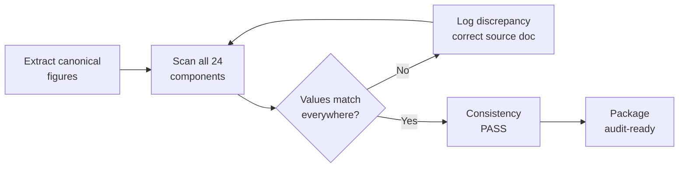

# 07.03 — Evidence Completeness Checklist

| Field | Value |
|---|---|
| Document ID | CIP-07.03 |
| Version | 1.0 |
| Date | 2026-03-02 |
| Classification | BES Cyber System Information (BCSI) // Illustrative Portfolio Sample |
| Owner | Karen Whitfield (NERC Compliance Manager) |
| Author | Advisory Team |
| Status | Approved |

## Purpose

This document provides the **completeness checklist** that GridPoint Energy uses to confirm the **24-component compliance evidence package** is audit-ready before submission to **ReliabilityFirst (RF)**. The checklist verifies three things for the **2027-Q2 Compliance Audit**: (1) **every RSAW has supporting evidence**; (2) **every applicable requirement part (118)** is covered by at least one mapped artifact; and (3) **cross-document consistency** — that figures, dates, and control statements reconcile across all 24 components and the ~260-artifact evidence index.

A control that "looks compliant" but cannot be proven from cited evidence is the single largest source of audit findings. This checklist exists to close that gap before RF ever opens the package.

## 1. Checklist Structure

The checklist is applied in three layers, each with a pass condition. A component is not marked complete until all three layers pass.

| Layer | Question | Pass Condition |
|---|---|---|
| **L1 — Evidence Presence** | Does every RSAW requirement part cite at least one artifact? | 0 orphaned requirement parts |
| **L2 — Requirement Coverage** | Are all 118 applicable parts covered? | 118 / 118 covered |
| **L3 — Cross-Document Consistency** | Do figures/dates/statements reconcile across components? | 0 unresolved discrepancies |

## 2. Layer 1 — Every RSAW Has Evidence

| # | RSAW | Requirement Parts | Artifacts Mapped | Orphaned Parts | Status |
|---|---|---|---|---|---|
| 1 | CIP-002-5.1a | ✓ | ~18 | 0 | ✅ Complete |
| 2 | CIP-003-8 | ✓ | ~20 | 0 | ✅ Complete |
| 3 | CIP-004-7 | ✓ | ~34 | 0 | ✅ Complete |
| 4 | CIP-005-7 | ✓ | ~24 | 0 | ✅ Complete |
| 5 | CIP-006-6 | ✓ | ~22 | 0 | ✅ Complete |
| 6 | CIP-007-6 | ✓ | ~30 | 0 | ✅ Complete |
| 7 | CIP-008-6 | ✓ | ~14 | 0 | ✅ Complete |
| 8 | CIP-009-6 | ✓ | ~16 | 0 | ✅ Complete |
| 9 | CIP-010-4 | ✓ | ~26 | 0 | ✅ Complete |
| 10 | CIP-011-3 | ✓ | ~16 | 0 | ✅ Complete |
| 11 | CIP-013-2 | ✓ | ~14 | 0 | ✅ Complete |
| 12 | CIP-014-3 (in-progress) | ✓ | ~10 | 0* | ⚠️ In-progress w/ commitment |
| — | **Total** | **118** | **~260** | **0** | **✅** |

\* CIP-014 Northgate risk assessment is noted as in-progress with a documented completion commitment; its RSAW is included with current-state evidence and an Area-of-Concern acknowledgment.

## 3. Layer 2 — Every Requirement Part Covered

Coverage is validated against the Phase 02 applicability matrix (118 parts). Each part maps to one of four evidence classes; the checklist confirms none is unmapped.

| Coverage Metric | Target | Actual | Status |
|---|---|---|---|
| Applicable requirement parts | 118 | 118 | ✅ |
| Parts with ≥1 mapped artifact | 118 | 118 | ✅ |
| Parts with documentation evidence | — | present | ✅ |
| Parts with record/artifact evidence | — | present | ✅ |
| Parts with technical evidence (where applicable) | — | present | ✅ |
| Parts requiring interview corroboration | — | SME assigned | ✅ |
| Uncovered / TBD parts | 0 | 0 | ✅ |

## 4. Layer 3 — Cross-Document Consistency

The most audit-sensitive layer. RF auditors reconcile figures across components; any mismatch invites a data request or a finding. The checklist verifies the canonical figures appear identically everywhere they are cited.

| Consistency Check | Canonical Value | Reconciles Across | Status |
|---|---|---|---|
| BES Cyber Systems | 14 Medium + 38 Low = **52** | 02.04, 02.06, package comp. 15 | ✅ |
| BES Cyber Assets | **~420** | 02.03, 02.04, evidence index | ✅ |
| EACMS / PACS / PCA | **26 / 18 / 60** | 02.07, package comp. 16 | ✅ |
| Applicable requirement parts | **118** | 02.10, all 12 RSAWs | ✅ |
| Medium substations | **8** | 02.02, 02.06, CIP-005/-006 RSAWs | ✅ |
| PNC findings | **9** (0 High/4 Mod/5 Low) | 05.15, package comp. 23 | ✅ |
| Mitigation Plans | **9** (MIT-01…09) | 06.02, package comp. 20 | ✅ |
| Self-Reports | **2** (MIT-02, MIT-07) | 06.04, package comp. 21 | ✅ |
| Evidence artifacts | **~260** | evidence index, comp. 19 | ✅ |
| CIP Senior Manager | **Daniel Reyes** | 01.06, all sign-offs | ✅ |

### Consistency Verification Flow

## 5. Freshness / Currency Checks

Evidence must be current through the audit period. The checklist flags any artifact whose coverage window ends before the audit period close.

| Currency Check | Requirement | Status |
|---|---|---|
| CIP-007 R2 patch-evaluation logs | ≤35-day cycle, continuous | ✅ Current (GAP-02 remediated) |
| CIP-010 R1 baselines & change records | Current with approvals | ✅ Current (MIT-07 closed) |
| CIP-005 IRA session logs | Continuous logging | ✅ Current (MIT-02 under plan) |
| CIP-004 quarterly access reviews | Signed, current quarter | ✅ Current (MIT-09 closed) |
| CIP-009 backup restoration test | Within test interval | ✅ Current (MIT-04 closed) |
| CIP-002 15-month review | Within 15 months | ✅ Current |

## 6. Sign-Off Gate

| Checklist Layer | Result |
|---|---|
| L1 — Evidence presence | ✅ 0 orphaned parts |
| L2 — Requirement coverage | ✅ 118 / 118 |
| L3 — Cross-document consistency | ✅ 0 unresolved discrepancies |
| Currency / freshness | ✅ All artifacts current |
| **Overall** | **✅ Complete — package cleared for pre-audit dry-run** |

Completeness sign-off is held by the Compliance Manager (Whitfield) and confirmed by the Program Lead (Cole) before the pre-audit dry-run ([07.05](07.05-pre-audit-dry-run.md)).

## Cross-References

- [07.02-compliance-evidence-package-assembly.md](07.02-compliance-evidence-package-assembly.md) — the 24-component package and ~260-artifact index
- [../02-bes-cyber-system-categorization/02.10-applicability-matrix.md](../02-bes-cyber-system-categorization/02.10-applicability-matrix.md) — 118 requirement parts
- [../05-internal-compliance-assessment/05.15-findings-register-and-risk-exposure.md](../05-internal-compliance-assessment/05.15-findings-register-and-risk-exposure.md) — 9 PNC register
- [07.05-pre-audit-dry-run.md](07.05-pre-audit-dry-run.md) — dry-run confirming readiness

---
[⬅ Previous](07.02-compliance-evidence-package-assembly.md) · [🏠 Phase README](07.00-README.md) · [Next ➡](07.04-data-request-response-process.md)
